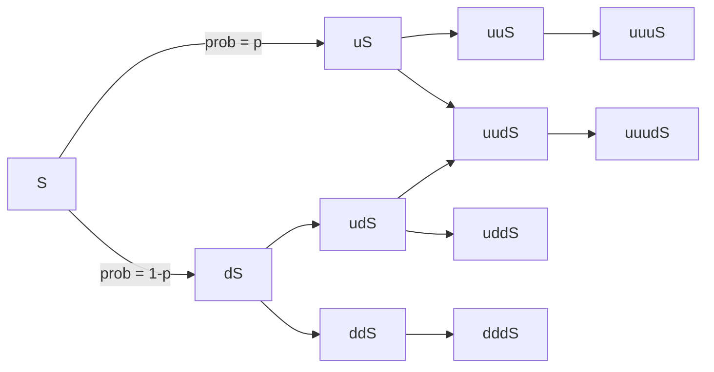
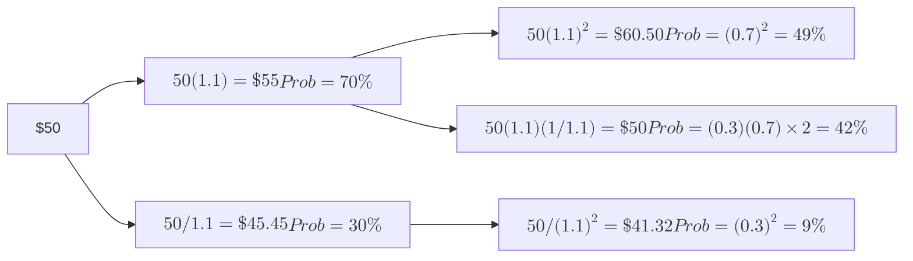

import FigureA from "./images/common-probability/figureA.png";
import FigureB from "./images/common-probability/figureB.png";
import FigureC from "./images/common-probability/figureC.png";
import FigureD from "./images/common-probability/figureD.png";
import FigureE from "./images/common-probability/figureE.png";
import FigureF from "./images/common-probability/figureF.png";
import FigureG from "./images/common-probability/figureG.png";
import FigureH from "./images/common-probability/figureH.png";
import FigureI from "./images/common-probability/figureI.png";
import FigureK from "./images/common-probability/figureK.png";

# Common Probability Distributions

This topic review contains a lot of key material. Learn the difference between discrete and continuous probability distributions. The binomial and normal distributions are the most important here. You must learn the properties of both distributions and memorize the formulas for the probability of a particular value when given a binomial probability distribution. Learn what shortfall risk is and how to calculate and use Roy’s safety-first criterion. Know how to standardize a normally distributed random variable, use a z-table, and construct confidence intervals. These skills will be used repeatedly in the topic reviews that follow. Additionally, understand the basic features of the lognormal distribution, Monte Carlo simulation, and historical simulation. Finally, it would be a good idea to know how to get continuously compounded rates of return from holding period returns.

## 1: UNIFORM AND BINOMIAL DISTRIBUTIONS

### A: Define a probability distribution and distinguish between discrete and continuous random variables and their probability functions.

### B: Describe the set of possible outcomes of a specified discrete random variable.

A **probability distribution** describes the probabilities of all the possible outcomes for a random variable. The probabilities of all possible outcomes must sum to 1. A simple probability distribution is that for the roll of one fair die; there are six possible outcomes and each one has a probability of 1/6, so they sum to 1. The probability distribution of all the possible returns on the S&P 500 Index for the next year is a more complex version of the same idea.

A **discrete random variable** is one for which the number of possible outcomes can be counted, and for each possible outcome, there is a measurable and positive probability. An example of a discrete random variable is the number of days it will rain in a given month, because there is a countable number of possible outcomes, ranging from zero to the number of days in the month.

A **probability function**, denoted $$p(x)$$, specifies the probability that a random variable is equal to a specific value. More formally, $$p(x)$$ is the probability that random variable $$X$$ takes on the value $x$, or $$p(x) = P(X = x)$$.

The two key properties of a probability function are:

- $$0 \leq p(x) \leq 1$$.
- $$\sum p(x) = 1$$, the sum of the probabilities for **all** possible outcomes, $$x$$, for a random variable, $$X$$, equals 1.

:::info[**EXAMPLE: Evaluating a probability function**]

Consider the following function: $$X = \{1, 2, 3, 4\}$$, $$p(x) = \frac{x}{10}$$, else $$p(x) = 0$$

Determine whether this function satisfies the conditions for a probability function.

**Answer:**

Note that all of the probabilities are between 0 and 1, and the sum of all probabilities equals 1:
$$
\sum p(x) = \frac{1}{10} + \frac{2}{10} + \frac{3}{10} + \frac{4}{10} = 0.1 + 0.2 + 0.3 + 0.4 = 1
$$

Both conditions for a probability function are satisfied.

:::

A **continuous random variable** is one for which the number of possible outcomes is infinite, even if lower and upper bounds exist. The actual amount of daily rainfall between zero and 100 inches is an example of a continuous random variable because the actual amount of rainfall can take on an infinite number of values. Daily rainfall can be measured in inches, half inches, quarter inches, thousandths of inches, or even smaller increments. Thus, the number of possible daily rainfall amounts between zero and 100 inches is essentially infinite.

The assignment of probabilities to the possible outcomes for discrete and continuous random variables provides us with discrete probability distributions and continuous probability distributions. The difference between these types of distributions is most apparent for the following properties:

- For a **discrete distribution**, $$p(x) = 0$$ when $$x$$ cannot occur, or $$p(x) > 0$$ if it can. Recall that $$p(x)$$ is read: “the probability that random variable $$X = x$$.” For example, the probability of it raining on 33 days in June is zero because this cannot occur, but the probability of it raining 25 days in June has some positive value.

- For a **continuous distribution**, $$p(x) = 0$$ even though $$x$$ can occur. We can only consider $$P(x_1 \leq X \leq x_2)$$ where $$x_1$$ and $$x_2$$ are actual numbers. For example, the probability of receiving two inches of rain in June is zero because two inches is a single point in an infinite range of possible values. On the other hand, the probability of the amount of rain being between 1.999999999 and 2.000000001 inches has some positive value. In the case of continuous distributions, $$P(x_1 \leq X \leq x_2) = P(x_1 < X < x_2)$$ because $$p(x_1) = p(x_2) = 0$$.

In finance, some discrete distributions are treated as though they are continuous because the number of possible outcomes is very large. For example, the increase or decrease in the price of a stock traded on an American exchange is recorded in dollars and cents. Yet, the probability of a change of exactly \$1.33 or \$1.34 or any other specific change is almost zero. It is customary, therefore, to speak in terms of the probability of a range of possible price change, say between \$1.00 and \$2.00. In other words $$p(\text{price change} = 1.33)$$ is essentially zero, but $$P(1 < \text{price change} < 2)$$ is greater than zero.

### C: Interpret a cumulative distribution function.

### D: Calculate and interpret probabilities for a random variable, given its cumulative distribution function.

A **cumulative distribution function** (cdf), or simply *distribution function*, defines the probability that a random variable, $$X$$, takes on a value equal to or less than a specific value, $$x$$. It represents the sum, or *cumulative value*, of the probabilities for the outcomes up to and including a specified outcome. The cumulative distribution function for a random variable, $$X$$, may be expressed as $$F(X) = P(X \leq x)$$.

Consider the probability function defined earlier for $$X = \{1, 2, 3, 4\}$$, $$p(x) = \frac{x}{10}$$. For this distribution, $$F(3) = 0.6 = 0.1 + 0.2 + 0.3$$, and $$F(4) = 1 = 0.1 + 0.2 + 0.3 + 0.4$$. This means that $$F(3)$$ is the cumulative probability that outcomes 1, 2, or 3 occur, and $$F(4)$$ is the cumulative probability that one of the possible outcomes occurs.

The following figure shows an example of a cumulative distribution function (for a standard normal distribution, described later in this topic). There is a 15.87\% probability of a value less than -1. This is the total area to the left of -1 in the pdf in Panel (a), and the y-axis value of the cdf for a value of -1 in Panel (b).

**Figure: Standard Normal Probability Density and Cumulative Distribution Functions**

:::info[**EXAMPLE**: Cumulative distribution function]
Return on equity for a firm is defined as a continuous distribution over the range from $$-20\%$$ to $$+30\%$$ and has a cumulative distribution function of $$F(x) = (x + 20) / 50$$. Calculate the probability that ROE will be between $$0\%$$ and $$15\%$$.

**Answer:**

To determine the probability that ROE will be between $$0\%$$ and $$15\%$$, we can first calculate the probability that ROE will be less than or equal to $$15\%$$, or $$F(15)$$, and then subtract the probability that ROE will be less than zero, or $$F(0)$$.

$$P(0 ≤ x ≤ 15) = F(15) – F(0)$$

$$F(15) = (15 + 20) / 50 = 0.70$$

$$F(0) = (0 + 20) / 50 = 0.40$$

$$F(15) – F(0) = 0.70 – 0.40 = 0.30 = 30\%$$

:::

### E: Define a discrete uniform random variable, a Bernoulli random variable, and a binomial random variable.

### F: Calculate and interpret probabilities given the discrete uniform and the binomial distribution functions.

A discrete uniform random variable is one for which the probabilities for all possible outcomes for a discrete random variable are equal. For example, consider the discrete uniform probability distribution defined as $$X = {1, 2, 3, 4, 5}, p(x) = 0.2$$. Here, the probability for each outcome is equal to 0.2 [i.e., $$p(1) = p(2) = p(3) = p(4) = p(5) = 0.2$$]. Also, the cumulative distribution function for the *n*th outcome, $$F(x_n) = np(x)$$, and the probability for a range of outcomes is $$p(x)k$$, where $$k$$ is the number of possible outcomes in the range.

:::info[**EXAMPLE**: Discrete uniform distribution]
Determine $$p(6)$$, $$F(6)$$, and $$P(2 ≤ X ≤ 8)$$ for the discrete uniform distribution function defined as:

$$X = \{2, 4, 6, 8, 10\}, p(x) = 0.2$$

**Answer:**

$$ p(6) = 0.2 $$, since $$ p(x) = 0.2 $$ for all $$ x $$. $$ F(6) = P(X \leq 6) = np(x) = 3(0.2) = 0.6 $$. Note that $$ n = 3 $$ since 6 is the third outcome in the range of possible outcomes. $$ P(2 \leq X \leq 8) = 4(0.2) = 0.8 $$. Note that $$ k = 4 $$, since there are four outcomes in the range $$ 2 \leq X \leq 8 $$. The following figures illustrate the concepts of a probability function and cumulative distribution function for this distribution.

| X = x | Probability of x Prob (X = x) | Cumulative Distribution Function Prob (X < x)|
|-------|-------------------------------|----------------------------------------------|
| 2     | 0.20                          | 0.20                                         |
| 4     | 0.20                          | 0.40                                         |
| 6     | 0.20                          | 0.60                                         |
| 8     | 0.20                          | 0.80                                         |

Cumulative Distribution Function for $$ X \sim \text{Uniform} \{2, 4, 6, 8, 10\} $$

:::

#### The Binomial Distribution

A **binomial random variable** may be defined as the number of “successes” in a given number of trials, whereby the outcome can be either “success” or “failure.” The probability of success, $$p$$, is constant for each trial, and the trials are independent. A binomial random variable for which the number of trials is 1 is called a **Bernoulli random variable**. Think of a trial as a mini-experiment (or “Bernoulli trial”). The final outcome is the number of successes in a series of $$n$$ trials. Under these conditions, the binomial probability function defines the probability of $$x$$ successes in $$n$$ trials. It can be expressed using the following formula:

$$
p(x) = P(X = x) = (\text{number of ways to choose } x \text{ from } n)p^x(1 – p)^{n-x}
$$

where:

* *number of ways to choose x from n* = $$\frac{n!}{(n-x)!x!}$$ which may also be denoted as $$\binom{n}{x}$$ or stated as “n choose x”
* $p$ = the probability of “success” on each trial [don’t confuse it with p(x)]

So the probability of exactly $x$ successes in $n$ trials is:

$$
p(x) = \frac{n!}{(n-x)!x!}p^x(1 – p)^{n-x}
$$

:::info[**EXAMPLE**: Binomial probability]

Assuming a binomial distribution, compute the probability of drawing three black beans from a bowl of black and white beans if the probability of selecting a black bean in any given attempt is 0.6. You will draw five beans from the bowl.

Answer:

$$
P(X = 3) = p(3) = \frac{5!}{2!3!}(0.6)^3(0.4)^2 = (120/12)(0.216)(0.160) = 0.3456
$$

:::

Some intuition about these results may help you remember the calculations. Consider that a (very large) bowl of black and white beans has 60\% black beans and that each time you select a bean, you replace it in the bowl before drawing again. We want to know the probability of selecting exactly three black beans in five draws, as in the previous example.

One way this might happen is BBBWW. Since the draws are independent, the probability of this is easy to calculate. The probability of drawing a black bean is 60\%, and the probability of drawing a white bean is $$1 - 60\% = 40\%$$. Therefore, the probability of selecting BBBWW, in order, is $$0.6 \times 0.6 \times 0.6 \times 0.4 \times 0.4 = 3.456\%$$. This is the $$p^3(1 – p)^2$$ from the formula and $$p$$ is 60\%, the probability of selecting a black bean on any single draw from the bowl. BBBWW is not, however, the only way to choose exactly three black beans in five trials. Another possibility is BBWWB, and a third is BWWBB. Each of these will have exactly the same probability of occurring as our initial outcome, BBBWW. That’s why we need to answer the question of how many ways (different orders) there are for us to choose three black beans in five draws. Using the formula, there are $$ \frac{5!}{3!(5-3)!} = 10 \text{ ways;} 10 \times 3.456\% = 34.56\%$$, the answer we computed above.

#### Expected Value and Variance of a Binomial Random Variable

For a given series of $$n$$ trials, the expected number of successes, or $$E(X)$$, is given by the following formula:

expected value of $$X = E(X) = np$$

The intuition is straightforward; if we perform $$n$$ trials and the probability of success on each trial is $$p$$, we expect $$np$$ successes.

The variance of a binomial random variable is given by:

variance of $$X = np(1 - p)$$

:::info[**EXAMPLE**: Expected value of a binomial random variable]
Based on empirical data, the probability that the Dow Jones Industrial Average (DJIA) will increase on any given day has been determined to equal 0.67. Assuming that the only other outcome is that it decreases, we can state p(UP) = 0.67 and p(DOWN) = 0.33. Further, assume that movements in the DJIA are independent (i.e., an increase in one day is independent of what happened on another day).

Using the information provided, compute the expected value of the number of up days in a 5-day period.

**Answer:**

Using binomial terminology, we define success as UP, so $$p = 0.67$$. Note that the definition of success is critical to any binomial problem.

$$E(X \mid n = 5, p = 0.67) = (5)(0.67) = 3.35$$

Recall that the “|” symbol means given. Hence, the preceding statement is read as: the expected value of $$X$$ given that $$n = 5$$, and the probability of success = 67% is 3.35.

We should note that since the binomial distribution is a discrete distribution, the result $$X = 3.35$$ is not possible. However, if we were to record the results of many 5-day periods, the average number of up days (successes) would converge to 3.35.
:::

### G: Construct a binomial tree to describe stock price movement.

A binomial model can be applied to stock price movements. We just need to define the two possible outcomes and the probability that each outcome will occur. Consider a stock with current price $$S$$ that will, over the next period, either increase in value or decrease in value (the only two possible outcomes). The probability of an up-move (the **up transition probability**, $$u$$) is $$p$$ and the probability of a down-move (the **down transition probability**, $$d$$) is $$(1 - p)$$.

A **binomial tree** is constructed by showing all the possible combinations of up-moves and down-moves over a number of successive periods. For two periods, these combinations are $$uu, ud, du,$$ and $$dd$$. Each of the possible values along a binomial tree is a **node**. The following figure illustrates a binomial tree for three periods.

**Figure: A Binomial Tree**

With an initial stock price $$S = 50$$, $$u = 1.01$$, $$d = \frac{1}{1.01}$$, and $$\text{Prob}(u) = 0.6$$, we can calculate the possible stock prices after two periods as:

$$
\begin{align*}
uuS & = 1.01^2 \times 50 = 51.01 \quad \text{with probability} \quad (0.6)^2 = 0.36 \\
udS & = 1.01 \left( \frac{1}{1.01} \right) \times 50 = 50 \quad \text{with probability} \quad (0.6)(0.4) = 0.24 \\
duS & = \left( \frac{1}{1.01} \right) (1.01) \times 50 = 50 \quad \text{with probability} \quad (0.4)(0.6) = 0.24 \\
ddS & = \left( \frac{1}{1.01} \right)^2 \times 50 = 49.01 \quad \text{with probability} \quad (0.4)^2 = 0.16
\end{align*}
$$

Since a stock price of 50 can result from either $$ud$$ or $$du$$ moves, the probability of a stock price of 50 after two periods (the middle value) is $$2 \times (0.6)(0.4) = 48\%$$.

A binomial tree with $$S = 50$$, $$u = 1.1$$, and $$\text{Prob}(u) = 0.7$$ is illustrated in the following figure . Note that the middle value after two periods (50) is equal to the beginning value because $$d = \frac{1}{u}$$, a special case of the binomial model. The probability that the stock price is down (\<50) after two periods is simply the probability of two down movements, $$(1 - 0.7)^2 = 9\%$$.

**Figure: A Two-Period Binomial Tree $$S = \$50$$, $$U = 1.10$$, $$\text{Prob}(U) = 0.7$$**

One of the important applications of a binomial stock price model is in pricing options. We can make a binomial tree for asset prices more realistic by shortening the length of the periods and increasing the number of periods and possible outcomes.

### H: Define the continuous uniform distribution and calculate and interpret probabilities, given a continuous uniform distribution.

The **continuous uniform distribution** is defined over a range that spans between some lower limit, $$ a $$, and some upper limit, $$ b $$, which serve as the parameters of the distribution. Outcomes can only occur between $$ a $$ and $$ b $$, and since we are dealing with a continuous distribution, even if $$ a < x < b $$, P($$ X = x $$) = 0. Formally, the properties of a continuous uniform distribution may be described as follows:

- For all $$ a \leq x_1 < x_2 \leq b $$ (i.e., for all $$ x_1 $$ and $$ x_2 $$ between the boundaries $$ a $$ and $$ b $$).
- P($$ X < a $$ or $$ X > b $$) = 0 (i.e., the probability of $$ X $$ outside the boundaries is zero).
- P($$ x_1 \leq X \leq x_2 $$) = $$(x_2 - x_1) / (b - a)$$. This defines the probability of outcomes between $$ x_1 $$ and $$ x_2 $$.

Don’t miss how simple this is just because the notation is so mathematical. For a continuous uniform distribution, the probability of outcomes in a range that is one-half the whole range is 50\%. The probability of outcomes in a range that is one-quarter as large as the whole possible range is 25\%.

:::info[**EXAMPLE**: Continuous uniform distribution]
$$ X $$ is uniformly distributed between 2 and 12. Calculate the probability that $$ X $$ will be between 4 and 8.

**Answer:**

$$
\frac{8 - 4}{12 - 2} = \frac{4}{10} = 40\%
$$

The figure below illustrates this continuous uniform distribution. Note that the area bounded by 4 and 8 is 40\% of the total probability between 2 and 12 (which is 100\%).

**Continuous Uniform Distribution**

:::

Since outcomes are equal over equal-size possible intervals, the cdf is linear over the variable’s range. The cdf for the distribution in the example, Prob $$(X \leq x)$$, is shown in the following figure.

**Figure: CDF for a Continuous Uniform Variable**

### 📝 QUIZ

1. Which of the following is least likely an example of a discrete random variable?

* A. The number of stocks a person owns.
* B. The time spent by a portfolio manager with a client.
* C. The number of days it rains in a month in Iowa City.

2. For a continuous random variable $$X$$, the probability of any single value of $$X$$ is:

* A. one.
* B. zero.
* C. determined by the cdf.

3. Which of the following is least likely a probability distribution?

* A. $$X = [1,2,3,4]; \text{Prob} [X_i] = \frac{X_i^2}{30}$$.
* B. $$X = [5,10]; \text{Prob} [X_i] = \frac{8 - X_i}{8}$$.
* C. $$X = [5,10]; \text{Prob} [X_i] = \frac{X_i - 3}{9}$$.

Use the following table to answer Questions 4 through 8.

**Probability distribution of a discrete random variable X**

| $$X$$   | 0    | 1    | 2    | 3    | 4    | 5    | 6    | 7    |
| ------- | ---- | ---- | ---- | ---- | ---- | ---- | ---- | ---- |
| $$P(X)$$ | 0.04 | 0.11 | 0.18 | 0.24 | 0.14 | 0.17 | 0.09 | 0.03 |

4. The probability that $$X = 3$$ is:

* A. 0.18.
* B. 0.24.
* C. 0.43.

5. The cdf of 5, or $$F(5)$$ is:

* A. 0.17.
* B. 0.71.
* C. 0.88.

6. The probability that $$X$$ is greater than 3 is:

* A. 0.24.
* B. 0.43.
* C. 0.67.

7. What is $$P(2 \leq X \leq 5)$$?

* A. 0.17.
* B. 0.38.
* C. 0.73.

8. The expected value of the random variable $$X$$ is:

* A. 3.35.
* B. 3.70.
* C. 5.47.

9. Which of the following is least likely a condition of a binomial experiment?

* A. There are only two trials.
* B. The trials are independent.
* C. If $$p$$ is the probability of success, and $$q$$ is the probability of failure, then $$p + q = 1$$.

10. Which of the following statements least accurately describes the binomial distribution?

* A. It is a discrete distribution.
* B. The probability of an outcome of zero is zero.
* C. The combination formula is used in computing probabilities.

11. A recent study indicated that 60% of all businesses have a fax machine. From the binomial probability distribution table, the probability that exactly four businesses will have a fax machine in a random selection of six businesses is:

* A. 0.138.
* B. 0.276.
* C. 0.311.

12. Ten percent of all college graduates hired stay with the same company for more than five years. In a random sample of six recently hired college graduates, the probability that exactly two will stay with the same company for more than five years is closest to:

* A. 0.098.
* B. 0.114.
* C. 0.185.

13. Assume that 40% of candidates who sit for the $$\text{CFA}^{\textregistered}$$ examination pass it the first time. Of a random sample of 15 candidates who are sitting for the exam for the first time, what is the expected number of candidates that will pass?

* A. 0.375.
* B. 4.000.
* C. 6.000.

14. A continuous uniform distribution has the parameters $$a = 4$$ and $$b = 10$$. The $$F(20)$$ is:

* A. 0.25.
* B. 0.50.
* C. 1.00.

## 2: NORMAL DISTRIBUTIONS

### I: Explain the key properties of the normal distribution.

The normal distribution is important for many reasons. Many of the random variables that are relevant to finance and other professional disciplines follow a normal distribution. In the area of investment and portfolio management, the normal distribution plays a central role in portfolio theory.

The **normal distribution** has the following key properties:

- It is completely described by its mean, $$\mu$$, and variance, $$\sigma^2$$, stated as $$X \sim N(\mu, \sigma^2)$$. In words, this says that “X is normally distributed with mean $$\mu$$ and variance $$\sigma^2$$.”

- Skewness = 0, meaning that the normal distribution is symmetric about its mean, so that $$P(X \leq \mu) = P(\mu \leq X) = 0.5$$, and mean = median = mode.

- Kurtosis = 3; this is a measure of how flat the distribution is. Recall that excess kurtosis is measured relative to 3, the kurtosis of the normal distribution.

- A linear combination of normally distributed random variables is also normally distributed.

- The probabilities of outcomes further above and below the mean get smaller and smaller but do not go to zero (the tails get very thin but extend infinitely).

Many of these properties are evident from examining the graph of a normal distribution’s probability density function as illustrated in the following figure.

**Figure: Normal Distribution Probability Density Function**

### J: Distinguish between a univariate and a multivariate distribution and explain the role of correlation in the multivariate normal distribution.

Up to this point, our discussion has been strictly focused on **univariate distributions** (i.e., the distribution of a single random variable). In practice, however, the relationships between two or more random variables are often relevant. For instance, investors and investment managers are frequently interested in the interrelationship among the returns of one or more assets. In fact, as you will see in your study of asset pricing models and modern portfolio theory, the return on a given stock and the return on the S&P 500 or some other market index will have special significance. Regardless of the specific variables, the simultaneous analysis of two or more random variables requires an understanding of multivariate distributions.

A **multivariate distribution** specifies the probabilities associated with a group of random variables and is meaningful only when the behavior of each random variable in the group is in some way dependent upon the behavior of the others. Both discrete and continuous random variables can have multivariate distributions. Multivariate distributions between two discrete random variables are described using joint probability tables. For continuous random variables, a **multivariate normal distribution** may be used to describe them if all of the individual variables follow a normal distribution. As previously mentioned, one of the characteristics of a normal distribution is that a linear combination of normally distributed random variables is normally distributed as well. For example, if the return of each stock in a portfolio is normally distributed, the return on the portfolio will also be normally distributed.

#### The Role of Correlation in the Multivariate Normal Distribution

Similar to a univariate normal distribution, a multivariate normal distribution can be described by the mean and variance of the individual random variables. Additionally, it is necessary to specify the correlation between the individual pairs of variables when describing a multivariate distribution. Correlation is the feature that distinguishes a multivariate distribution from a univariate normal distribution. Correlation indicates the strength of the linear relationship between a pair of random variables.

Using asset returns as our random variables, the multivariate normal distribution for the returns on *n* assets can be completely defined by the following three sets of parameters:

- n means of the n series of returns ($$\mu_1, \mu_2, ..., \mu_n$$).
- n variances of the n series of returns ($$\sigma_1^2, \sigma_2^2, ..., \sigma_n^2$$).
- $$\frac{n(n - 1)}{2}$$ pair-wise correlations.

For example, if there are two assets, $$n = 2$$, then the multivariate returns distribution can be described with two means, two variances, and one correlation $$[0.5(2)(2 - 1) = 1]$$. If there are four assets, $$n = 4$$, the multivariate distribution can be described with four means, four variances, and six correlations $$[0.5(4)(4 - 1) = 6]$$. When building a portfolio of assets, all other things being equal, it is desirable to combine assets having low returns correlation because this will result in a portfolio with a lower variance than one composed of assets with higher correlations.

### K: Determine the probability that a normally distributed random variable lies inside a given interval.

A **confidence interval** is a range of values around the expected outcome within which we expect the actual outcome to be some specified percentage of the time. A 95\% confidence interval is a range that we expect the random variable to be in 95\% of the time. For a normal distribution, this interval is based on the expected value (sometimes called a point estimate) of the random variable and on its variability, which we measure with standard deviation.

Confidence intervals for a normal distribution are illustrated in the following figure. For any normally distributed random variable, 68\% of the outcomes are within one standard deviation of the expected value (mean), and approximately 95\% of the outcomes are within two standard deviations of the expected value.

**Figure: Confidence Intervals for a Normal Distribution**

In practice, we will not know the actual values for the mean and standard deviation of the distribution, but will have estimated them as $$ \bar{X} $$ and $$ s $$. The three confidence intervals of most interest are given by:

- The 90\% confidence interval for $$ X $$ is $$ \bar{X} - 1.65s $$ to $$ \bar{X} + 1.65s $$.
- The 95\% confidence interval for $$ X $$ is $$ \bar{X} - 1.96s $$ to $$ \bar{X} + 1.96s $$.
- The 99\% confidence interval for $$ X $$ is $$ \bar{X} - 2.58s $$ to $$ \bar{X} + 2.58s $$.

:::info[**EXAMPLE: Confidence intervals**]
The average return of a mutual fund is 10.5\% per year and the standard deviation of annual returns is 18\%. If returns are approximately normal, what is the 95\% confidence interval for the mutual fund return next year?

**Answer:**

Here $$ \mu $$ and $$ \sigma $$ are 10.5\% and 18\%, respectively. Thus, the 95\% confidence interval for the return, $$ R $$, is:

$$
10.5 \pm 1.96(18) = -24.78\% \text{ to } 45.78\%
$$

Symbolically, this result can be expressed as:

$$
P(-24.78 < R < 45.78) = 0.95 \text{ or } 95\%
$$

The interpretation is that the annual return is expected to be within this interval 95\% of the time, or 95 out of 100 years.
:::

### L: Define the standard normal distribution, explain how to standardize a random variable, and calculate and interpret probabilities using the standard normal distribution.

The **standard normal distribution** is a normal distribution that has been standardized so that it has a mean of zero and a standard deviation of 1 [i.e., $$N\sim(0,1)$$]. To standardize an observation from a given normal distribution, the **z-value** of the observation must be calculated. The z-value represents the number of standard deviations a given observation is from the population mean. **Standardization** is the process of converting an observed value for a random variable to its z-value. The following formula is used to standardize a random variable:

$$
z = \frac{\text{observation} - \text{population mean}}{\text{standard deviation}} = \frac{x - \mu}{\sigma}
$$

:::note[**PROFESSOR’S NOTE**]
The term **z-value** will be used for a standardized observation in this document. The terms **z-score** and **z-statistic** are also commonly used.
:::

:::info[**EXAMPLE**: Standardizing a random variable (calculating z-values)]
Assume that the annual earnings per share (EPS) for a population of firms are normally distributed with a mean of \$6 and a standard deviation of \$2.
What are the z-values for EPS of \$2 and \$8?

**Answer:**

If $$EPS = x = $$ \$8, then z = (x − μ) / σ = (\$8 − \$6) / \$2 = +1

If $$EPS = x = $$ \$2, then z = (x − μ) / σ = (\$2 − \$6) / \$2 = −2

Here, z = +1 indicates that an EPS of \$8 is one standard deviation above the mean, and z = −2 means that an EPS of \$2 is two standard deviations below the mean.
:::

#### Calculating Probabilities Using z-Values

Now we will show how to use standardized values (z-values) and a table of probabilities for Z to determine probabilities. A portion of a table of the cumulative distribution function for a standard normal distribution is shown in the following figure. We will refer to this table as the z-table, as it contains values generated using the cumulative density function for a standard normal distribution, denoted by $$F(Z)$$. Thus, the values in the z-table are the probabilities of observing a z-value that is less than a given value, $$z$$ [i.e., $$P(Z < z)$$]. The numbers in the first column are z-values that have only one decimal place. The columns to the right supply probabilities for z-values with two decimal places.

Note that the z-table in the following figure only provides probabilities for positive z-values. This is not a problem because we know from the symmetry of the standard normal distribution that $$F(-Z) = 1 - F(Z)$$. The tables in the back of many texts actually provide probabilities for negative z-values, but we will work with only the positive portion of the table because this may be all you get on the exam. In the following figure, we can find the probability that a standard normal random variable will be less than 1.66, for example. The table value is 95.15%. The probability that the random variable will be less than -1.66 is simply $$1 - 0.9515 = 0.0485 = 4.85\%$$, which is also the probability that the variable will be greater than +1.66.

**Figure: Cumulative Probabilities for a Standard Normal Distribution**

(*Please note that several of the rows have been deleted to save space.*)

| z   | .00   | .01   | .02   | .03   | .04   | .05   | .06   | .07   | .08   | .09   |
| --- | ----- | ----- | ----- | ----- | ----- | ----- | ----- | ----- | ----- | ----- |
| 0.0 | .5000 | .5040 | .5080 | .5120 | .5160 | .5199 | .5239 | .5279 | .5319 | .5359 |
| 0.1 | .5398 | .5438 | .5478 | .5517 | .5557 | .5596 | .5636 | .5675 | .5714 | .5753 |
| 0.2 | .5793 | .5832 | .5871 | .5910 | .5948 | .5987 | .6026 | .6064 | .6103 | .6141 |
| 0.5 | .6915 |  |
| 1.2 | .8849 | .8869 | .8888 | .8907 | .8925 | .8944 | .8962 | .8980 | .8997 | .9015 |
| 1.6 | .9452 | .9463 | .9474 | .9484 | .9495 | .9505 | .9515 | .9525 | .9535 | .9545 |
| 1.8 | .9641 | .9649 | .9656 | .9664 | .9671 | .9678 | .9686 | .9693 | .9699 | .9706 |
| 2.0 | .9772 | .9778 | .9783 | .9788 | .9793 | .9798 | .9803 | .9808 | .9812 | .9817 |
| 2.5 | .9938 | .9940 | .9941 | .9943 | .9945 | .9945 | .9948 | .9949 | .9951 | .9952 |
| 3.0 | .9987 | .9987 | .9987 | .9988 | .9988 | .9989 | .9989 | .9989 | .9989 | .9990 |

* *A complete cumulative standard normal table is included in Appendix A.*

:::note[**PROFESSOR’S NOTE**]
When you use the standard normal probabilities, you have formulated the problem in terms of standard deviations from the mean. Consider a security with returns that are approximately normal, an expected return of 10\%, and standard deviation of returns of 12\%. The probability of returns greater than 30\% is calculated based on the number of standard deviations that 30\% is above the expected return of 10\%. 30\% is 20\% above the expected return of 10\%, which is $$20 / 12 = 1.67$$ standard deviations above the mean. We look up the probability of returns less than 1.67 standard deviations above the mean (0.9525 or 95.25\% from the above figure) and calculate the probability of returns more than 1.67 standard deviations above the mean as $$1 - 0.9525 = 4.75\%$$.
:::

:::info[**EXAMPLE: Using the $z$-table (1)**]

Considering again EPS distributed with $$\mu = \$6$$ and $$\sigma = \$2$$, what is the probability that EPS will be $$\$9.70$$ or more?

**Answer:**

Here we want to know $$P(EPS > \$9.70)$$, which is the area under the curve to the right of the $z$-value corresponding to $$EPS = \$9.70$$ (see the following figure).

The $z$-value for $$EPS = \$9.70$$ is:

$$
z = \frac{(x - \mu)}{\sigma} = \frac{(9.70 - 6)}{2} = 1.85
$$

That is, \$9.70 is 1.85 standard deviations above the mean EPS value of \$6.

From the $z$-table we have $F(1.85) = 0.9678$, but this is $P(EPS \le 9.70)$. We want $P(EPS > 9.70)$, which is $1 - P(EPS \le 9.70)$.

$$
P(EPS > 9.70) = 1 - 0.9678 = 0.0322, \text{or 3.2\%}
$$

**P(EPS > $9.70)**

:::

:::info[**EXAMPLE**: Using the z-table (2)]

Using the distribution of EPS with $$\mu = \$6$$ and $$\sigma = \$2$$ again, what percent of the observed EPS values are likely to be less than $$\$4.10$$?

**Answer:**

As shown graphically in the following figure, we want to know $$\text{P}(\text{EPS} < \$4.10)$$. This requires a 2-step approach like the one taken in the preceding example.

$$
z = \frac{(4.10 - 6)}{2} = -0.95,
$$

so $$\$4.10$$ is $$0.95 \$ $$ standard deviations below the mean of $$6.00 \$ $$.

Now, from the z-table for negative values in the back of this book, we find that $\text{F}(-0.95) = 0.1711$, or $17.11\%$.

**Finding a Left-Tail Probability**

The z-table gives us the probability that the outcome will be more than $0.95$ standard deviations below the mean.

:::

### 📝 QUIZ

1. A key property of a normal distribution is that it:

* A. has zero skewness.
* B. is asymmetrical.
* C. has zero kurtosis.

2. Which of the following parameters is necessary to describe a multivariate normal distribution?

* A. Beta.
* B. Correlation.
* C. Degrees of freedom.

Use the following table to answer Question 3.

| z   | 0.00  | 0.01  | 0.02  | 0.03  | 0.04  |
|-----|-------|-------|-------|-------|-------|
| 1.0 | 0.8413| 0.8438| 0.8461| 0.8485| 0.8508|
| 1.1 | 0.8643| 0.8665| 0.8686| 0.8708| 0.8729|
| 1.2 | 0.8849| 0.8869| 0.8888| 0.8907| 0.8925|

3. A study of hedge fund investors found that their annual household incomes are normally distributed with a mean of \$175,000 and a standard deviation of \$25,000. The percentage of hedge fund investors that have incomes greater than \$150,000 is closest to:

* A. 34.13%
* B. 68.26%
* C. 84.13%

4. For the standard normal distribution, the z-value gives the distance between the mean and a point in terms of:

* A. the variance.
* B. the standard deviation.
* C. the center of the curve.

5. For a standard normal distribution, F(0) is:

* A. 0.0.
* B. 0.1.
* C. 0.5.

## 3: LOGNORMAL DISTRIBUTION, SIMULATIONS

### M: Define shortfall risk, calculate the safety-first ratio, and select an optimal portfolio using Roy’s safety-first criterion.

**Shortfall risk** is the probability that a portfolio value or return will fall below a particular (target) value or return over a given time period.

**Roy’s safety-first criterion** states that the optimal portfolio minimizes the probability that the return of the portfolio falls below some minimum acceptable level. This minimum acceptable level is called the threshold level. Symbolically, Roy’s safety-first criterion can be stated as:

$$
\text{minimize } P(R_P < R_L)
$$

where:

* $$ R_P $$ = portfolio return
* $$ R_L $$ = threshold level return

If portfolio returns are normally distributed, then Roy’s safety-first criterion can be stated as:

$$
\text{maximize the SFRatio}, \textit{where\ } \text{SFRatio} = \frac{E(R_P) - R_L}{\sigma_P}
$$

The reasoning behind the safety-first criterion is illustrated in the following figure. Assume an investor is choosing between two portfolios: Portfolio A with expected return of $12\%$ and standard deviation of returns of $18\%$, and Portfolio B with expected return of $10\%$ and standard deviation of returns of $12\%$. The investor has stated that he wants to minimize the probability of losing money (negative returns). Assuming that returns are normally distributed, the portfolio with the larger $\text{SFR}$ using $0\%$ as the threshold return ($$ R_L $$) will be the one with the lower probability of negative returns.

**Figure: The Safety-First Criterion and Shortfall Risk**

Panel B of the above figure relates the **SFRatio** to the standard normal distribution. Note that the SFR is the number of standard deviations below the mean. Thus, the portfolio with the larger SFR has the lower probability of returns below the threshold return, which is a return of 0% in our example. Using a z-table for negative values, we can find the probabilities in the left-hand tails as indicated. These probabilities (25% for Portfolio A and 20% for Portfolio B) are also the shortfall risk for a target return of 0%, that is, the probability of negative returns. Portfolio B has the higher SFR which means it has the lower probability of negative returns.

In summary, when choosing among portfolios with normally distributed returns using Roy’s safety-first criterion, there are two steps:

Step 1: Calculate the $$\text{SFRatio} = \frac{E(R_p) - R_L}{σ_p}$$

Step 2: Choose the portfolio that has the largest SFRatio.

:::info[**EXAMPLE: Roy’s safety-first criterion**]

For the next year, the managers of a \$120 million college endowment plan have set a minimum acceptable end-of-year portfolio value of \$123.6 million. Three portfolios are being considered which have the expected returns and standard deviation shown in the first two rows of the following table. Determine which of these portfolios is the most desirable using Roy’s safety-first criterion and the probability that the portfolio value will fall short of the target amount.

**Answer:**

The threshold return is $R_L = (123.6 - 120) / 120 = 0.030 = 3\%$. The SFRs are shown in the table below. As indicated, the best choice is Portfolio A because it has the largest SFR.

| Roy’s Safety-First Ratios | Portfolio A | Portfolio B | Portfolio C |
|---------------------------|-------------|-------------|-------------|
| $E(R_p)$                  | 9%          | 11%         | 6.6%        |
| $σ_p$                     | 12%         | 20%         | 8.2%        |
| SFRatio                   | 0.5 = (9 - 3) / 12 | 0.4 = (11 - 3) / 20 | 0.44 = (6.6 - 3) / 8.2 |

The probability of an ending value for Portfolio A less than $123.6 million (a return less than 3%) is simply F(-0.5) which we can find on the z-table for negative values. The probability is 0.3085 = 30.85%.

:::

### N: Explain the relationship between normal and lognormal distributions and why the lognormal distribution is used to model asset prices.

The **lognormal distribution** is generated by the function $$ e^x $$, where $$ x $$ is normally distributed. Since the natural logarithm, $$ \ln $$, of $$ e^x $$ is $$ x $$, the logarithms of lognormally distributed random variables are normally distributed, thus the name.

The following figure illustrates the differences between a normal distribution and a lognormal distribution.

**Figure: Normal vs. Lognormal Distributions**

In the above figure, we can see that:

- The *lognormal distribution* is **skewed** to the right.
- The *lognormal distribution* is bounded from below by zero so that it is useful for modeling asset prices which never take negative values.

If we used a normal distribution of returns to model asset prices over time, we would admit the possibility of returns less than *-100%*, which would admit the possibility of asset prices less than zero. Using a lognormal distribution to model *price relatives* avoids this problem. A price relative is just the end-of-period price of the asset divided by the beginning price ($\text{S1/S0}$) and is equal to ($\text{1 + the holding period return}$). To get the end-of-period asset price, we can simply multiply the price relative times the beginning-of-period asset price. Since a lognormal distribution takes a minimum value of zero, end-of-period asset prices cannot be less than zero. A price relative of zero corresponds to a holding period return of -100% (i.e., the asset price has gone to zero). Recall that we used *price relatives* as the up-move and down-move (multiplier) terms in constructing a binomial tree for stock price changes over a number of periods.

### O: Distinguish between discretely and continuously compounded rates of return and calculate and interpret a continuously compounded rate of return, given a specific holding period return.

**Discretely compounded** returns are just the compound returns we are familiar with, given some discrete compounding period, such as semiannual or quarterly. Recall that the more frequent the compounding, the greater the effective annual return. For a stated rate of 10%, semiannual compounding results in an effective yield of $$\left(1 + \frac{0.10}{2}\right)^2 - 1 = 10.25\%$$ and monthly compounding results in an effective yield of $$\left(1 + \frac{0.10}{12}\right)^{12} - 1 = 10.47\%$$. Daily or even hourly compounding will produce still larger effective yields. The limit of this exercise, as the compounding periods get shorter and shorter, is called **continuous compounding**. The effective annual rate, based on continuous compounding for a stated annual rate of $$R_{cc}$$, can be calculated from the formula:

$$
\text{effective annual rate} = e^{R_{cc}} - 1
$$

Based on a stated rate of 10%, the effective rate with continuous compounding is $$e^{0.10} - 1 = 10.5171\%$$. Please verify this by entering 0.1 in your calculator and finding the $$e^x$$ function.

Since the natural log, $$\ln$$, of $$e^x$$ is $$x$$, we can get the continuously compounded rate from an effective annual rate by using the $$\ln$$ calculator function. Using our previous example, $$\ln(1 + 10.517\%) = \ln 1.105171 = 10\%$$. Verify this by entering 1.105171 in your calculator and then entering the $$\ln$$ key. (Using the HP calculator, the keystrokes are 1.105171 [g] [ln].)

We can use this method to find the continuously compounded rate that will generate a particular holding period return. If we are given a holding period return of 12.5% for the year, the equivalent continuously compounded rate is $$\ln 1.125 = 11.778\%$$. Since the calculation is based on 1 plus the holding period return, we can also do the calculation directly from the *price relative*. The price relative is just the end-of-period value divided by the beginning-of-period value. The continuously compounded rate of return is:

$$
\ln\left(\frac{S_1}{S_0}\right) = \ln(1 + \text{HPR}) = R_{cc}
$$

:::info[**EXAMPLE: Calculating continuously compounded returns**]

A stock was purchased for \$100 and sold one year later for \$120. Calculate the investor’s annual rate of return on a continuously compounded basis.

Answer:

$$
\ln\left(\frac{120}{100}\right) = 18.232\%
$$

If we had been given the return (20%) instead, the calculation is:

$$
\ln(1 + 0.20) = 18.232\%
$$

:::

One property of continuously compounded rates of return is that they are additive for multiple periods. Note that the (effective) holding period return over two years is calculated by doubling the continuously compounded annual rate. If $$R_{cc} = 10\%$$, the (effective) holding period return over two years is $$e^{(0.10) \cdot 2} - 1 = 22.14\%$$. In general, the holding period return after $$T$$ years, when the annual continuously compounded rate is $$R_{cc}$$, is given by:

$$
\text{HPR}_T = e^{R_{CC} \times T} - 1
$$

Given investment results over a 2-year period, we can calculate the 2-year continuously compounded return and divide by two to get the annual rate. Consider an investment that appreciated from \$1,000 to \$1,221.40 over a 2-year period. The 2-year continuously compounded rate is $$\ln(1,221.40 / 1,000) = 20\%$$, and the annual continuously compounded rate ($$R_{CC}$$) is $$20\% / 2 = 10\%$$.

