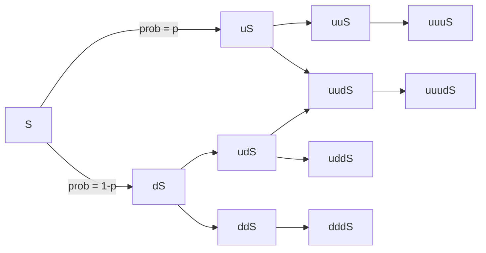
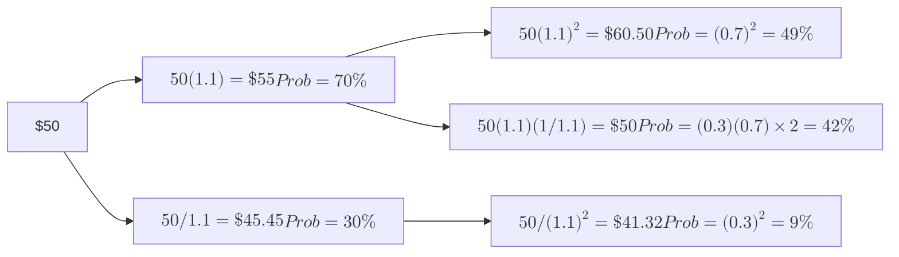

import FigureA from "./images/common-probability/figureA.png";
import FigureB from "./images/common-probability/figureB.png";
import FigureC from "./images/common-probability/figureC.png";
import FigureD from "./images/common-probability/figureD.png";

# Common Probability Distributions

This topic review contains a lot of key material. Learn the difference between discrete and continuous probability distributions. The binomial and normal distributions are the most important here. You must learn the properties of both distributions and memorize the formulas for the probability of a particular value when given a binomial probability distribution. Learn what shortfall risk is and how to calculate and use Roy’s safety-first criterion. Know how to standardize a normally distributed random variable, use a z-table, and construct confidence intervals. These skills will be used repeatedly in the topic reviews that follow. Additionally, understand the basic features of the lognormal distribution, Monte Carlo simulation, and historical simulation. Finally, it would be a good idea to know how to get continuously compounded rates of return from holding period returns.

## 1: UNIFORM AND BINOMIAL DISTRIBUTIONS

### A: Define a probability distribution and distinguish between discrete and continuous random variables and their probability functions.

### B: Describe the set of possible outcomes of a specified discrete random variable.

A **probability distribution** describes the probabilities of all the possible outcomes for a random variable. The probabilities of all possible outcomes must sum to 1. A simple probability distribution is that for the roll of one fair die; there are six possible outcomes and each one has a probability of 1/6, so they sum to 1. The probability distribution of all the possible returns on the S&P 500 Index for the next year is a more complex version of the same idea.

A **discrete random variable** is one for which the number of possible outcomes can be counted, and for each possible outcome, there is a measurable and positive probability. An example of a discrete random variable is the number of days it will rain in a given month, because there is a countable number of possible outcomes, ranging from zero to the number of days in the month.

A **probability function**, denoted $$p(x)$$, specifies the probability that a random variable is equal to a specific value. More formally, $$p(x)$$ is the probability that random variable $$X$$ takes on the value $x$, or $$p(x) = P(X = x)$$.

The two key properties of a probability function are:

- $$0 \leq p(x) \leq 1$$.
- $$\sum p(x) = 1$$, the sum of the probabilities for **all** possible outcomes, $$x$$, for a random variable, $$X$$, equals 1.

:::info[**EXAMPLE: Evaluating a probability function**]

Consider the following function: $$X = \{1, 2, 3, 4\}$$, $$p(x) = \frac{x}{10}$$, else $$p(x) = 0$$

Determine whether this function satisfies the conditions for a probability function.

**Answer:**

Note that all of the probabilities are between 0 and 1, and the sum of all probabilities equals 1:
$$
\sum p(x) = \frac{1}{10} + \frac{2}{10} + \frac{3}{10} + \frac{4}{10} = 0.1 + 0.2 + 0.3 + 0.4 = 1
$$

Both conditions for a probability function are satisfied.

:::

A **continuous random variable** is one for which the number of possible outcomes is infinite, even if lower and upper bounds exist. The actual amount of daily rainfall between zero and 100 inches is an example of a continuous random variable because the actual amount of rainfall can take on an infinite number of values. Daily rainfall can be measured in inches, half inches, quarter inches, thousandths of inches, or even smaller increments. Thus, the number of possible daily rainfall amounts between zero and 100 inches is essentially infinite.

The assignment of probabilities to the possible outcomes for discrete and continuous random variables provides us with discrete probability distributions and continuous probability distributions. The difference between these types of distributions is most apparent for the following properties:

- For a **discrete distribution**, $$p(x) = 0$$ when $$x$$ cannot occur, or $$p(x) > 0$$ if it can. Recall that $$p(x)$$ is read: “the probability that random variable $$X = x$$.” For example, the probability of it raining on 33 days in June is zero because this cannot occur, but the probability of it raining 25 days in June has some positive value.

- For a **continuous distribution**, $$p(x) = 0$$ even though $$x$$ can occur. We can only consider $$P(x_1 \leq X \leq x_2)$$ where $$x_1$$ and $$x_2$$ are actual numbers. For example, the probability of receiving two inches of rain in June is zero because two inches is a single point in an infinite range of possible values. On the other hand, the probability of the amount of rain being between 1.999999999 and 2.000000001 inches has some positive value. In the case of continuous distributions, $$P(x_1 \leq X \leq x_2) = P(x_1 < X < x_2)$$ because $$p(x_1) = p(x_2) = 0$$.

In finance, some discrete distributions are treated as though they are continuous because the number of possible outcomes is very large. For example, the increase or decrease in the price of a stock traded on an American exchange is recorded in dollars and cents. Yet, the probability of a change of exactly \$1.33 or \$1.34 or any other specific change is almost zero. It is customary, therefore, to speak in terms of the probability of a range of possible price change, say between \$1.00 and \$2.00. In other words $$p(\text{price change} = 1.33)$$ is essentially zero, but $$P(1 < \text{price change} < 2)$$ is greater than zero.

### C: Interpret a cumulative distribution function.

### D: Calculate and interpret probabilities for a random variable, given its cumulative distribution function.

A **cumulative distribution function** (cdf), or simply *distribution function*, defines the probability that a random variable, $$X$$, takes on a value equal to or less than a specific value, $$x$$. It represents the sum, or *cumulative value*, of the probabilities for the outcomes up to and including a specified outcome. The cumulative distribution function for a random variable, $$X$$, may be expressed as $$F(X) = P(X \leq x)$$.

Consider the probability function defined earlier for $$X = \{1, 2, 3, 4\}$$, $$p(x) = \frac{x}{10}$$. For this distribution, $$F(3) = 0.6 = 0.1 + 0.2 + 0.3$$, and $$F(4) = 1 = 0.1 + 0.2 + 0.3 + 0.4$$. This means that $$F(3)$$ is the cumulative probability that outcomes 1, 2, or 3 occur, and $$F(4)$$ is the cumulative probability that one of the possible outcomes occurs.

The following figure shows an example of a cumulative distribution function (for a standard normal distribution, described later in this topic). There is a 15.87\% probability of a value less than -1. This is the total area to the left of -1 in the pdf in Panel (a), and the y-axis value of the cdf for a value of -1 in Panel (b).

**Figure: Standard Normal Probability Density and Cumulative Distribution Functions**

:::info[**EXAMPLE**: Cumulative distribution function]
Return on equity for a firm is defined as a continuous distribution over the range from $$-20\%$$ to $$+30\%$$ and has a cumulative distribution function of $$F(x) = (x + 20) / 50$$. Calculate the probability that ROE will be between $$0\%$$ and $$15\%$$.

**Answer:**

To determine the probability that ROE will be between $$0\%$$ and $$15\%$$, we can first calculate the probability that ROE will be less than or equal to $$15\%$$, or $$F(15)$$, and then subtract the probability that ROE will be less than zero, or $$F(0)$$.

$$P(0 ≤ x ≤ 15) = F(15) – F(0)$$

$$F(15) = (15 + 20) / 50 = 0.70$$

$$F(0) = (0 + 20) / 50 = 0.40$$

$$F(15) – F(0) = 0.70 – 0.40 = 0.30 = 30\%$$

:::

### E: Define a discrete uniform random variable, a Bernoulli random variable, and a binomial random variable.

### F: Calculate and interpret probabilities given the discrete uniform and the binomial distribution functions.

A discrete uniform random variable is one for which the probabilities for all possible outcomes for a discrete random variable are equal. For example, consider the discrete uniform probability distribution defined as $$X = {1, 2, 3, 4, 5}, p(x) = 0.2$$. Here, the probability for each outcome is equal to 0.2 [i.e., $$p(1) = p(2) = p(3) = p(4) = p(5) = 0.2$$]. Also, the cumulative distribution function for the *n*th outcome, $$F(x_n) = np(x)$$, and the probability for a range of outcomes is $$p(x)k$$, where $$k$$ is the number of possible outcomes in the range.

:::info[**EXAMPLE**: Discrete uniform distribution]
Determine $$p(6)$$, $$F(6)$$, and $$P(2 ≤ X ≤ 8)$$ for the discrete uniform distribution function defined as:

$$X = \{2, 4, 6, 8, 10\}, p(x) = 0.2$$

**Answer:**

$$ p(6) = 0.2 $$, since $$ p(x) = 0.2 $$ for all $$ x $$. $$ F(6) = P(X \leq 6) = np(x) = 3(0.2) = 0.6 $$. Note that $$ n = 3 $$ since 6 is the third outcome in the range of possible outcomes. $$ P(2 \leq X \leq 8) = 4(0.2) = 0.8 $$. Note that $$ k = 4 $$, since there are four outcomes in the range $$ 2 \leq X \leq 8 $$. The following figures illustrate the concepts of a probability function and cumulative distribution function for this distribution.

| X = x | Probability of x Prob (X = x) | Cumulative Distribution Function Prob (X < x)|
|-------|-------------------------------|----------------------------------------------|
| 2     | 0.20                          | 0.20                                         |
| 4     | 0.20                          | 0.40                                         |
| 6     | 0.20                          | 0.60                                         |
| 8     | 0.20                          | 0.80                                         |

Cumulative Distribution Function for $$ X \sim \text{Uniform} \{2, 4, 6, 8, 10\} $$

:::

#### The Binomial Distribution

A **binomial random variable** may be defined as the number of “successes” in a given number of trials, whereby the outcome can be either “success” or “failure.” The probability of success, $$p$$, is constant for each trial, and the trials are independent. A binomial random variable for which the number of trials is 1 is called a **Bernoulli random variable**. Think of a trial as a mini-experiment (or “Bernoulli trial”). The final outcome is the number of successes in a series of $$n$$ trials. Under these conditions, the binomial probability function defines the probability of $$x$$ successes in $$n$$ trials. It can be expressed using the following formula:

$$
p(x) = P(X = x) = (\text{number of ways to choose } x \text{ from } n)p^x(1 – p)^{n-x}
$$

where:

* *number of ways to choose x from n* = $$\frac{n!}{(n-x)!x!}$$ which may also be denoted as $$\binom{n}{x}$$ or stated as “n choose x”
* $p$ = the probability of “success” on each trial [don’t confuse it with p(x)]

So the probability of exactly $x$ successes in $n$ trials is:

$$
p(x) = \frac{n!}{(n-x)!x!}p^x(1 – p)^{n-x}
$$

:::info[**EXAMPLE**: Binomial probability]

Assuming a binomial distribution, compute the probability of drawing three black beans from a bowl of black and white beans if the probability of selecting a black bean in any given attempt is 0.6. You will draw five beans from the bowl.

Answer:

$$
P(X = 3) = p(3) = \frac{5!}{2!3!}(0.6)^3(0.4)^2 = (120/12)(0.216)(0.160) = 0.3456
$$

:::

Some intuition about these results may help you remember the calculations. Consider that a (very large) bowl of black and white beans has 60\% black beans and that each time you select a bean, you replace it in the bowl before drawing again. We want to know the probability of selecting exactly three black beans in five draws, as in the previous example.

One way this might happen is BBBWW. Since the draws are independent, the probability of this is easy to calculate. The probability of drawing a black bean is 60\%, and the probability of drawing a white bean is $$1 - 60\% = 40\%$$. Therefore, the probability of selecting BBBWW, in order, is $$0.6 \times 0.6 \times 0.6 \times 0.4 \times 0.4 = 3.456\%$$. This is the $$p^3(1 – p)^2$$ from the formula and $$p$$ is 60\%, the probability of selecting a black bean on any single draw from the bowl. BBBWW is not, however, the only way to choose exactly three black beans in five trials. Another possibility is BBWWB, and a third is BWWBB. Each of these will have exactly the same probability of occurring as our initial outcome, BBBWW. That’s why we need to answer the question of how many ways (different orders) there are for us to choose three black beans in five draws. Using the formula, there are $$ \frac{5!}{3!(5-3)!} = 10 \text{ ways;} 10 \times 3.456\% = 34.56\%$$, the answer we computed above.

#### Expected Value and Variance of a Binomial Random Variable

For a given series of $$n$$ trials, the expected number of successes, or $$E(X)$$, is given by the following formula:

expected value of $$X = E(X) = np$$

The intuition is straightforward; if we perform $$n$$ trials and the probability of success on each trial is $$p$$, we expect $$np$$ successes.

The variance of a binomial random variable is given by:

variance of $$X = np(1 - p)$$

:::info[**EXAMPLE**: Expected value of a binomial random variable]
Based on empirical data, the probability that the Dow Jones Industrial Average (DJIA) will increase on any given day has been determined to equal 0.67. Assuming that the only other outcome is that it decreases, we can state p(UP) = 0.67 and p(DOWN) = 0.33. Further, assume that movements in the DJIA are independent (i.e., an increase in one day is independent of what happened on another day).

Using the information provided, compute the expected value of the number of up days in a 5-day period.

**Answer:**

Using binomial terminology, we define success as UP, so $$p = 0.67$$. Note that the definition of success is critical to any binomial problem.

$$E(X \mid n = 5, p = 0.67) = (5)(0.67) = 3.35$$

Recall that the “|” symbol means given. Hence, the preceding statement is read as: the expected value of $$X$$ given that $$n = 5$$, and the probability of success = 67% is 3.35.

We should note that since the binomial distribution is a discrete distribution, the result $$X = 3.35$$ is not possible. However, if we were to record the results of many 5-day periods, the average number of up days (successes) would converge to 3.35.
:::

### G: Construct a binomial tree to describe stock price movement.

A binomial model can be applied to stock price movements. We just need to define the two possible outcomes and the probability that each outcome will occur. Consider a stock with current price $$S$$ that will, over the next period, either increase in value or decrease in value (the only two possible outcomes). The probability of an up-move (the **up transition probability**, $$u$$) is $$p$$ and the probability of a down-move (the **down transition probability**, $$d$$) is $$(1 - p)$$.

A **binomial tree** is constructed by showing all the possible combinations of up-moves and down-moves over a number of successive periods. For two periods, these combinations are $$uu, ud, du,$$ and $$dd$$. Each of the possible values along a binomial tree is a **node**. The following figure illustrates a binomial tree for three periods.

**Figure: A Binomial Tree**

With an initial stock price $$S = 50$$, $$u = 1.01$$, $$d = \frac{1}{1.01}$$, and $$\text{Prob}(u) = 0.6$$, we can calculate the possible stock prices after two periods as:

$$
\begin{align*}
uuS & = 1.01^2 \times 50 = 51.01 \quad \text{with probability} \quad (0.6)^2 = 0.36 \\
udS & = 1.01 \left( \frac{1}{1.01} \right) \times 50 = 50 \quad \text{with probability} \quad (0.6)(0.4) = 0.24 \\
duS & = \left( \frac{1}{1.01} \right) (1.01) \times 50 = 50 \quad \text{with probability} \quad (0.4)(0.6) = 0.24 \\
ddS & = \left( \frac{1}{1.01} \right)^2 \times 50 = 49.01 \quad \text{with probability} \quad (0.4)^2 = 0.16
\end{align*}
$$

Since a stock price of 50 can result from either $$ud$$ or $$du$$ moves, the probability of a stock price of 50 after two periods (the middle value) is $$2 \times (0.6)(0.4) = 48\%$$.

A binomial tree with $$S = 50$$, $$u = 1.1$$, and $$\text{Prob}(u) = 0.7$$ is illustrated in the following figure . Note that the middle value after two periods (50) is equal to the beginning value because $$d = \frac{1}{u}$$, a special case of the binomial model. The probability that the stock price is down (\<50) after two periods is simply the probability of two down movements, $$(1 - 0.7)^2 = 9\%$$.

**Figure: A Two-Period Binomial Tree $$S = \$50$$, $$U = 1.10$$, $$\text{Prob}(U) = 0.7$$**

One of the important applications of a binomial stock price model is in pricing options. We can make a binomial tree for asset prices more realistic by shortening the length of the periods and increasing the number of periods and possible outcomes.

### H: Define the continuous uniform distribution and calculate and interpret probabilities, given a continuous uniform distribution.

The **continuous uniform distribution** is defined over a range that spans between some lower limit, $$ a $$, and some upper limit, $$ b $$, which serve as the parameters of the distribution. Outcomes can only occur between $$ a $$ and $$ b $$, and since we are dealing with a continuous distribution, even if $$ a < x < b $$, P($$ X = x $$) = 0. Formally, the properties of a continuous uniform distribution may be described as follows:

- For all $$ a \leq x_1 < x_2 \leq b $$ (i.e., for all $$ x_1 $$ and $$ x_2 $$ between the boundaries $$ a $$ and $$ b $$).
- P($$ X < a $$ or $$ X > b $$) = 0 (i.e., the probability of $$ X $$ outside the boundaries is zero).
- P($$ x_1 \leq X \leq x_2 $$) = $$(x_2 - x_1) / (b - a)$$. This defines the probability of outcomes between $$ x_1 $$ and $$ x_2 $$.

Don’t miss how simple this is just because the notation is so mathematical. For a continuous uniform distribution, the probability of outcomes in a range that is one-half the whole range is 50\%. The probability of outcomes in a range that is one-quarter as large as the whole possible range is 25\%.

:::info[**EXAMPLE**: Continuous uniform distribution]
$$ X $$ is uniformly distributed between 2 and 12. Calculate the probability that $$ X $$ will be between 4 and 8.

**Answer:**

$$
\frac{8 - 4}{12 - 2} = \frac{4}{10} = 40\%
$$

The figure below illustrates this continuous uniform distribution. Note that the area bounded by 4 and 8 is 40\% of the total probability between 2 and 12 (which is 100\%).

**Continuous Uniform Distribution**

:::

Since outcomes are equal over equal-size possible intervals, the cdf is linear over the variable’s range. The cdf for the distribution in the example, Prob $$(X \leq x)$$, is shown in the following figure.

**Figure: CDF for a Continuous Uniform Variable**

