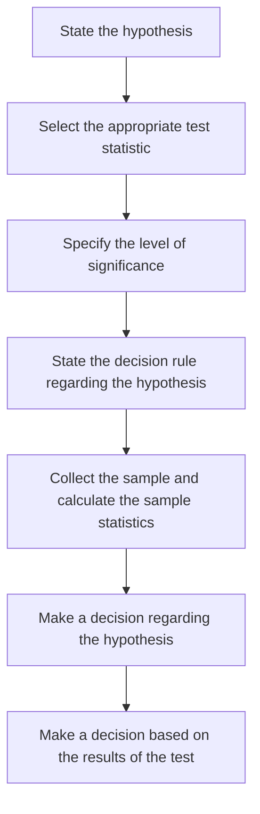

import FigureA from "./images/hypothesis-testing/figureA.png";

# Hypothesis Testing

This review addresses common hypothesis testing procedures. These procedures are used to conduct tests of population means, population variances, differences in means, differences in variances, and mean differences. Specific tests reviewed include the $z$-test, $t$-test, $\text{chi-square}$ test, and $F$-test. You should know when and how to apply each of these. A standard hypothesis testing procedure is utilized in this review. Know it! You should be able to perform a hypothesis test on the value of the mean without being given any formulas. Confidence intervals, levels of significance, the power of a test, and types of hypothesis testing errors are also discussed. Don’t worry about memorizing the messy formulas on testing for the equalities and differences in means and variances at the end of this review, but be able to interpret these statistics.

## 1: HYPOTHESIS TESTS AND TYPES OF ERRORS

Hypothesis testing is the statistical assessment of a statement or idea regarding a population. For instance, a statement could be as follows: “The mean return for the U.S. equity market is greater than zero.” Given the relevant returns data, hypothesis testing procedures can be employed to test the validity of this statement at a given significance level.

### A: Define a hypothesis, describe the steps of hypothesis testing, and describe and interpret the choice of the null and alternative hypotheses.

A hypothesis is a statement about the value of a population parameter developed for the purpose of testing a theory or belief. Hypotheses are stated in terms of the population parameter to be tested, like the population mean, $$\mu$$. For example, a researcher may be interested in the mean daily return on stock options. Hence, the hypothesis may be that the mean daily return on a portfolio of stock options is positive.

Hypothesis testing procedures, based on sample statistics and probability theory, are used to determine whether a hypothesis is a reasonable statement and should not be rejected or if it is an unreasonable statement and should be rejected. The process of hypothesis testing consists of a series of steps shown in the following figure.

**Figure: Hypothesis Testing Procedure**

#### The Null Hypothesis and Alternative Hypothesis

**The null hypothesis**, designated $$H_0$$, is the hypothesis that the researcher wants to reject. It is the hypothesis that is actually tested and is the basis for the selection of the test statistics. The null is generally stated as a simple statement about a population parameter. Typical statements of the null hypothesis for the population mean include $$H_0: \mu = \mu_0$$, $$H_0: \mu \leq \mu_0$$, and $$H_0: \mu \geq \mu_0$$, where $$\mu$$ is the population mean and $$\mu_0$$ is the hypothesized value of the population mean.

:::note[**PROFESSOR’S NOTE**]
The null hypothesis always includes the “equal to” condition.
:::

The **alternative hypothesis**, designated $$H_a$$, is what is concluded if there is sufficient evidence to reject the null hypothesis. It is usually the alternative hypothesis that you are really trying to assess. Why? Since you can never really prove anything with statistics, when the null hypothesis is discredited, the implication is that the alternative hypothesis is valid.

### B: Distinguish between one-tailed and two-tailed tests of hypotheses.

The alternative hypothesis can be one-sided or two-sided. A one-sided test is referred to as a **one-tailed test**, and a two-sided test is referred to as a **two-tailed test**. Whether the test is one- or two-sided depends on the proposition being tested. If a researcher wants to test whether the return on stock options is greater than zero, a one-tailed test should be used. However, a two-tailed test should be used if the research question is whether the return on options is simply different from zero. Two-sided tests allow for deviation on both sides of the hypothesized value (zero). In practice, most hypothesis tests are constructed as two-tailed tests.

A **two-tailed test** for the population mean may be structured as:

$$
H_0: \mu = \mu_0 \text{ versus } H_a: \mu \neq \mu_0
$$

Since the alternative hypothesis allows for values above and below the hypothesized parameter, a two-tailed test uses two **critical values** (or **rejection points**).

The *general decision rule for a two-tailed test* is:

$$
\text{Reject } H_0 \text{ if:}
\begin{cases}
\text{test statistic } > \text{upper critical value} \\
\textbf{\textit{or}}\ \text{test statistic} < \text{lower critical value}
\end{cases}
$$

Let's look at the development of the decision rule for a two-tailed test using a z-distributed test statistic (z-test) at a 5\% level of significance, $\alpha = 0.05$.

- At $\alpha = 0.05$, the computed test statistic is compared with the critical z-values of $\pm 1.96$. The values of $\pm 1.96$ correspond to $z_{\alpha/2} = \pm z_{0.025}$, which is the range of z-values within which 95\% of the probability lies. These values are obtained from the cumulative probability table for the standard normal distribution (z-table), which is included at the back of this book.

- If the computed test statistic falls outside the range of critical z-values (i.e., test statistic $> 1.96$, or test statistic $< -1.96$), we reject the null and conclude that the sample statistic is sufficiently different from the hypothesized value.

- If the computed test statistic falls within the range $\pm 1.96$, we conclude that the sample statistic is not sufficiently different from the hypothesized value ($\mu = \mu_0$ in this case), and we fail to reject the null hypothesis.

The **decision rule** (rejection rule) *for a two-tailed z-test* at $\alpha = 0.05$ can be stated as:

$$
\text{Reject } H_0 \text{ if:}
\begin{cases}
\text{test statistic } > \text{1.96} \\
\textbf{\textit{or}}\ \text{test statistic} < \text{-1.96}
\end{cases}
$$

The following figure shows the standard normal distribution for a two-tailed hypothesis test using the z-distribution. Notice that the significance level of 0.05 means that there is 0.05 / 2 = 0.025 probability (area) under each tail of the distribution beyond $\pm 1.96$.

For a **one-tailed hypothesis test** of the population mean, the null and alternative hypotheses are either:

$$
\begin{aligned}
    &\text{Upper tail: } & H_0: \mu \leq \mu_0 \ & \textbf{versus} & H_a: \mu > \mu_0 & \textit{, or} \\
    &\text{Lower tail: } & H_0: \mu \geq \mu_0 \ & \textbf{versus} & H_a: \mu < \mu_0 & \textit{.}
\end{aligned}
$$