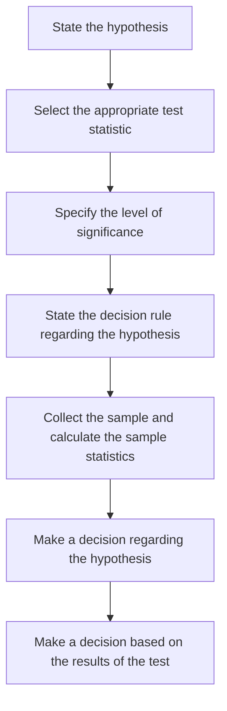

import FigureA from "./images/hypothesis-testing/figureA.png";
import FigureB from "./images/hypothesis-testing/figureB.png";

# Hypothesis Testing

This review addresses common hypothesis testing procedures. These procedures are used to conduct tests of population means, population variances, differences in means, differences in variances, and mean differences. Specific tests reviewed include the $z$-test, $t$-test, $\text{chi-square}$ test, and $F$-test. You should know when and how to apply each of these. A standard hypothesis testing procedure is utilized in this review. Know it! You should be able to perform a hypothesis test on the value of the mean without being given any formulas. Confidence intervals, levels of significance, the power of a test, and types of hypothesis testing errors are also discussed. Don’t worry about memorizing the messy formulas on testing for the equalities and differences in means and variances at the end of this review, but be able to interpret these statistics.

## 1: HYPOTHESIS TESTS AND TYPES OF ERRORS

Hypothesis testing is the statistical assessment of a statement or idea regarding a population. For instance, a statement could be as follows: “The mean return for the U.S. equity market is greater than zero.” Given the relevant returns data, hypothesis testing procedures can be employed to test the validity of this statement at a given significance level.

### A: Define a hypothesis, describe the steps of hypothesis testing, and describe and interpret the choice of the null and alternative hypotheses.

A hypothesis is a statement about the value of a population parameter developed for the purpose of testing a theory or belief. Hypotheses are stated in terms of the population parameter to be tested, like the population mean, $$\mu$$. For example, a researcher may be interested in the mean daily return on stock options. Hence, the hypothesis may be that the mean daily return on a portfolio of stock options is positive.

Hypothesis testing procedures, based on sample statistics and probability theory, are used to determine whether a hypothesis is a reasonable statement and should not be rejected or if it is an unreasonable statement and should be rejected. The process of hypothesis testing consists of a series of steps shown in the following figure.

**Figure: Hypothesis Testing Procedure**

#### The Null Hypothesis and Alternative Hypothesis

**The null hypothesis**, designated $$H_0$$, is the hypothesis that the researcher wants to reject. It is the hypothesis that is actually tested and is the basis for the selection of the test statistics. The null is generally stated as a simple statement about a population parameter. Typical statements of the null hypothesis for the population mean include $$H_0: \mu = \mu_0$$, $$H_0: \mu \leq \mu_0$$, and $$H_0: \mu \geq \mu_0$$, where $$\mu$$ is the population mean and $$\mu_0$$ is the hypothesized value of the population mean.

:::note[**PROFESSOR’S NOTE**]
The null hypothesis always includes the “equal to” condition.
:::

The **alternative hypothesis**, designated $$H_a$$, is what is concluded if there is sufficient evidence to reject the null hypothesis. It is usually the alternative hypothesis that you are really trying to assess. Why? Since you can never really prove anything with statistics, when the null hypothesis is discredited, the implication is that the alternative hypothesis is valid.

### B: Distinguish between one-tailed and two-tailed tests of hypotheses.

The alternative hypothesis can be one-sided or two-sided. A one-sided test is referred to as a **one-tailed test**, and a two-sided test is referred to as a **two-tailed test**. Whether the test is one- or two-sided depends on the proposition being tested. If a researcher wants to test whether the return on stock options is greater than zero, a one-tailed test should be used. However, a two-tailed test should be used if the research question is whether the return on options is simply different from zero. Two-sided tests allow for deviation on both sides of the hypothesized value (zero). In practice, most hypothesis tests are constructed as two-tailed tests.

A **two-tailed test** for the population mean may be structured as:

$$
H_0: \mu = \mu_0 \text{ versus } H_a: \mu \neq \mu_0
$$

Since the alternative hypothesis allows for values above and below the hypothesized parameter, a two-tailed test uses two **critical values** (or **rejection points**).

The *general decision rule for a two-tailed test* is:

$$
\text{Reject } H_0 \text{ if:}
\begin{cases}
\text{test statistic } > \text{upper critical value} \\
\textbf{\textit{or}}\ \text{test statistic} < \text{lower critical value}
\end{cases}
$$

Let's look at the development of the decision rule for a two-tailed test using a z-distributed test statistic (z-test) at a 5\% level of significance, $\alpha = 0.05$.

- At $\alpha = 0.05$, the computed test statistic is compared with the critical z-values of $\pm 1.96$. The values of $\pm 1.96$ correspond to $z_{\alpha/2} = \pm z_{0.025}$, which is the range of z-values within which 95\% of the probability lies. These values are obtained from the cumulative probability table for the standard normal distribution (z-table), which is included at the back of this book.

- If the computed test statistic falls outside the range of critical z-values (i.e., test statistic $> 1.96$, or test statistic $< -1.96$), we reject the null and conclude that the sample statistic is sufficiently different from the hypothesized value.

- If the computed test statistic falls within the range $\pm 1.96$, we conclude that the sample statistic is not sufficiently different from the hypothesized value ($\mu = \mu_0$ in this case), and we fail to reject the null hypothesis.

The **decision rule** (rejection rule) *for a two-tailed z-test* at $\alpha = 0.05$ can be stated as:

$$
\text{Reject } H_0 \text{ if:}
\begin{cases}
\text{test statistic } > \text{1.96} \\
\textbf{\textit{or}}\ \text{test statistic} < \text{-1.96}
\end{cases}
$$

The following figure shows the standard normal distribution for a two-tailed hypothesis test using the z-distribution. Notice that the significance level of 0.05 means that there is 0.05 / 2 = 0.025 probability (area) under each tail of the distribution beyond $\pm 1.96$.

For a **one-tailed hypothesis test** of the population mean, the null and alternative hypotheses are either:

$$
\begin{aligned}
* &\text{Upper tail: } & H_0: \mu \leq \mu_0 \ & \textbf{versus} & H_a: \mu > \mu_0 & \textit{, or} \\
* &\text{Lower tail: } & H_0: \mu \geq \mu_0 \ & \textbf{versus} & H_a: \mu < \mu_0 & \textit{.}
\end{aligned}
$$

The appropriate set of hypotheses depends on whether we believe the population mean, μ, to be greater than (upper tail) or less than (lower tail) the hypothesized value, μ₀. Using a z-test at the 5% level of significance, the computed test statistic is compared with the critical values of 1.645 for the upper tail tests (i.e., $$H_{a}: \mu > \mu_{0}$$) or -1.645 for lower tail tests (i.e., $$H_{a}: \mu < \mu_{0}$$). These critical values are obtained from a z-table, where $$-z_{0.05} = -1.645$$ corresponds to a cumulative probability equal to 5\%, and the $$z_{0.05} = 1.645$$ corresponds to a cumulative probability of 95\% (1 - 0.05).

Let’s use the upper tail test structure where $$H_{0}: \mu \leq \mu_{0}$$ and $$H_{a}: \mu > \mu_{0}$$.

- If the calculated test statistic is greater than 1.645, we conclude that the sample statistic is sufficiently greater than the hypothesized value. In other words, we reject the null hypothesis.
- If the calculated test statistic is less than 1.645, we conclude that the sample statistic is not sufficiently different from the hypothesized value, and we fail to reject the null hypothesis.

The following figure shows the standard normal distribution and the rejection region for a one-tailed test (upper tail) at the 5\% level of significance.

**Figure: One-Tailed Hypothesis Test Using the Standard Normal (z) Distribution**

#### The Choice of the Null and Alternative Hypotheses

The most common null hypothesis will be an “equal to” hypothesis. Combined with a “not equal to” alternative, this will require a two-tailed test. The alternative is often the hoped-for hypothesis. The null will include the “equal to” sign and the alternative will include the “not equal to” sign. When the null is that a coefficient is equal to zero, we hope to reject it and show the significance of the relationship.

When the null is less than or equal to, the (mutually exclusive) alternative is framed as greater than, and a one-tail test is appropriate. If we are trying to demonstrate that a return is greater than the risk-free rate, this would be the correct formulation. We will have set up the null and alternative hypothesis so that rejection of the null will lead to acceptance of the alternative, our goal in performing the test. As with a two-tailed test, the null for a one-tailed test will include the “equal to” sign (i.e., either “greater than or equal to” or “less than or equal to”). The alternative will include the opposite sign to the null—either “less than” or “greater than.”

### C: Explain a test statistic, Type I and Type II errors, a significance level, and how significance levels are used in hypothesis testing.

Hypothesis testing involves two statistics: the test statistic calculated from the sample data and the critical value of the test statistic. The value of the computed test statistic relative to the critical value is a key step in assessing the validity of a hypothesis.

A test statistic is calculated by comparing the point estimate of the population parameter with the hypothesized value of the parameter (i.e., the value specified in the null hypothesis). With reference to our option return example, this means we are concerned with the difference between the mean return of the sample (i.e., $$ \bar{x} = 0.001 $$) and the hypothesized mean return (i.e., $$ H_0: \mu = 0 $$). As indicated in the following expression, the test statistic is the difference between the sample statistic and the hypothesized value, scaled by the standard error of the sample statistic.

$$
\text{test statistic} = \frac{\text{sample statistic} - \text{hypothesized value}}{\text{standard error of the sample statistic}}
$$

The standard error of the sample statistic is the adjusted standard deviation of the sample. When the sample statistic is the sample mean, $$ \bar{x} $$, the standard error of the sample statistic for sample size $$ n $$ is calculated as:

$$
\sigma_{\bar{x}} = \frac{\sigma}{\sqrt{n}}
$$

when the population standard deviation, $$ \sigma $$, is known, or

$$
s_{\bar{x}} = \frac{s}{\sqrt{n}}
$$

when the population standard deviation, $$ \sigma $$, is not known. In this case, it is estimated using the standard deviation of the sample, $$ s $$.

:::note[**PROFESSOR'S NOTE**]
Don't be confused by the notation here. A lot of the literature you will encounter in your studies simply uses the term $$ \sigma_{\bar{x}} $$ for the standard error of the test statistic, regardless of whether the population standard deviation or sample standard deviation was used in its computation.
:::

As you will soon see, a test statistic is a random variable that may follow one of several distributions, depending on the characteristics of the sample and the population. We will look at four distributions for test statistics: the t-distribution, the z-distribution (standard normal distribution), the chi-square distribution, and the F-distribution. The critical value for the appropriate test statistic—the value against which the computed test statistic is compared—depends on its distribution.

#### Type I and Type II Errors

Keep in mind that hypothesis testing is used to make inferences about the parameters of a given population on the basis of statistics computed for a sample that is drawn from that population. We must be aware that there is some probability that the sample, in some way, does not represent the population, and any conclusion based on the sample about the population may be made in error.

When drawing inferences from a hypothesis test, there are two types of errors:

- **Type I error**: the rejection of the null hypothesis when it is actually true.
- **Type II error**: the failure to reject the null hypothesis when it is actually false.

The **significance level** is the probability of making a Type I error (rejecting the null when it is true) and is designated by the Greek letter alpha ($$\alpha$$). For instance, a significance level of 5% ($$\alpha = 0.05$$) means there is a 5% chance of rejecting a true null hypothesis. When conducting hypothesis tests, a significance level must be specified in order to identify the critical values needed to evaluate the test statistic.

### D: Explain a decision rule, the power of a test, and the relation between confidence intervals and hypothesis tests.

The decision for a hypothesis test is to either reject the null hypothesis or fail to reject the null hypothesis. Note that it is statistically incorrect to say "accept" the null hypothesis; it can only be supported or rejected. The decision rule for rejecting or failing to reject the null hypothesis is based on the distribution of the test statistic. For example, if the test statistic follows a normal distribution, the decision rule is based on critical values determined from the standard normal distribution (z-distribution). Regardless of the appropriate distribution, it must be determined if a one-tailed or two-tailed hypothesis test is appropriate before a decision rule (rejection rule) can be determined.

A decision rule is specific and quantitative. Once we have determined whether a one- or two-tailed test is appropriate, the significance level we require, and the distribution of the test statistic, we can calculate the exact critical value for the test statistic. Then we have a decision rule of the following form: if the test statistic is (greater, less) than the value X, reject the null hypothesis.

#### The Power of a Test

While the significance level of a test is the probability of rejecting the null hypothesis when it is true, the power of a test is the probability of correctly rejecting the null hypothesis when it is false. The power of a test is actually one minus the probability of making a Type II error, or $$1 - P(\text{Type II error})$$. In other words, the probability of rejecting the null when it is false (power of the test) equals one minus the probability of not rejecting the null when it is false (Type II error). When more than one test statistic may be used, the power of the test for the competing test statistics may be useful in deciding which test statistic to use. Ordinarily, we wish to use the test statistic that provides the most powerful test among all possible tests.

The following figure shows the relationship between the level of significance, the power of a test, and the two types of errors.

**Figure: Type I and Type II Errors in Hypothesis Testing**

||True Condition   |True Condition|
|---------------|:----------------:|:-------------------:|
| **Decision**   | $$H_0$$ **is true**  | $$H_0$$ **is false** |
| Do not reject $$H_0$$ | Correct decision  | Incorrect decision   **Type II error**|
| Reject $$H_0$$    | Incorrect decision **Type I error**  *Significance level*, $$\alpha$$   =P(Type I error)| Correct decision *Power of the test*   = $$1 - P(\text{Type II error})$$) | 

Sample size and the choice of significance level (Type I error probability) will together determine the probability of a Type II error. The relation is not simple, however, and calculating the probability of a Type II error in practice is quite difficult. Decreasing the significance level (probability of a Type I error) from 5% to 1%, for example, will increase the probability of failing to reject a false null (Type II error) and therefore reduce the power of the test. Conversely, for a given sample size, we can increase the power of a test only with the cost that the probability of rejecting a true null (Type I error) increases. For a given significance level, we can decrease the probability of a Type II error and increase the power of a test, only by increasing the sample size.

#### The Relation Between Confidence Intervals and Hypothesis Tests

A confidence interval is a range of values within which the researcher believes the true population parameter may lie.

A confidence interval is determined as:

$$
\left[ 
\begin{array}{c}
\text{sample} \\
\text{statistic} 
\end{array} 
- \left( 
\begin{array}{c}
\text{critical} \\
\text{value} 
\end{array} \right) 
\left( 
\begin{array}{c}
\text{standard} \\
\text{error} 
\end{array} \right) \right] 
\leq 
\begin{array}{c}
\text{population} \\
\text{parameter} 
\end{array} 
\leq \left[ 
\begin{array}{c}
\text{sample} \\
\text{statistic} 
\end{array} 
+ \left( 
\begin{array}{c}
\text{critical} \\
\text{value} 
\end{array} \right)
\left( 
\begin{array}{c}
\text{standard} \\
\text{error} 
\end{array} \right) \right]
$$

The interpretation of a confidence interval is that for a level of confidence of 95%, for example, there is a 95% probability that the true population parameter is contained in the interval.

From the previous expression, we see that a confidence interval and a hypothesis test are linked by the critical value. For example, a 95% confidence interval uses a critical value associated with a given distribution at the 5% level of significance. Similarly, a hypothesis test would compare a test statistic to a critical value at the 5% level of significance. To see this relationship more clearly, the expression for the confidence interval can be manipulated and restated as:

$$
-\text{{critical value}} \leq \text{{test statistic}} \leq +\text{{critical value}}
$$

This is the range within which we fail to reject the null for a two-tailed hypothesis test at a given level of significance.

:::info[**EXAMPLE**: Confidence intervals and two-tailed hypothesis tests]

A researcher has gathered data on the daily returns on a portfolio of call options over a recent 250-day period. The mean daily return has been 0.1\%, and the sample standard deviation of daily portfolio returns is 0.25\%. The researcher believes that the mean daily portfolio return is not equal to zero.

1. Construct a 95\% confidence interval for the population mean daily return over the 250-day sample period.
2. Construct a hypothesis test of the researcher's belief.

**Answer:**

1. Given a sample size of 250 with a standard deviation of 0.25\%, the standard error can be computed as 

$$
s_{\bar{x}} = \frac{s}{\sqrt{n}} = \frac{0.25}{\sqrt{250}} = 0.0158\%.
$$

At the 5\% level of significance, the critical z-values for the confidence interval are ±0.025 = 1.96 and ±0.025 = -1.96. Thus, given a sample mean equal to 0.1\%, the 95\% confidence interval for the population mean is:

$$
0.1 - 1.96(0.0158) \leq \mu \leq 0.1 + 1.96(0.0158)
$$

or

$$
0.069\% \leq \mu \leq 0.131\%.
$$

2. First we need to specify the null and alternative hypotheses. The null hypothesis is the one researcher expects to reject.

$$
H_0: \mu = 0 \text{ versus } H_a: \mu \neq 0
$$

Since the null hypothesis is an equality, this is a two-tailed test. At a 5\% level of significance, the critical z-values for a two-tailed test are ±1.96, so the decision rule can be stated as:

Reject $H_0$ if test statistic $<-1.96$ or test statistic $>+1.96$

Using the standard error of the sample mean we calculated above, our test statistic is:

$$
z = \frac{0.001 - 0}{0.00158} = 6.33
$$

Since 6.33 > 1.96, we reject the null hypothesis that the mean daily option return is equal to zero.

Notice the similarity of this analysis with our confidence interval. We rejected the hypothesis $\mu = 0$ because the sample mean of 0.1\% is more than 1.96 standard errors from zero. Based on the 95\% confidence interval, we reject $\mu = 0$ because zero is more than 1.96 standard errors from the sample mean of 0.1\%.
:::

### 📝 QUIZ

1. To test whether the mean of a population is greater than 20, the appropriate null hypothesis is that the population mean is:

* A. less than 20.
* B. greater than 20.
* C. less than or equal to 20.

2. Which of the following statements about hypothesis testing is most accurate?

* A. A Type II error is rejecting the null when it is actually true.
* B. The significance level equals one minus the probability of a Type I error.
* C. A two-tailed test with a significance level of 5\% has z-critical values of $$\pm 1.96$$.

3. For a hypothesis test with a probability of a Type II error of 60\% and a probability of a Type I error of 5\%, which of the following statements is most accurate?

* A. The power of the test is 40\%, and there is a 5\% probability that the test statistic will exceed the critical value(s).
* B. There is a 95\% probability that the test statistic will be between the critical values if this is a two-tailed test.
* C. There is a 5\% probability that the null hypothesis will be rejected when actually true, and the probability of rejecting the null when it is false is 40\%.

4. If the significance level of a test is 0.05 and the probability of a Type II error is 0.15, what is the power of the test?

* A. 0.850.
* B. 0.950.
* C. 0.975.