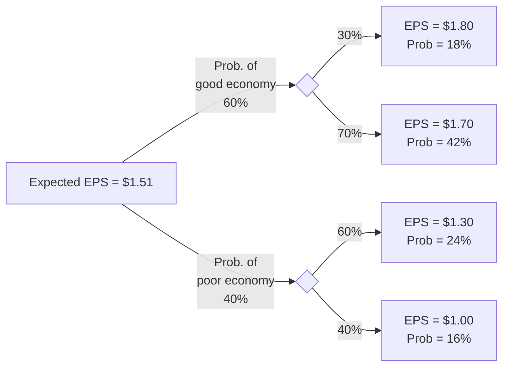

import Figure1 from "./images/probability/figure1.png";

# Probability Concepts

This topic review covers important terms and concepts associated with probability theory. Random variables, events, outcomes, conditional probability, and joint probability are described. Probability rules such as the addition rule and multiplication rule are introduced. These rules are frequently used by finance practitioners. Expected value, standard deviation, covariance, and correlation for individual asset and portfolio returns are discussed. A well-prepared candidate will be able to calculate and interpret these widely used measures. This review also discusses counting rules, which lay the foundation for the binomial probability distribution that is covered in the next topic review.

## 1: CONDITIONAL AND JOINT PROBABILITIES

### A: Define a random variable, an outcome, an event, mutually exclusive events, and exhaustive events.

- **A random variable** is an uncertain quantity/number.
- **An outcome** is an observed value of a random variable.
- **An event** is a single outcome or a set of outcomes.
- **Mutually exclusive events** are events that cannot both happen at the same time.
- **Exhaustive events** are those that include all possible outcomes.

Consider rolling a 6-sided die. The number that comes up is a **random variable**. If you roll a 4, that is an **outcome**. Rolling a 4 is an **event**, and rolling an even number is an **event**. Rolling a 4 and rolling a 6 are **mutually exclusive events**. Rolling an even number and rolling an odd number is a set of mutually exclusive and **exhaustive events**.

### B: State the two defining properties of probability and distinguish among empirical, subjective, and a priori probabilities.

There are **two defining properties of probability**.

- The probability of occurrence of any event ($E_i$) is between 0 and 1 (i.e., $0 \leq P(E_i) \leq 1$).
- If a set of events, $E_1, E_2, \ldots, E_n$, is mutually exclusive and exhaustive, the probabilities of those events sum to 1 (i.e., $\sum P(E_i) = 1$).

The first of the defining properties introduces the term $P(E_i)$, which is shorthand for the “probability of event i.” If $P(E_i) = 0$, the event will never happen. If $P(E_i) = 1$, the event is certain to occur, and the outcome is not random.

The probability of rolling any one of the numbers 1–6 with a fair die is $1/6 = 0.1667 = 16.7\%$. The set of events—rolling a number equal to 1, 2, 3, 4, 5, or 6—is exhaustive, and the individual events are mutually exclusive, so the probability of this set of events is equal to 1. We are certain that one of the values in this set of events will occur.

An **empirical probability** is established by analyzing past data. An **a priori probability** is determined using a formal reasoning and inspection process. A **subjective probability** is the least formal method of developing probabilities and involves the use of personal judgment. An analyst may know many things about a firm’s performance and have expectations about the overall market that are all used to arrive at a subjective probability, such as, “I believe there is a 70\% probability that Acme Foods will outperform the market this year.” Empirical and a priori probabilities, by contrast, are **objective probabilities**.

### C: State the probability of an event in terms of odds for and against the event.

Stating the **odds** that an event will or will not occur is an alternative way of expressing probabilities. Consider an event that has a probability of occurrence of 0.125, which is one-eighth. The odds that the event will occur are $\frac{0.125}{(1 - 0.125)} = \frac{1/8}{7/8} = \frac{1}{7}$, which we state as, “the odds for the event occurring are one-to-seven.” The odds against the event occurring are the reciprocal of $1/7$, which is seven-to-one.

We can also get the probability of an event from the odds by reversing these calculations. If we know that the odds for an event are one-to-six, we can compute the probability of occurrence as $\frac{1}{1+6} = \frac{1}{7} = 0.1429 = 14.29\%$. Alternatively, the probability that the event will not occur is $\frac{6}{1+6} = \frac{6}{7} = 0.8571 = 85.71\%$.

:::note[**PROFESSOR’S NOTE**]
While I am quite familiar with the use of odds rather than probabilities at the horse track, I can’t remember encountering odds for a stock or bond. The use of odds at the horse track lets you know how much you will win per \$1 bet on a horse (less the track’s percentage). If you bet on a 15-1 long shot and the horse wins, you will receive \$15 and your \$1 bet will be returned, so the profit is \$15. Of course, if the horse loses, you would lose the \$1 you bet and the “profit” is -\$1.

One last point is that the expected return on the bet is zero, based on the probability of winning expressed in the odds. The probability of the horse winning when the odds are 15-to-1 is $\frac{1}{15+1} = \frac{1}{16}$ and the probability of the horse losing is $15/16$. The expected profit is $$\frac{1}{16} \times \$15 + \frac{15}{16} \times (-\$1) = 0$$.
:::

### D: Distinguish between unconditional and conditional probabilities.

- **Unconditional probability** (a.k.a. **marginal probability**) refers to the probability of an event regardless of the past or future occurrence of other events. If we are concerned with the probability of an economic recession, regardless of the occurrence of changes in interest rates or inflation, we are concerned with the unconditional probability of a recession.

- **A conditional probability** is one where the occurrence of one event affects the probability of the occurrence of another event. For example, we might be concerned with the probability of a recession **given** that the monetary authority increases interest rates. This is a conditional probability. The key word to watch for here is “given.” Using probability notation, “the probability of A **given** the occurrence of B” is expressed as $$P(A | B)$$, where the vertical bar ($$|$$) indicates “given,” or “conditional upon.” For our interest rate example above, the probability of a recession **given** an increase in interest rates is expressed as $$P(\text{recession}\ | \ \text{increase in interest rates})$$. A conditional probability of an occurrence is also called its **likelihood**.

### E: Explain the multiplication, addition, and total probability rules.

The **multiplication rule of probability** is used to determine the joint probability of two events:

$$
P(AB) = P(A \mid B) \times P(B)
$$

The **addition rule of probability** is used to determine the probability that at least one of two events will occur:

$$
P(A \text{ or } B) = P(A) + P(B) - P(AB)
$$

The **total probability rule** is used to determine the unconditional probability of an event, given conditional probabilities:

$$
P(A) = P(A \mid B_1)P(B_1) + P(A \mid B_2)P(B_2) + \ldots + P(A \mid B_N)P(B_N)
$$

where $$ B_1, B_2, \ldots B_N $$ is a mutually exclusive and exhaustive set of outcomes.

### F: Calculate and interpret 1) the joint probability of two events, 2) the probability that at least one of two events will occur, given the probability of each and the joint probability of the two events, and 3) a joint probability of any number of independent events.

The **joint probability** of two events is the probability that they will both occur. We can calculate this from the conditional probability that A will occur given B occurs (a conditional probability) and the probability that B will occur (the unconditional probability of B). This calculation is sometimes referred to as the **multiplication rule of probability**. Using the notation for conditional and unconditional probabilities we can express this rule as:

$$
P(AB) = P(A | B) \times P(B)
$$

This expression is read as follows: “The joint probability of A and B, $$P(AB)$$, is equal to the conditional probability of A given B, $$P(A | B)$$, times the unconditional probability of B, $$P(B)$$.”

This relationship can be rearranged to define the conditional probability of A given B as follows:

$$
P(A|B) = \frac{P(AB)}{P(B)}
$$

:::info[**EXAMPLE**: Multiplication rule of probability]
Consider the following information:

- P(I) = 0.4, the probability of the monetary authority increasing interest rates (I) is 40%.
- P(R | I) = 0.7, the probability of a recession (R) given an increase in interest rates is 70%.

What is P(RI), the joint probability of a recession and an increase in interest rates?

**Answer:**

Applying the multiplication rule, we get the following result:

$$
\begin{align*}
P(RI) &= P(R | I) \times P(I) \\
P(RI) &= 0.7 \times 0.4 \\
P(RI) &= 0.28
\end{align*}
$$

Don’t let the cumbersome notation obscure the simple logic of this result. If an interest rate increase will occur 40% of the time and lead to a recession 70% of the time when it occurs, the joint probability of an interest rate increase and a resulting recession is (0.4)(0.7) = (0.28) = 28%.
:::

#### Calculating the Probability That at Least One of Two Events Will Occur

The **addition rule** for probabilities is used to determine the probability that at least one of two events will occur. For example, given two events, A and B, the addition rule can be used to determine the probability that either A or B will occur. If the events are *not* mutually exclusive, double counting must be avoided by subtracting the joint probability that both A and B will occur from the sum of the unconditional probabilities. This is reflected in the following general expression for the addition rule:

$$
P(A \text{ or } B) = P(A) + P(B) - P(AB)
$$

For mutually exclusive events, where the joint probability, $$P(AB)$$, is zero, the probability that either A or B will occur is simply the sum of the unconditional probabilities for each event, $$P(A \text{ or } B) = P(A) + P(B)$$.

**Figure: Venn Diagram for Events That Are Not Mutually Exclusive**

The figure illustrates the addition rule with a Venn Diagram and highlights why the joint probability must be subtracted from the sum of the unconditional probabilities. Note that if the events are **mutually exclusive** the sets do not intersect, $$P(AB) = 0$$, and the probability that one of the two events will occur is simply $$P(A) + P(B)$$.

:::info[**EXAMPLE**: Addition rule of probability]
Using the information in our previous interest rate and recession example and the fact that the unconditional probability of a recession, $$P(R)$$, is 34\%, determine the probability that either interest rates will increase or a recession will occur.

**Answer:**
Given that $$P(R) = 0.34$$, $$P(I) = 0.40$$, and $$P(RI) = 0.28$$, we can compute $$P(R \text{ or } I)$$ as follows:

$$
P(R \text{ or } I) = P(R) + P(I) - P(RI)
$$

$$
P(R \text{ or } I) = 0.34 + 0.40 - 0.28
$$

$$
P(R \text{ or } I) = 0.46
$$
:::

#### Calculating a Joint Probability of any Number of Independent Events

On the roll of two dice, the joint probability of getting two 4s is calculated as:

$$
P(4 \text{ on first die and 4 on second die}) = P(4 \text{ on first die}) \times P(4 \text{ on second die}) = \frac{1}{6} \times \frac{1}{6} = \frac{1}{36} = 0.0278
$$

On the flip of two coins, the probability of getting two heads is:

$$
P(\text{heads on first coin and heads on second coin}) = \frac{1}{2} \times \frac{1}{2} = \frac{1}{4} = 0.25
$$

*Hint*: When dealing with **independent events**, the word *`and`* indicates multiplication, and the word *`or`* indicates addition. In probability notation:

$$
P(A \textbf{ or } B) = P(A) + P(B) - P(AB), \text{ and } P(A \textbf{ and } B) = P(A) \times P(B)
$$

The multiplication rule we used to calculate the joint probability of two independent events may be applied to any number of independent events, as the following example illustrates.

:::info[**EXAMPLE**: Joint probability for more than two independent events]
**What is the probability of rolling three 4s in one simultaneous toss of three dice?**

**Answer:**
Since the probability of rolling a 4 for each die is 1/6, the probability of rolling three 4s is:

$$
P(\text{three 4s on the roll of three dice}) = \frac{1}{6} \times \frac{1}{6} \times \frac{1}{6} = \frac{1}{216} = 0.00463
$$
:::

### 📝 QUIZ

1. An event that includes all of the possible outcomes is said to be:

* A. random.
* B. exclusive.
* C. exhaustive.

2. Which of the following values cannot be the probability of an event?

* A. 0.00.
* B. 1.00.
* C. 1.25.

3. The probability that the DJIA will increase tomorrow is 2/3. The probability of an increase in the DJIA stated as odds is:

* A. two-to-one.
* B. one-to-three.
* C. two-to-three.

4. The multiplication rule of probability determines the joint probability of two events as the product of:

* A. two conditional probabilities.
* B. two unconditional probabilities.
* C. a conditional probability and an unconditional probability.

5. If events A and B are mutually exclusive, then:

* A. P(A | B) = P(A).
* B. P(AB) = P(A) x P(B).
* C. P(A or B) = P(A) + P(B).

6. At a charity ball, 800 names are put into a hat. Four of the names are identical. On a random draw, what is the probability that one of these four names will be drawn?

* A. 0.004.
* B. 0.005.
* C. 0.010.

7. Two mutually exclusive events:

* A. always occur together.
* B. cannot occur together.
* C. can sometimes occur together.

## 2: CONDITIONAL EXPECTATIONS, CORRELATION

### G: Distinguish between dependent and independent events.

Independent events refer to events for which the occurrence of one has no influence on the occurrence of the others. The definition of independent events can be expressed in terms of conditional probabilities. Events A and B are independent if and only if:

$$
P(A | B) = P(A), \text{ or equivalently, } P(B | A) = P(B)
$$

If this condition is not satisfied, the events are dependent events (i.e., the occurrence of one is dependent on the occurrence of the other).

In our interest rate and recession example, recall that events I and R are not independent; the occurrence of I affects the probability of the occurrence of R. In this example, the independence conditions for I and R are violated because:

$$
P(R) = 0.34, \text{ but } P(R | I) = 0.7;
$$

the probability of a recession is greater when there is an increase in interest rates.

The best examples of independent events are found with the a priori probabilities of dice tosses or coin flips. A die has “no memory.” Therefore, the event of rolling a 4 on the second toss is independent of rolling a 4 on the first toss. This idea may be expressed as:

$$
P(4 \text{ on second toss } | 4 \text{ on first toss }) = P(4 \text{ on second toss }) = 1/6 \text{ or } 0.167
$$

The idea of independent events also applies to flips of a coin:

$$
P(\text{heads on first coin } | \text{ heads on second coin}) = P(\text{heads on first coin}) = 1/2 \text{ or } 0.50
$$

### H: Calculate and interpret an unconditional probability using the total probability rule.

The **total probability rule** highlights the relationship between unconditional and conditional probabilities of mutually exclusive and exhaustive events. It is used to explain the unconditional probability of an event in terms of probabilities that are conditional upon other events.

In general, the unconditional probability of event R,

$$
P(R) = P(R | S_1) × P(S_1) + P(R | S_2) × P(S_2) + . . . + P(R | S_N) × P(S_N)
$$

where the set of events $${S_1, S_2, . . . S_N}$$ is mutually exclusive and exhaustive.

:::info[**EXAMPLE: An investment application of unconditional probability**]
Building upon our ongoing example about interest rates and economic recession, we can assume that a recession can only occur with either of the two events—interest rates increase (I) or interest rates do not increase ($$I^C$$)—since these events are mutually exclusive and exhaustive. $$I^C$$ is read "the complement of I," which means "not I." Therefore, the probability of $$I^C$$ is $$1 - P(I)$$. It is logical, therefore, that the sum of the two joint probabilities must be the unconditional probability of a recession. This can be expressed as follows:

$$
P(R) = P(RI) + P(RI^C)
$$

Applying the multiplication rule, we may restate this expression as:

$$
P(R) = P(R | I) × P(I) + P(R | I^C) × P(I^C)
$$

Assume that $$P(R | I) = 0.70, P(R | I^C)$$, the probability of recession if interest rates do not rise, is 10% and that $$P(I) = 0.40$$ so that $$P(I^C) = 0.60$$. The unconditional probability of a recession can be calculated as follows:

$$
P(R) = P(R | I) × P(I) + P(R | I) × P(I)
\\
= (0.70)(0.40) + (0.10)(0.60)
\\
= 0.28 + 0.06 = 0.34
$$
:::

#### Expected Value

The expected value of a random variable is the weighted average of the possible outcomes for the variable. The mathematical representation for the expected value of random variable \(X\) is:

$$
E(X) = \Sigma P(x_i)x_i = P(x_1)x_1 + P(x_2)x_2 + \cdots + P(x_n)x_n
$$

:::info[**EXAMPLE**: Expected earnings per share]

The probability distribution of EPS for Ron’s Stores is given in the figure below. Calculate the expected earnings per share.

**EPS Probability Distribution**

| Probability | Earnings Per Share |
|-------------|--------------------|
| 10%         | £1.80              |
| 20%         | £1.60              |
| 40%         | £1.20              |
| 30%         | £1.00              |

**Answer:**

The expected EPS is simply a weighted average of each possible EPS, where the weights are the probabilities of each possible outcome.

$$
E[\text{EPS}] = 0.10(1.80) + 0.20(1.60) + 0.40(1.20) + 0.30(1.00) = £1.28
$$

:::

### I: Explain the use of conditional expectation in investment applications.

**Expected values or returns can be calculated using conditional probabilities.** As the name implies, *conditional expected values* are contingent upon the outcome of some other event. An analyst would use a conditional expected value to revise his expectations when new information arrives.

Consider the effect of a tariff on steel imports on the returns of a domestic steel stock. The stock’s expected return, given that the government imposes the tariff, will be higher than the expected return if the tariff is not imposed.

Using the total probability rule, we can estimate the (unconditional) expected return on the stock as the sum of the expected return given no tariff times the probability a tariff will not be enacted plus the expected return given a tariff times the probability a tariff will be enacted.

### J: Explain the use of a tree diagram to represent an investment problem.

You might well wonder where the returns and probabilities used in calculating expected values come from. A general framework called a **tree diagram** is used to show the probabilities of various outcomes. In the following figure, we have shown estimates of EPS for four different outcomes: (1) a good economy and relatively good results at the company, (2) a good economy and relatively poor results at the company, (3) a poor economy and relatively good results at the company, and (4) a poor economy and relatively poor results at the company. Using the rules of probability, we can calculate the probabilities of each of the four EPS outcomes shown in the boxes on the right-hand side of the “tree.”

The expected EPS of $1.51 is simply calculated as:

$$
0.18 \times 1.80 + 0.42 \times 1.70 + 0.24 \times 1.30 + 0.16 \times 1.00 = \$1.51
$$

Note that the probabilities of the four possible outcomes sum to 1.

**Figure: A Tree Diagram**

### K: Calculate and interpret covariance and correlation and interpret a scatterplot.

The variance and standard deviation measure the dispersion, or volatility, of only one variable. In many finance situations, however, we are interested in how two random variables move in relation to each other. For investment applications, one of the most frequently analyzed pairs of random variables is the returns of two assets. Investors and managers frequently ask questions such as, “what is the relationship between the return for Stock A and Stock B?” or, “what is the relationship between the performance of the S&P 500 and that of the automotive industry?”

**Covariance** is a measure of how two assets move together. It is the expected value of the product of the deviations of the two random variables from their respective expected values. A common symbol for the covariance between random variables X and Y is Cov(X, Y). Since we will be mostly concerned with the covariance of asset returns, the following formula has been written in terms of the covariance of the return of asset i, $$ R_i $$, and the return of asset j, $$ R_j $$:

$$
\text{Cov}(R_i, R_j) = \mathrm{E}[(R_i - \mathrm{E}(R_i))(R_j - \mathrm{E}(R_j))]
$$

The following are **properties of the covariance**:

- The covariance is a general representation of the same concept as the variance. That is, the variance measures how a random variable moves with itself, and the covariance measures how one random variable moves with another random variable.
- The covariance of $$ R_A $$ with itself is equal to the variance of $$ R_A $$; that is, $$ \text{Cov}(R_A, R_A) = \text{Var}(R_A) $$.
- The covariance may range from negative infinity to positive infinity.

To aid in the interpretation of covariance, consider the returns of a stock and of a put option on the stock. These two returns will have a negative covariance because they move in opposite directions. The returns of two automotive stocks would likely have a positive covariance, and the returns of a stock and a riskless asset would have a zero covariance because the riskless asset’s returns never move, regardless of movements in the stock’s return. While the formula for covariance given previously is correct, the method of computing the covariance of returns from a joint probability model uses a probability-weighted average of the products of the random variable’s deviations from their means for each possible outcome. The following example illustrates this calculation.

:::info[**EXAMPLE**: Covariance]

Assume that the economy can be in three possible states (S) next year: boom, normal, or slow economic growth. An expert source has calculated that $$P(boom) = 0.30, P(normal) = 0.50,\ \text{and}\ P(slow) = 0.20$$. The returns for Stock A, $$ R_A $$, and Stock B, $$ R_B $$, under each of the economic states are provided in the probability model as follows. What is the covariance of the returns for Stock A and Stock B?

**Probability Distribution of Returns**

| Event  | P(S) | $$ R_A $$ | $$ R_B $$ |
|--------|------|-----------|-----------|
| Boom   | 0.3  | 0.20      | 0.30      |
| Normal | 0.5  | 0.12      | 0.10      |
| Slow   | 0.2  | 0.05      | 0.00      |

**Answer:**

First, the expected returns for each of the stocks must be determined.

$$
E(R_A) = (0.3)(0.20) + (0.5)(0.12) + (0.2)(0.05) = 0.13
$$

$$
E(R_B) = (0.3)(0.30) + (0.5)(0.10) + (0.2)(0.00) = 0.14
$$

The covariance can now be computed using the procedure described in the following table.

**Covariance Computation**

| Event  | P(S) | $$ R_A $$ | $$ R_B $$ | $$ P(S) \times [R_A - E(R_A)] \times [R_B - E(R_B)] $$         |
|--------|------|-----------|-----------|-------------------------------------------------------------|
| Boom   | 0.3  | 0.20      | 0.30      | $$ (0.3)(0.2 - 0.13)(0.3 - 0.14) = 0.00336 $$                 |
| Normal | 0.5  | 0.12      | 0.10      | $$ (0.5)(0.12 - 0.13)(0.1 - 0.14) = 0.00020 $$                |
| Slow   | 0.2  | 0.05      | 0.00      | $$ (0.2)(0.05 - 0.13)(0 - 0.14) = 0.00224 $$                  |

$$
\text{Cov}(R_A, R_B) = \sum \{ P(S) \times [R_A - E(R_A)] \times [R_B - E(R_B)] \} = 0.00580
$$

:::

So far, we have calculated covariance from a probability model. We can also determine covariance using historical data. The calculation of the sample covariance is based on the following formula:

$$
\text{Cov}_{1,2} = \frac{\sum_{t=1}^{n}\{(R_{t,1} - \overline{R_1})(R_{t,2} - \overline{R_2})\}}{n-1}
$$

where:
- $$R_{t,1}$$ = return on Asset 1 in period $$t$$
- $$R_{t,2}$$ = return on Asset 2 in period $$t$$
- $$\overline{R_1}$$ = mean return on Asset 1
- $$\overline{R_2}$$ = mean return on Asset 2
- $$n$$ = number of periods

In practice, the covariance is difficult to interpret. This is mostly because it can take on extremely large values, ranging from negative to positive infinity, and, like the variance, these values are expressed in terms of square units.

To make the covariance of two random variables easier to interpret, it may be divided by the product of the random variables’ standard deviations. The resulting value is called the **correlation coefficient**, or simply, **correlation**. The relationship between covariances, standard deviations, and correlations can be seen in the following expression for the correlation of the returns for asset $$i$$ and $$j$$:

$$
\text{Corr} (R_i, R_j) = \frac{\text{Cov}(R_i, R_j)}{\sigma (R_i) \sigma (R_j)}
$$

which implies

$$
\text{Cov}(R_i, R_j) = \text{Corr} (R_i, R_j) \sigma (R_i) \sigma (R_j)
$$

The correlation between two random return variables may also be expressed as $$\rho(R_i,R_j)$$, or $$\rho_{i,j}$$. Correlation can be forward-looking if it uses covariance from a probability model, or backward-looking if it uses sample covariance from historical data.

Properties of correlation of two random variables $$R_i$$ and $$R_j$$ are summarized here:
- Correlation measures the strength of the linear relationship between two random variables.
- Correlation has no units.
- The correlation ranges from $$-1$$ to $$+1$$. That is, $$-1 \leq \text{Corr}(R_i, R_j) \leq +1$$.
- If $$\text{Corr}(R_i, R_j) = 1.0$$, the random variables have perfect positive correlation. This means that a movement in one random variable results in a proportional positive movement in the other relative to its mean.
- If $$\text{Corr}(R_i, R_j) = -1.0$$, the random variables have perfect negative correlation. This means that a movement in one random variable results in an exact opposite proportional movement in the other relative to its mean.
- If $$\text{Corr}(R_i, R_j) = 0$$, there is no linear relationship between the variables, indicating that prediction of $$R_i$$ cannot be made on the basis of $$R_j$$ using linear methods.
