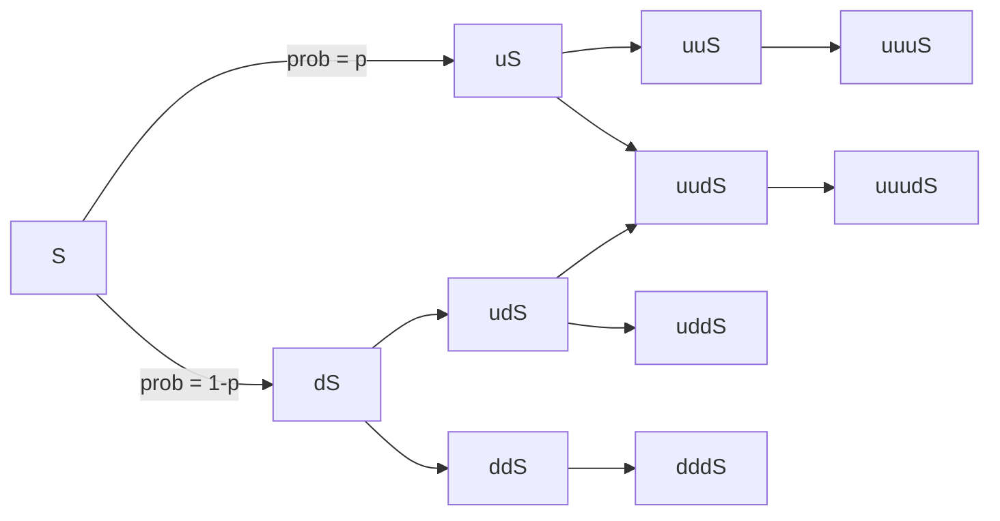
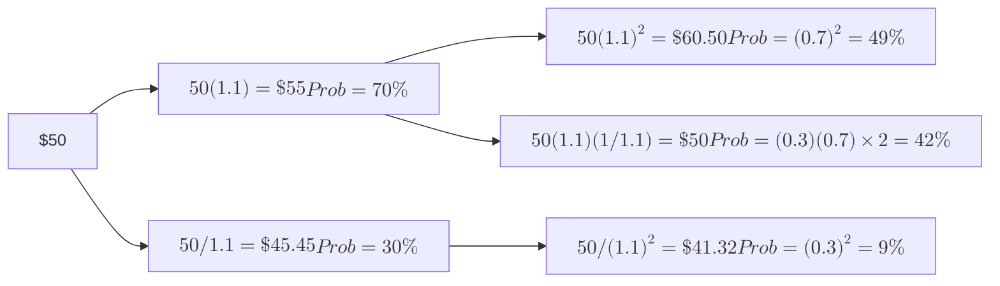

import FigureA from "./images/common-probability/figureA.png";
import FigureB from "./images/common-probability/figureB.png";
import FigureC from "./images/common-probability/figureC.png";
import FigureD from "./images/common-probability/figureD.png";
import FigureE from "./images/common-probability/figureE.png";
import FigureF from "./images/common-probability/figureF.png";
import FigureG from "./images/common-probability/figureG.png";
import FigureH from "./images/common-probability/figureH.png";

# Các Phân Phối Xác Suất Thông Thường

Bài tổng quan này chứa nhiều kiến thức quan trọng. Hãy tìm hiểu sự khác biệt giữa phân phối xác suất rời rạc và liên tục. Phân phối nhị thức và phân phối chuẩn là những phân phối quan trọng nhất ở đây. Bạn cần học các thuộc tính của cả hai phân phối và ghi nhớ các công thức cho xác suất của một giá trị cụ thể khi được đưa ra phân phối xác suất nhị thức. Tìm hiểu rủi ro thâm hụt là gì và cách tính toán và sử dụng tiêu chuẩn an toàn của Roy. Biết cách chuẩn hóa một biến ngẫu nhiên phân phối chuẩn, sử dụng bảng z, và xây dựng khoảng tin cậy. Những kỹ năng này sẽ được sử dụng lặp lại trong các bài tổng quan chủ đề tiếp theo. Ngoài ra, hãy hiểu các đặc điểm cơ bản của phân phối lognormal, mô phỏng Monte Carlo và mô phỏng lịch sử. Cuối cùng, sẽ là một ý tưởng tốt nếu biết cách nhận được tỷ suất sinh lời kép liên tục từ các khoản hoàn vốn kỳ hạn.

## 1: PHÂN PHỐI ĐỀU VÀ PHÂN PHỐI NHỊ THỨC

### A: Định nghĩa phân phối xác suất và phân biệt giữa các biến ngẫu nhiên rời rạc và liên tục và các hàm xác suất của chúng.

### B: Mô tả tập hợp các kết quả có thể có của một biến ngẫu nhiên rời rạc được chỉ định.

Một **phân phối xác suất** mô tả xác suất của tất cả các kết quả có thể có cho một biến ngẫu nhiên. Các xác suất của tất cả các kết quả có thể có phải cộng lại bằng 1. Một phân phối xác suất đơn giản là phân phối cho một lần tung một con xúc xắc công bằng; có sáu kết quả có thể có và mỗi kết quả có xác suất là 1/6, vì vậy chúng cộng lại bằng 1. Phân phối xác suất của tất cả các khoản hoàn vốn có thể có trên Chỉ số S&P 500 cho năm tới là một phiên bản phức tạp hơn của cùng một ý tưởng.

Một **biến ngẫu nhiên rời rạc** là một biến mà số lượng kết quả có thể có thể được đếm, và đối với mỗi kết quả có thể có, có một xác suất đo lường và dương. Một ví dụ về biến ngẫu nhiên rời rạc là số ngày mưa trong một tháng nhất định, vì có một số lượng kết quả có thể đếm được, từ không đến số ngày trong tháng.

Một **hàm xác suất**, ký hiệu là $$p(x)$$, xác định xác suất rằng một biến ngẫu nhiên bằng một giá trị cụ thể. Nói một cách chính xác hơn, $$p(x)$$ là xác suất rằng biến ngẫu nhiên $$X$$ nhận giá trị $x$, hay $$p(x) = P(X = x)$$.

Hai tính chất chính của hàm xác suất là:

- $$0 \leq p(x) \leq 1$$.
- $$\sum p(x) = 1$$, tổng của các xác suất cho **tất cả** các kết quả có thể, $$x$$, cho một biến ngẫu nhiên, $$X$$, bằng 1.

:::info[**VÍ DỤ: Đánh giá một hàm xác suất**]

Xét hàm sau: $$X = \{1, 2, 3, 4\}$$, $$p(x) = \frac{x}{10}$$, còn lại thì $$p(x) = 0$$

Xác định xem hàm này có thỏa mãn các điều kiện của một hàm xác suất hay không.

**Trả lời:**

Lưu ý rằng tất cả các xác suất đều nằm trong khoảng từ 0 đến 1, và tổng của tất cả các xác suất bằng 1:
$$
\sum p(x) = \frac{1}{10} + \frac{2}{10} + \frac{3}{10} + \frac{4}{10} = 0.1 + 0.2 + 0.3 + 0.4 = 1
$$

Cả hai điều kiện cho một hàm xác suất đều được thỏa mãn.

:::

Một **biến ngẫu nhiên liên tục** là biến có số kết quả có thể là vô hạn, ngay cả khi có tồn tại các giới hạn dưới và trên. Lượng mưa hàng ngày thực tế giữa không và 100 inch là một ví dụ về biến ngẫu nhiên liên tục vì lượng mưa thực tế có thể có vô số giá trị. Lượng mưa hàng ngày có thể được đo bằng inch, nửa inch, phần tư inch, phần nghìn inch, hoặc thậm chí nhỏ hơn. Do đó, số lượng các lượng mưa hàng ngày có thể xảy ra giữa không và 100 inch là vô hạn.

Việc gán xác suất cho các kết quả có thể cho các biến ngẫu nhiên rời rạc và liên tục cung cấp cho chúng ta các phân phối xác suất rời rạc và phân phối xác suất liên tục. Sự khác biệt giữa các loại phân phối này rõ ràng nhất ở các tính chất sau:

- Đối với **phân phối rời rạc**, $$p(x) = 0$$ khi $$x$$ không thể xảy ra, hoặc $$p(x) > 0$$ nếu nó có thể. Nhớ rằng $$p(x)$$ được đọc là: “xác suất rằng biến ngẫu nhiên $$X = x$$.” Ví dụ, xác suất trời mưa 33 ngày trong tháng Sáu là không vì điều này không thể xảy ra, nhưng xác suất trời mưa 25 ngày trong tháng Sáu có giá trị dương.

- Đối với **phân phối liên tục**, $$p(x) = 0$$ ngay cả khi $$x$$ có thể xảy ra. Chúng ta chỉ có thể xem xét $$P(x_1 \leq X \leq x_2)$$ nơi mà $$x_1$$ và $$x_2$$ là các số thực. Ví dụ, xác suất nhận được hai inch mưa trong tháng Sáu là không vì hai inch là một điểm duy nhất trong một dải vô hạn các giá trị có thể. Mặt khác, xác suất lượng mưa nằm trong khoảng từ 1.999999999 đến 2.000000001 inch có giá trị dương. Trong trường hợp của các phân phối liên tục, $$P(x_1 \leq X \leq x_2) = P(x_1 < X < x_2)$$ vì $$p(x_1) = p(x_2) = 0$$.

Trong tài chính, một số phân phối rời rạc được coi như liên tục vì số lượng kết quả có thể rất lớn. Ví dụ, sự tăng hoặc giảm giá của một cổ phiếu được giao dịch trên một sàn giao dịch Mỹ được ghi lại bằng đô la và xu. Tuy nhiên, xác suất của một thay đổi chính xác là \$1.33 hoặc \$1.34 hoặc bất kỳ thay đổi cụ thể nào khác gần như bằng không. Vì vậy, thường nói về xác suất của một dải thay đổi giá có thể, chẳng hạn như giữa \$1.00 và \$2.00. Nói cách khác, $$p(\text{thay đổi giá} = 1.33)$$ gần như bằng không, nhưng $$P(1 < \text{thay đổi giá} < 2)$$ lớn hơn không.

### C: Diễn giải hàm phân phối tích lũy.

### D: Tính toán và diễn giải xác suất cho một biến ngẫu nhiên, dựa trên hàm phân phối tích lũy của nó.

Một **hàm phân phối tích lũy** (cdf), hay đơn giản là *hàm phân phối*, định nghĩa xác suất rằng một biến ngẫu nhiên, $$X$$, nhận giá trị bằng hoặc nhỏ hơn một giá trị cụ thể, $$x$$. Nó đại diện cho tổng, hoặc *giá trị tích lũy*, của các xác suất cho các kết quả lên đến và bao gồm một kết quả được chỉ định. Hàm phân phối tích lũy cho một biến ngẫu nhiên, $$X$$, có thể được biểu diễn là $$F(X) = P(X \leq x)$$.

Hãy xem xét hàm xác suất đã được định nghĩa trước đó cho $$X = \{1, 2, 3, 4\}$$, $$p(x) = \frac{x}{10}$$. Với phân phối này, $$F(3) = 0.6 = 0.1 + 0.2 + 0.3$$, và $$F(4) = 1 = 0.1 + 0.2 + 0.3 + 0.4$$. Điều này có nghĩa là $$F(3)$$ là xác suất tích lũy rằng các kết quả 1, 2, hoặc 3 xảy ra, và $$F(4)$$ là xác suất tích lũy rằng một trong những kết quả có thể xảy ra.

Hình sau đây minh họa một ví dụ về hàm phân phối tích lũy (cho phân phối chuẩn, được mô tả sau trong chủ đề này). Có xác suất 15.87\% của một giá trị nhỏ hơn -1. Đây là tổng diện tích bên trái của -1 trong pdf ở hình (a), và giá trị trục y của cdf cho một giá trị của -1 trong hình (b).

**Hình: Hàm mật độ xác suất chuẩn và hàm phân phối tích lũy**

:::info[**EXAMPLE**: Hàm phân phối tích lũy]
Lợi nhuận trên vốn chủ sở hữu (ROE) cho một công ty được định nghĩa là một phân phối liên tục trong khoảng từ $$-20\%$$ đến $$+30\%$$ và có hàm phân phối tích lũy là $$F(x) = (x + 20) / 50$$. Tính xác suất rằng ROE sẽ nằm trong khoảng từ $$0\%$$ đến $$15\%$$.

**Trả lời:**

Để xác định xác suất rằng ROE sẽ nằm trong khoảng từ $$0\%$$ đến $$15\%$$, chúng ta có thể tính xác suất rằng ROE sẽ nhỏ hơn hoặc bằng $$15\%$$, hoặc $$F(15)$$, và sau đó trừ đi xác suất rằng ROE sẽ nhỏ hơn không, hoặc $$F(0)$$.

$$P(0 ≤ x ≤ 15) = F(15) – F(0)$$

$$F(15) = (15 + 20) / 50 = 0.70$$

$$F(0) = (0 + 20) / 50 = 0.40$$

$$F(15) – F(0) = 0.70 – 0.40 = 0.30 = 30\%$$

:::

### E: Định nghĩa biến ngẫu nhiên rời rạc đều, biến ngẫu nhiên Bernoulli và biến ngẫu nhiên nhị thức.

### F: Tính toán và giải thích xác suất dựa trên hàm phân phối rời rạc đều và nhị thức.

Một biến ngẫu nhiên rời rạc đều là một biến ngẫu nhiên rời rạc có xác suất cho tất cả các kết quả có thể xảy ra là bằng nhau. Ví dụ, xem xét phân phối xác suất rời rạc đều được định nghĩa là $$X = \{1, 2, 3, 4, 5\}, p(x) = 0.2$$. Ở đây, xác suất cho mỗi kết quả là bằng 0.2 [tức là, $$p(1) = p(2) = p(3) = p(4) = p(5) = 0.2$$]. Ngoài ra, hàm phân phối tích lũy cho kết quả thứ *n*, $$F(x_n) = np(x)$$, và xác suất cho một khoảng kết quả là $$p(x)k$$, trong đó $$k$$ là số lượng kết quả có thể trong khoảng đó.

:::info[**EXAMPLE**: Phân phối rời rạc đều]
Xác định $$p(6)$$, $$F(6)$$, và $$P(2 ≤ X ≤ 8)$$ cho hàm phân phối rời rạc đều được định nghĩa như sau:

$$X = \{2, 4, 6, 8, 10\}, p(x) = 0.2$$

**Trả lời:**

$$ p(6) = 0.2 $$, vì $$ p(x) = 0.2 $$ cho tất cả $$ x $$. $$ F(6) = P(X \leq 6) = np(x) = 3(0.2) = 0.6 $$. Lưu ý rằng $$ n = 3 $$ vì 6 là kết quả thứ ba trong các kết quả có thể xảy ra. $$ P(2 \leq X \leq 8) = 4(0.2) = 0.8 $$. Lưu ý rằng $$ k = 4 $$, vì có bốn kết quả trong khoảng $$ 2 \leq X \leq 8 $$.

| X = x | Xác suất của x (Prob (X = x)) | Hàm phân phối tích lũy (Prob (X < x))|
|-------|-------------------------------|--------------------------------------|
| 2     | 0.20                          | 0.20                                 |
| 4     | 0.20                          | 0.40                                 |
| 6     | 0.20                          | 0.60                                 |
| 8     | 0.20                          | 0.80                                 |

Hàm phân phối tích lũy cho $$ X \sim \text{Uniform} \{2, 4, 6, 8, 10\} $$

:::

#### Phân phối nhị thức

Một **biến ngẫu nhiên nhị thức** có thể được định nghĩa là số lần "thành công" trong một số lần thử nghiệm nhất định, trong đó kết quả có thể là "thành công" hoặc "thất bại." Xác suất thành công, $p$, là không đổi cho mỗi lần thử, và các lần thử là độc lập. Một biến ngẫu nhiên nhị thức mà số lần thử là 1 được gọi là **biến ngẫu nhiên Bernoulli**. Hãy nghĩ về một lần thử như một thí nghiệm nhỏ (hoặc "thử nghiệm Bernoulli"). Kết quả cuối cùng là số lần thành công trong một loạt $n$ lần thử. Trong những điều kiện này, hàm xác suất nhị thức định nghĩa xác suất của $x$ lần thành công trong $n$ lần thử. Nó có thể được biểu diễn bằng công thức sau:

$$
p(x) = P(X = x) = (\text{number of ways to choose } x \text{ from } n)p^x(1 – p)^{n-x}
$$

trong đó:

* *số cách chọn x từ n* = $$\frac{n!}{(n-x)!x!}$$ có thể được ký hiệu là $$\binom{n}{x}$$ hoặc nói là "n chọn x"
* $p$ = xác suất của "thành công" trong mỗi lần thử [đừng nhầm lẫn với p(x)]

Vì vậy, xác suất của chính xác $x$ lần thành công trong $n$ lần thử là:

$$
p(x) = \frac{n!}{(n-x)!x!}p^x(1 – p)^{n-x}
$$

:::info[**VÍ DỤ**: Xác suất nhị thức]

Giả sử một phân phối nhị thức, tính xác suất rút được ba hạt đậu đen từ một bát đậu đen và đậu trắng nếu xác suất chọn một hạt đậu đen trong bất kỳ lần thử nào là 0.6. Bạn sẽ rút năm hạt đậu từ bát.

Trả lời:

$$
P(X = 3) = p(3) = \frac{5!}{2!3!}(0.6)^3(0.4)^2 = (120/12)(0.216)(0.160) = 0.3456
$$

:::

Một chút trực giác về những kết quả này có thể giúp bạn nhớ các phép tính. Hãy xem xét một bát đậu đen và đậu trắng (rất lớn) có 60\% là đậu đen và mỗi lần bạn chọn một hạt đậu, bạn thay thế nó vào bát trước khi rút lại. Chúng ta muốn biết xác suất chọn chính xác ba hạt đậu đen trong năm lần rút, như trong ví dụ trước.

Một cách để điều này xảy ra là BBBWW. Vì các lần rút là độc lập, xác suất của điều này rất dễ tính. Xác suất chọn một hạt đậu đen là 60\%, và xác suất chọn một hạt đậu trắng là $$1 - 60\% = 40\%$$. Do đó, xác suất chọn BBBWW, theo thứ tự, là $$0.6 \times 0.6 \times 0.6 \times 0.4 \times 0.4 = 3.456\%$$. Đây là $$p^3(1 – p)^2$$ từ công thức và $$p$$ là 60\%, xác suất chọn một hạt đậu đen trong bất kỳ lần rút nào từ bát. Tuy nhiên, BBBWW không phải là cách duy nhất để chọn chính xác ba hạt đậu đen trong năm lần thử. Một khả năng khác là BBWWB, và khả năng thứ ba là BWWBB. Mỗi trường hợp này sẽ có xác suất xảy ra chính xác như kết quả ban đầu của chúng ta, BBBWW. Đó là lý do tại sao chúng ta cần trả lời câu hỏi có bao nhiêu cách (thứ tự khác nhau) để chúng ta chọn ba hạt đậu đen trong năm lần rút. Sử dụng công thức, có $$ \frac{5!}{3!(5-3)!} = 10 \text{ cách;} 10 \times 3.456\% = 34.56\%$$, là câu trả lời chúng ta đã tính ở trên.

#### Giá Trị Kỳ Vọng và Phương Sai của Biến Ngẫu Nhiên Nhị Thức

Đối với một loạt $$n$$ thử nghiệm, số lần thành công kỳ vọng, hay $$E(X)$$, được cho bởi công thức sau:

giá trị kỳ vọng của $$X = E(X) = np$$

Trực giác khá đơn giản; nếu chúng ta thực hiện $$n$$ thử nghiệm và xác suất thành công trong mỗi thử nghiệm là $$p$$, chúng ta kỳ vọng có $$np$$ lần thành công.

Phương sai của biến ngẫu nhiên nhị thức được cho bởi:

phương sai của $$X = np(1 - p)$$

:::info[**VÍ DỤ**: Giá trị kỳ vọng của biến ngẫu nhiên nhị thức]
Dựa trên dữ liệu thực nghiệm, xác suất rằng Chỉ số Công nghiệp Dow Jones (DJIA) sẽ tăng vào bất kỳ ngày nào được xác định là 0.67. Giả sử rằng kết quả duy nhất khác là nó giảm, chúng ta có thể nói p(LÊN) = 0.67 và p(XUỐNG) = 0.33. Hơn nữa, giả sử rằng các chuyển động trong DJIA là độc lập (tức là, việc tăng một ngày không phụ thuộc vào điều gì đã xảy ra vào ngày khác).

Sử dụng thông tin đã cung cấp, tính giá trị kỳ vọng của số ngày tăng trong một khoảng thời gian 5 ngày.

**Trả lời:**

Sử dụng thuật ngữ nhị thức, chúng ta định nghĩa thành công là LÊN, vậy $$p = 0.67$$. Lưu ý rằng định nghĩa của thành công là rất quan trọng đối với bất kỳ bài toán nhị thức nào.

$$E(X \mid n = 5, p = 0.67) = (5)(0.67) = 3.35$$

Hãy nhớ rằng ký hiệu “|” có nghĩa là cho trước. Do đó, câu nói trước đó được đọc là: giá trị kỳ vọng của $$X$$ cho trước $$n = 5$$, và xác suất thành công = 67% là 3.35.

Chúng ta nên lưu ý rằng vì phân phối nhị thức là một phân phối rời rạc, kết quả $$X = 3.35$$ là không thể. Tuy nhiên, nếu chúng ta ghi lại kết quả của nhiều khoảng thời gian 5 ngày, số ngày tăng trung bình (thành công) sẽ hội tụ về 3.35.
:::

Mô hình nhị thức có thể được áp dụng cho các biến động giá cổ phiếu. Chúng ta chỉ cần xác định hai kết quả có thể xảy ra và xác suất mà mỗi kết quả sẽ xảy ra. Hãy xem xét một cổ phiếu với giá hiện tại là $$S$$, trong khoảng thời gian tiếp theo, sẽ hoặc tăng giá trị hoặc giảm giá trị (hai kết quả có thể xảy ra duy nhất). Xác suất của một lần tăng giá (xác suất chuyển tiếp tăng, $$u$$) là $$p$$ và xác suất của một lần giảm giá (xác suất chuyển tiếp giảm, $$d$$) là $$(1 - p)$$.

Một **cây nhị thức** được xây dựng bằng cách hiển thị tất cả các kết hợp có thể của các lần tăng và giảm giá trong một số khoảng thời gian liên tiếp. Đối với hai khoảng thời gian, các kết hợp này là $$uu, ud, du,$$ và $$dd$$. Mỗi giá trị có thể dọc theo cây nhị thức là một **nút**. Hình dưới đây minh họa một cây nhị thức cho ba khoảng thời gian.

**Hình: Cây nhị thức**

Với giá cổ phiếu ban đầu $$S = 50$$, $$u = 1.01$$, $$d = \frac{1}{1.01}$$, và $$\text{Prob}(u) = 0.6$$, chúng ta có thể tính toán các giá cổ phiếu có thể xảy ra sau hai giai đoạn như sau:

$$
\begin{align*}
uuS & = 1.01^2 \times 50 = 51.01 \quad \text{với xác suất} \quad (0.6)^2 = 0.36 \\
udS & = 1.01 \left( \frac{1}{1.01} \right) \times 50 = 50 \quad \text{với xác suất} \quad (0.6)(0.4) = 0.24 \\
duS & = \left( \frac{1}{1.01} \right) (1.01) \times 50 = 50 \quad \text{với xác suất} \quad (0.4)(0.6) = 0.24 \\
ddS & = \left( \frac{1}{1.01} \right)^2 \times 50 = 49.01 \quad \text{với xác suất} \quad (0.4)^2 = 0.16
\end{align*}
$$

Vì giá cổ phiếu là 50 có thể xảy ra từ cả hai chuyển động $$ud$$ hoặc $$du$$, xác suất của giá cổ phiếu là 50 sau hai giai đoạn (giá trị giữa) là $$2 \times (0.6)(0.4) = 48\%$$.

Một cây nhị phân với $$S = 50$$, $$u = 1.1$$, và $$\text{Prob}(u) = 0.7$$ được minh họa trong hình dưới đây. Lưu ý rằng giá trị giữa sau hai giai đoạn (50) bằng với giá trị ban đầu vì $$d = \frac{1}{u}$$, một trường hợp đặc biệt của mô hình nhị phân. Xác suất rằng giá cổ phiếu giảm (\<50) sau hai giai đoạn chỉ đơn giản là xác suất của hai chuyển động giảm, $$(1 - 0.7)^2 = 9\%$$.

**Hình: Cây nhị phân hai giai đoạn $$S = \$50$$, $$U = 1.10$$, $$\text{Prob}(U) = 0.7$$**

Một trong những ứng dụng quan trọng của mô hình giá cổ phiếu nhị thức là trong việc định giá quyền chọn. Chúng ta có thể làm cho cây nhị thức cho giá tài sản trở nên thực tế hơn bằng cách rút ngắn độ dài của các giai đoạn và tăng số lượng giai đoạn cũng như các kết quả có thể xảy ra.

### H: Định nghĩa phân phối đều liên tục và tính toán, giải thích xác suất, cho một phân phối đều liên tục.

**Phân phối đều liên tục** được định nghĩa trên một khoảng từ giới hạn dưới, $$ a $$, đến giới hạn trên, $$ b $$, là các tham số của phân phối. Các kết quả chỉ có thể xảy ra giữa $$ a $$ và $$ b $$, và vì chúng ta đang xử lý một phân phối liên tục, ngay cả khi $$ a < x < b $$, P($$ X = x $$) = 0. Chính thức, các tính chất của phân phối đều liên tục có thể được mô tả như sau:

- Với tất cả $$ a \leq x_1 < x_2 \leq b $$ (tức là, với tất cả $$ x_1 $$ và $$ x_2 $$ giữa các giới hạn $$ a $$ và $$ b $$).
- P($$ X < a $$ hoặc $$ X > b $$) = 0 (tức là xác suất của $$ X $$ ngoài các giới hạn là bằng không).
- P($$ x_1 \leq X \leq x_2 $$) = $$(x_2 - x_1) / (b - a)$$. Điều này định nghĩa xác suất của các kết quả giữa $$ x_1 $$ và $$ x_2 $$.

Đừng bỏ lỡ sự đơn giản của điều này chỉ vì ký hiệu toán học quá phức tạp. Với một phân phối đều liên tục, xác suất của các kết quả trong một khoảng bằng một nửa toàn bộ khoảng là 50\%. Xác suất của các kết quả trong một khoảng bằng một phần tư toàn bộ khoảng có thể là 25\%.

:::info[**VÍ DỤ**: Phân phối đều liên tục]
$$ X $$ được phân phối đều trong khoảng từ 2 đến 12. Tính xác suất rằng $$ X $$ sẽ nằm trong khoảng từ 4 đến 8.

**Câu trả lời:**

$$
\frac{8 - 4}{12 - 2} = \frac{4}{10} = 40\%
$$

Hình dưới đây minh họa phân phối đều liên tục này. Lưu ý rằng diện tích bị giới hạn bởi 4 và 8 là 40\% tổng xác suất giữa 2 và 12 (là 100\%).

**Phân phối đều liên tục**

:::

Vì các kết quả là bằng nhau trên các khoảng có kích thước bằng nhau, hàm phân phối tích lũy (cdf) là tuyến tính trên khoảng của biến. Hàm cdf cho phân phối trong ví dụ, xác suất $$(X \leq x)$$, được hiển thị trong hình sau.

**Hình: CDF cho biến phân phối đều liên tục**

### 📝 LUYỆN TẬP

1. Điều nào sau đây ít có khả năng là một ví dụ về biến ngẫu nhiên rời rạc?

* A. Số lượng cổ phiếu mà một người sở hữu.
* B. Thời gian mà một nhà quản lý danh mục đầu tư dành cho một khách hàng.
* C. Số ngày mưa trong một tháng ở Iowa City.

2. Đối với biến ngẫu nhiên liên tục $$X$$, xác suất của bất kỳ giá trị đơn lẻ nào của $$X$$ là:

* A. một.
* B. không.
* C. được xác định bởi hàm phân phối tích lũy (cdf).

3. Điều nào sau đây ít có khả năng là một phân phối xác suất?

* A. $$X = [1,2,3,4]; \text{Prob} [X_i] = \frac{X_i^2}{30}$$.
* B. $$X = [5,10]; \text{Prob} [X_i] = \frac{8 - X_i}{8}$$.
* C. $$X = [5,10]; \text{Prob} [X_i] = \frac{X_i - 3}{9}$$.

Sử dụng bảng sau để trả lời các câu hỏi từ 4 đến 8.

**Phân phối xác suất của một biến ngẫu nhiên rời rạc X**

| $$X$$   | 0    | 1    | 2    | 3    | 4    | 5    | 6    | 7    |
| ------- | ---- | ---- | ---- | ---- | ---- | ---- | ---- | ---- |
| $$P(X)$$ | 0.04 | 0.11 | 0.18 | 0.24 | 0.14 | 0.17 | 0.09 | 0.03 |

4. Xác suất để $$X = 3$$ là:

* A. 0.18.
* B. 0.24.
* C. 0.43.

5. Hàm phân phối tích lũy của 5, hay $$F(5)$$ là:

* A. 0.17.
* B. 0.71.
* C. 0.88.

6. Xác suất để $$X$$ lớn hơn 3 là:

* A. 0.24.
* B. 0.43.
* C. 0.67.

7. $$P(2 \leq X \leq 5)$$ là bao nhiêu?

* A. 0.17.
* B. 0.38.
* C. 0.73.

8. Giá trị kỳ vọng của biến ngẫu nhiên $$X$$ là:

* A. 3.35.
* B. 3.70.
* C. 5.47.

9. Điều nào sau đây ít có khả năng là điều kiện của một thí nghiệm nhị thức?

* A. Chỉ có hai lần thử.
* B. Các lần thử là độc lập.
* C. Nếu $$p$$ là xác suất thành công, và $$q$$ là xác suất thất bại, thì $$p + q = 1$$.

10. Điều nào sau đây ít chính xác nhất khi mô tả phân phối nhị thức?

* A. Nó là một phân phối rời rạc.
* B. Xác suất của một kết quả bằng không là không.
* C. Công thức kết hợp được sử dụng trong việc tính xác suất.

11. Một nghiên cứu gần đây cho thấy rằng 60% các doanh nghiệp đều có máy fax. Theo bảng phân phối xác suất nhị thức, xác suất có đúng bốn doanh nghiệp có máy fax trong một mẫu ngẫu nhiên gồm sáu doanh nghiệp là:

* A. 0.138.
* B. 0.276.
* C. 0.311.

12. Mười phần trăm tất cả các sinh viên tốt nghiệp đại học được tuyển dụng ở lại cùng một công ty hơn năm năm. Trong một mẫu ngẫu nhiên gồm sáu sinh viên tốt nghiệp đại học mới được tuyển dụng, xác suất có đúng hai người ở lại cùng một công ty hơn năm năm gần nhất là:

* A. 0.098.
* B. 0.114.
* C. 0.185.

13. Giả sử rằng 40% các ứng viên tham gia kỳ thi $$\text{CFA}^{\textregistered}$$ đậu ngay lần đầu. Trong một mẫu ngẫu nhiên gồm 15 ứng viên lần đầu tiên tham gia kỳ thi, số ứng viên đậu dự kiến là bao nhiêu?

* A. 0.375.
* B. 4.000.
* C. 6.000.

14. Một phân phối đều liên tục có các tham số $$a = 4$$ và $$b = 10$$. $$F(20)$$ là:

* A. 0.25.
* B. 0.50.
* C. 1.00.

### I: Giải thích các đặc tính chính của phân phối chuẩn

Phân phối chuẩn quan trọng vì nhiều lý do. Nhiều biến ngẫu nhiên liên quan đến tài chính và các lĩnh vực chuyên môn khác tuân theo phân phối chuẩn. Trong lĩnh vực đầu tư và quản lý danh mục đầu tư, phân phối chuẩn đóng vai trò trung tâm trong lý thuyết danh mục đầu tư.

**Phân phối chuẩn** có các đặc tính chính sau:

- Nó được mô tả hoàn toàn bởi trung bình, $$\mu$$, và phương sai, $$\sigma^2$$, được biểu diễn là $$X \sim N(\mu, \sigma^2)$$. Nói cách khác, điều này có nghĩa là “X có phân phối chuẩn với trung bình $$\mu$$ và phương sai $$\sigma^2$$.”

- Độ lệch = 0, có nghĩa là phân phối chuẩn đối xứng quanh trung bình của nó, do đó $$P(X \leq \mu) = P(\mu \leq X) = 0.5$$, và trung bình = trung vị = mode.

- Hệ số Kurtosis = 3; đây là một thước đo mức độ phẳng của phân phối. Nhớ rằng kurtosis dư được đo tương đối với 3, hệ số kurtosis của phân phối chuẩn.

- Một tổ hợp tuyến tính của các biến ngẫu nhiên phân phối chuẩn cũng sẽ có phân phối chuẩn.

- Xác suất của các kết quả xa hơn trên và dưới trung bình ngày càng nhỏ hơn nhưng không về không (các đuôi rất mỏng nhưng kéo dài vô tận).

Nhiều đặc tính trong số này có thể được thấy rõ từ việc xem xét đồ thị của hàm mật độ xác suất của phân phối chuẩn như minh họa trong hình dưới.

**Hình: Hàm mật độ xác suất của phân phối chuẩn**

### J: Phân biệt giữa phân phối một biến và phân phối đa biến và giải thích vai trò của tương quan trong phân phối chuẩn đa biến.

Cho đến thời điểm này, chúng ta đã tập trung thảo luận về **phân phối một biến** (tức là, phân phối của một biến ngẫu nhiên duy nhất). Trong thực tế, các mối quan hệ giữa hai hoặc nhiều biến ngẫu nhiên thường có liên quan. Ví dụ, các nhà đầu tư và các nhà quản lý đầu tư thường quan tâm đến mối quan hệ giữa lợi nhuận của một hoặc nhiều tài sản. Thực tế, như bạn sẽ thấy trong nghiên cứu của mình về các mô hình định giá tài sản và lý thuyết danh mục đầu tư hiện đại, lợi nhuận của một cổ phiếu nhất định và lợi nhuận của S&P 500 hoặc một chỉ số thị trường khác sẽ có ý nghĩa đặc biệt. Bất kể các biến cụ thể là gì, phân tích đồng thời hai hoặc nhiều biến ngẫu nhiên đòi hỏi phải hiểu biết về phân phối đa biến.

Một **phân phối đa biến** xác định các xác suất liên quan đến một nhóm các biến ngẫu nhiên và chỉ có ý nghĩa khi hành vi của từng biến ngẫu nhiên trong nhóm phụ thuộc một cách nào đó vào hành vi của các biến khác. Cả biến ngẫu nhiên rời rạc và biến ngẫu nhiên liên tục đều có thể có phân phối đa biến. Phân phối đa biến giữa hai biến ngẫu nhiên rời rạc được mô tả bằng các bảng xác suất chung. Đối với các biến ngẫu nhiên liên tục, có thể sử dụng **phân phối chuẩn đa biến** để mô tả chúng nếu tất cả các biến riêng lẻ đều tuân theo phân phối chuẩn. Như đã đề cập trước đó, một trong những đặc điểm của phân phối chuẩn là một tổ hợp tuyến tính của các biến ngẫu nhiên tuân theo phân phối chuẩn cũng sẽ tuân theo phân phối chuẩn. Ví dụ, nếu lợi nhuận của mỗi cổ phiếu trong một danh mục đầu tư tuân theo phân phối chuẩn, lợi nhuận của danh mục đầu tư cũng sẽ tuân theo phân phối chuẩn.

#### Vai Trò của Tương Quan trong Phân Phối Chuẩn Đa Biến

Tương tự như phân phối chuẩn một biến, một phân phối chuẩn đa biến có thể được mô tả bằng trung bình và phương sai của các biến ngẫu nhiên riêng lẻ. Ngoài ra, cần phải xác định tương quan giữa các cặp biến riêng lẻ khi mô tả một phân phối đa biến. Tương quan là đặc điểm phân biệt một phân phối đa biến với một phân phối chuẩn một biến. Tương quan chỉ ra sức mạnh của mối quan hệ tuyến tính giữa một cặp biến ngẫu nhiên.

Sử dụng lợi nhuận tài sản làm biến ngẫu nhiên của chúng ta, phân phối chuẩn đa biến cho lợi nhuận trên *n* tài sản có thể được định nghĩa hoàn chỉnh bằng ba tập hợp tham số sau:

- n giá trị trung bình của n chuỗi lợi nhuận ($$\mu_1, \mu_2, ..., \mu_n$$).
- n phương sai của n chuỗi lợi nhuận ($$\sigma_1^2, \sigma_2^2, ..., \sigma_n^2$$).
- $$\frac{n(n - 1)}{2}$$ tương quan cặp đôi.

Ví dụ, nếu có hai tài sản, $$n = 2$$, thì phân phối lợi nhuận đa biến có thể được mô tả bằng hai giá trị trung bình, hai phương sai và một tương quan $$[0.5(2)(2 - 1) = 1]$$. Nếu có bốn tài sản, $$n = 4$$, phân phối đa biến có thể được mô tả bằng bốn giá trị trung bình, bốn phương sai và sáu tương quan $$[0.5(4)(4 - 1) = 6]$$. Khi xây dựng một danh mục đầu tư, tất cả các yếu tố khác bằng nhau, sẽ là mong muốn kết hợp các tài sản có tương quan lợi nhuận thấp vì điều này sẽ dẫn đến một danh mục đầu tư có phương sai thấp hơn so với một danh mục đầu tư gồm các tài sản có tương quan cao hơn.

### K: Xác định xác suất mà một biến ngẫu nhiên phân phối chuẩn nằm trong một khoảng cho trước.

Một **khoảng tin cậy** là một phạm vi giá trị xung quanh kết quả kỳ vọng mà trong đó chúng ta mong đợi kết quả thực tế sẽ nằm trong một tỷ lệ phần trăm nhất định. Một khoảng tin cậy 95\% là một phạm vi mà chúng ta mong đợi biến ngẫu nhiên sẽ nằm trong đó 95\% thời gian. Đối với phân phối chuẩn, khoảng này dựa trên giá trị kỳ vọng (đôi khi được gọi là ước tính điểm) của biến ngẫu nhiên và dựa trên sự biến thiên của nó, mà chúng ta đo lường bằng độ lệch chuẩn.

Các khoảng tin cậy cho một phân phối chuẩn được minh họa trong hình sau. Đối với bất kỳ biến ngẫu nhiên phân phối chuẩn nào, 68\% kết quả nằm trong một độ lệch chuẩn của giá trị kỳ vọng (trung bình), và khoảng 95\% kết quả nằm trong hai độ lệch chuẩn của giá trị kỳ vọng.

**Hình: Khoảng Tin Cậy cho một Phân Phối Chuẩn**

Trong thực tế, chúng ta sẽ không biết các giá trị thực của trung bình và độ lệch chuẩn của phân phối, mà sẽ ước tính chúng như $$ \bar{X} $$ và $$ s $$. Ba khoảng tin cậy quan trọng nhất là:

- Khoảng tin cậy 90\% cho $$ X $$ là từ $$ \bar{X} - 1.65s $$ đến $$ \bar{X} + 1.65s $$.
- Khoảng tin cậy 95\% cho $$ X $$ là từ $$ \bar{X} - 1.96s $$ đến $$ \bar{X} + 1.96s $$.
- Khoảng tin cậy 99\% cho $$ X $$ là từ $$ \bar{X} - 2.58s $$ đến $$ \bar{X} + 2.58s $$.

:::info[**VÍ DỤ: Khoảng tin cậy**]
Lợi nhuận trung bình của một quỹ tương hỗ là 10.5\% mỗi năm và độ lệch chuẩn của lợi nhuận hàng năm là 18\%. Nếu lợi nhuận xấp xỉ phân phối chuẩn, khoảng tin cậy 95\% cho lợi nhuận của quỹ tương hỗ vào năm sau là bao nhiêu?

**Trả lời:**

Ở đây $$ \mu $$ và $$ \sigma $$ lần lượt là 10.5\% và 18\%. Vì vậy, khoảng tin cậy 95\% cho lợi nhuận, $$ R $$, là:

$$
10.5 \pm 1.96(18) = -24.78\% \text{ đến } 45.78\%
$$

Một cách tượng trưng, kết quả này có thể được biểu diễn như sau:

$$
P(-24.78 < R < 45.78) = 0.95 \text{ hoặc } 95\%
$$

Điều này có nghĩa là lợi nhuận hàng năm dự kiến sẽ nằm trong khoảng này 95\% thời gian, tức là 95 trên 100 năm.
:::

### L: Định nghĩa phân phối chuẩn tắc, giải thích cách chuẩn hóa một biến ngẫu nhiên và tính toán cũng như diễn giải các xác suất sử dụng phân phối chuẩn tắc.

**Phân phối chuẩn tắc** là một phân phối chuẩn đã được chuẩn hóa để có trung bình bằng không và độ lệch chuẩn bằng 1 [tức là, $$N\sim(0,1)$$]. Để chuẩn hóa một quan sát từ một phân phối chuẩn cho trước, cần tính toán **giá trị z** của quan sát đó. Giá trị z biểu thị số độ lệch chuẩn mà một quan sát cụ thể lệch so với trung bình của tổng thể. **Chuẩn hóa** là quá trình chuyển đổi một giá trị quan sát cho một biến ngẫu nhiên thành giá trị z của nó. Công thức sau đây được sử dụng để chuẩn hóa một biến ngẫu nhiên:

$$
z = \frac{\text{quan sát} - \text{trung bình tổng thể}}{\text{độ lệch chuẩn}} = \frac{x - \mu}{\sigma}
$$

:::note[**GHI CHÚ CỦA GIÁO SƯ**]
Thuật ngữ **giá trị z** sẽ được sử dụng cho một quan sát chuẩn hóa trong tài liệu này. Các thuật ngữ **z-score** và **z-statistic** cũng thường được sử dụng.
:::

:::info[**VÍ DỤ**: Chuẩn hóa một biến ngẫu nhiên (tính toán giá trị z)]
Giả sử rằng lợi nhuận hàng năm trên mỗi cổ phần (EPS) của một tổng thể các công ty được phân phối chuẩn với trung bình là \$6 và độ lệch chuẩn là \$2.
Giá trị z cho EPS là \$2 và \$8 là bao nhiêu?

**Trả lời:**

Nếu $$EPS = x = $$ \$8, thì z = (x − μ) / σ = (\$8 − \$6) / \$2 = +1

Nếu $$EPS = x = $$ \$2, thì z = (x − μ) / σ = (\$2 − \$6) / \$2 = −2

Ở đây, z = +1 chỉ ra rằng một EPS là \$8 cao hơn trung bình một độ lệch chuẩn, và z = −2 có nghĩa là một EPS là \$2 thấp hơn trung bình hai độ lệch chuẩn.
:::

#### Tính Xác Suất Sử Dụng Giá Trị z

Bây giờ chúng ta sẽ chỉ cách sử dụng giá trị chuẩn hóa (giá trị z) và bảng xác suất cho Z để xác định xác suất. Một phần của bảng phân phối tích lũy cho phân phối chuẩn được hiển thị trong hình dưới đây. Chúng ta sẽ gọi bảng này là bảng z, vì nó chứa các giá trị được tạo bằng cách sử dụng hàm mật độ tích lũy cho phân phối chuẩn, được ký hiệu là $$F(Z)$$. Do đó, các giá trị trong bảng z là xác suất quan sát giá trị z nhỏ hơn một giá trị cho trước, $$z$$ [tức là, $$P(Z < z)$$]. Các số trong cột đầu tiên là các giá trị z có một chữ số thập phân. Các cột bên phải cung cấp xác suất cho các giá trị z có hai chữ số thập phân.

Lưu ý rằng bảng z trong hình dưới đây chỉ cung cấp xác suất cho các giá trị z dương. Điều này không phải là vấn đề vì chúng ta biết từ tính đối xứng của phân phối chuẩn mà $$F(-Z) = 1 - F(Z)$$. Các bảng ở phần sau của nhiều sách thực tế cung cấp xác suất cho các giá trị z âm, nhưng chúng ta sẽ chỉ làm việc với phần dương của bảng vì đây có thể là tất cả những gì bạn nhận được trong kỳ thi. Trong hình dưới đây, chúng ta có thể tìm thấy xác suất mà một biến ngẫu nhiên chuẩn sẽ nhỏ hơn 1.66, chẳng hạn. Giá trị trong bảng là 95.15%. Xác suất mà biến ngẫu nhiên sẽ nhỏ hơn -1.66 đơn giản là $$1 - 0.9515 = 0.0485 = 4.85\%$$, đây cũng là xác suất mà biến số sẽ lớn hơn +1.66.

**Hình: Xác Suất Tích Lũy Cho Phân Phối Chuẩn**

(*Xin lưu ý rằng một số hàng đã bị xóa để tiết kiệm không gian.*)

| z   | .00   | .01   | .02   | .03   | .04   | .05   | .06   | .07   | .08   | .09   |
| --- | ----- | ----- | ----- | ----- | ----- | ----- | ----- | ----- | ----- | ----- |
| 0.0 | .5000 | .5040 | .5080 | .5120 | .5160 | .5199 | .5239 | .5279 | .5319 | .5359 |
| 0.1 | .5398 | .5438 | .5478 | .5517 | .5557 | .5596 | .5636 | .5675 | .5714 | .5753 |
| 0.2 | .5793 | .5832 | .5871 | .5910 | .5948 | .5987 | .6026 | .6064 | .6103 | .6141 |
| 0.5 | .6915 |  |
| 1.2 | .8849 | .8869 | .8888 | .8907 | .8925 | .8944 | .8962 | .8980 | .8997 | .9015 |
| 1.6 | .9452 | .9463 | .9474 | .9484 | .9495 | .9505 | .9515 | .9525 | .9535 | .9545 |
| 1.8 | .9641 | .9649 | .9656 | .9664 | .9671 | .9678 | .9686 | .9693 | .9699 | .9706 |
| 2.0 | .9772 | .9778 | .9783 | .9788 | .9793 | .9798 | .9803 | .9808 | .9812 | .9817 |
| 2.5 | .9938 | .9940 | .9941 | .9943 | .9945 | .9945 | .9948 | .9949 | .9951 | .9952 |
| 3.0 | .9987 | .9987 | .9987 | .9988 | .9988 | .9989 | .9989 | .9989 | .9989 | .9990 |

* *Bảng phân phối chuẩn đầy đủ được bao gồm trong Phụ lục A.*

:::note[**LƯU Ý CỦA GIÁO SƯ**]
Khi bạn sử dụng xác suất chuẩn, bạn đã xác định vấn đề theo các độ lệch chuẩn so với giá trị trung bình. Hãy xem xét một chứng khoán có lợi tức xấp xỉ chuẩn, lợi tức kỳ vọng là 10\% và độ lệch chuẩn của lợi tức là 12\%. Xác suất lợi tức lớn hơn 30\% được tính dựa trên số độ lệch chuẩn mà 30\% cao hơn lợi tức kỳ vọng 10\%. 30\% cao hơn 20\% so với lợi tức kỳ vọng 10\%, tức là $$20 / 12 = 1.67$$ độ lệch chuẩn cao hơn giá trị trung bình. Chúng ta tra cứu xác suất của lợi tức nhỏ hơn 1.67 độ lệch chuẩn so với giá trị trung bình (0.9525 hoặc 95.25\% từ hình trên) và tính xác suất của lợi tức lớn hơn 1.67 độ lệch chuẩn so với giá trị trung bình là $$1 - 0.9525 = 4.75\%$$.
:::

:::info[**EXAMPLE: Sử dụng bảng $z$ (1)**]

Xét EPS được phân phối với $$\mu = \$6$$ và $$\sigma = \$2$$, xác suất rằng EPS sẽ là $$\$9.70$$ hoặc cao hơn là bao nhiêu?

**Trả lời:**

Ở đây, chúng ta muốn biết $$P(EPS > \$9.70)$$, là diện tích dưới đường cong về phía bên phải của giá trị $z$ tương ứng với $$EPS = \$9.70$$ (xem hình dưới đây).

Giá trị $z$ cho $$EPS = \$9.70$$ là:

$$
z = \frac{(x - \mu)}{\sigma} = \frac{(9.70 - 6)}{2} = 1.85
$$

Tức là, \$9.70 nằm cách giá trị trung bình EPS \$6 một khoảng 1.85 độ lệch chuẩn.

Từ bảng $z$ ta có $F(1.85) = 0.9678$, nhưng đây là $P(EPS \le 9.70)$. Chúng ta muốn $P(EPS > 9.70)$, tức là $1 - P(EPS \le 9.70)$.

$$
P(EPS > 9.70) = 1 - 0.9678 = 0.0322, \text{hay 3.2\%}
$$

**P(EPS > $9.70)**

:::

:::info[**VÍ DỤ**: Sử dụng bảng z (2)]

Sử dụng phân phối của EPS với $$\mu = \$6$$ và $$\sigma = \$2$$, phần trăm giá trị EPS quan sát được có khả năng nhỏ hơn $$\$4.10$$ là bao nhiêu?

**Câu trả lời:**

Như được hiển thị trong hình dưới đây, chúng ta muốn biết $$\text{P}(\text{EPS} < \$4.10)$$. Điều này yêu cầu một cách tiếp cận 2 bước giống như ví dụ trước.

$$
z = \frac{(4.10 - 6)}{2} = -0.95,
$$

vì vậy $$\$4.10$$ là $$0.95 \$ $$ độ lệch chuẩn dưới trung bình $$6.00 \$ $$.

Bây giờ, từ bảng z cho các giá trị âm ở cuối sách này, chúng ta thấy rằng $$\text{F}(-0.95) = 0.1711$$, hoặc $$17.11\%$$.

**Tìm xác suất đuôi trái**

Bảng z cho chúng ta xác suất rằng kết quả sẽ nhỏ hơn $$0.95$$ độ lệch chuẩn dưới trung bình.

:::

### 📝 LUYỆN TẬP

1. Một thuộc tính chính của phân phối chuẩn là:

* A. không có độ lệch.
* B. không đối xứng.
* C. không có độ nhọn.

2. Tham số nào sau đây cần thiết để mô tả một phân phối chuẩn đa biến?

* A. Beta.
* B. Tương quan.
* C. Bậc tự do.

Sử dụng bảng sau để trả lời Câu hỏi 3.

| z   | 0.00  | 0.01  | 0.02  | 0.03  | 0.04  |
|-----|-------|-------|-------|-------|-------|
| 1.0 | 0.8413| 0.8438| 0.8461| 0.8485| 0.8508|
| 1.1 | 0.8643| 0.8665| 0.8686| 0.8708| 0.8729|
| 1.2 | 0.8849| 0.8869| 0.8888| 0.8907| 0.8925|

3. Một nghiên cứu về các nhà đầu tư quỹ phòng hộ cho thấy thu nhập hàng năm của họ được phân phối chuẩn với trung bình là \$175,000 và độ lệch chuẩn là \$25,000. Phần trăm các nhà đầu tư quỹ phòng hộ có thu nhập lớn hơn \$150,000 gần nhất với:

* A. 34.13%
* B. 68.26%
* C. 84.13%

4. Đối với phân phối chuẩn, giá trị z cho khoảng cách giữa trung bình và một điểm theo:

* A. phương sai.
* B. độ lệch chuẩn.
* C. trung tâm của đường cong.

5. Đối với phân phối chuẩn, F(0) là:

* A. 0.0.
* B. 0.1.
* C. 0.5.