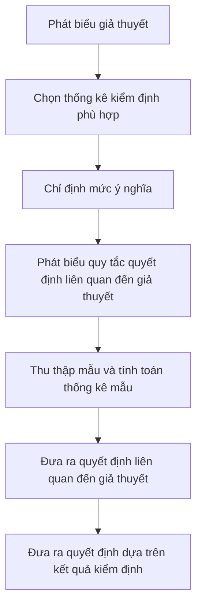

import FigureA from "./images/hypothesis-testing/figureA.png";
import FigureB from "./images/hypothesis-testing/figureB.png";

# Kiểm Định Giả Thuyết

Bài này đề cập đến các quy trình kiểm định giả thuyết phổ biến. Các quy trình này được sử dụng để tiến hành các kiểm định về trung bình tổng thể, phương sai tổng thể, sự khác biệt về trung bình, sự khác biệt về phương sai, và sự khác biệt trung bình. Các kiểm định cụ thể được xem xét bao gồm kiểm định $z$, kiểm định $t$, kiểm định $\text{chi-square}$ và kiểm định $F$. Bạn nên biết khi nào và làm thế nào để áp dụng từng loại kiểm định này. Một quy trình kiểm định giả thuyết tiêu chuẩn được sử dụng trong bài này. Hãy nắm vững nó! Bạn nên có khả năng thực hiện một kiểm định giả thuyết về giá trị trung bình mà không cần công thức nào. Các khoảng tin cậy, mức ý nghĩa, độ mạnh của kiểm định, và các loại lỗi kiểm định giả thuyết cũng được thảo luận. Đừng lo lắng về việc ghi nhớ các công thức phức tạp về kiểm định sự bằng nhau và khác nhau về trung bình và phương sai ở cuối bài này, nhưng hãy có khả năng diễn giải các thống kê này.

## 1: KIỂM ĐỊNH GIẢ THUYẾT VÀ CÁC LOẠI LỖI

Kiểm định giả thuyết là đánh giá thống kê của một phát biểu hoặc ý tưởng liên quan đến một tổng thể. Ví dụ, một phát biểu có thể như sau: “Lợi nhuận trung bình của thị trường cổ phiếu Mỹ lớn hơn không.” Với dữ liệu lợi nhuận liên quan, các quy trình kiểm định giả thuyết có thể được sử dụng để kiểm tra tính hợp lệ của phát biểu này ở một mức ý nghĩa nhất định.

### A: Định nghĩa giả thuyết, mô tả các bước kiểm định giả thuyết, và mô tả và diễn giải sự lựa chọn giả thuyết không và giả thuyết thay thế.

Giả thuyết là một phát biểu về giá trị của một tham số tổng thể được phát triển nhằm mục đích kiểm tra một lý thuyết hoặc niềm tin. Giả thuyết được phát biểu theo tham số tổng thể cần được kiểm tra, như trung bình tổng thể, $$\mu$$. Ví dụ, một nhà nghiên cứu có thể quan tâm đến lợi nhuận trung bình hàng ngày của các quyền chọn cổ phiếu. Do đó, giả thuyết có thể là lợi nhuận trung bình hàng ngày của một danh mục quyền chọn cổ phiếu là dương.

Các quy trình kiểm định giả thuyết, dựa trên thống kê mẫu và lý thuyết xác suất, được sử dụng để xác định xem giả thuyết có phải là một phát biểu hợp lý và không nên bị bác bỏ hay không, hoặc nếu nó là một phát biểu không hợp lý và nên bị bác bỏ. Quy trình kiểm định giả thuyết bao gồm một loạt các bước được hiển thị trong hình sau.

**Hình: Quy Trình Kiểm Định Giả Thuyết**

#### Giả thuyết không và Giả thuyết thay thế

**Giả thuyết không**, được ký hiệu là $$H_0$$, là giả thuyết mà nhà nghiên cứu muốn bác bỏ. Đây là giả thuyết được thực sự kiểm tra và là cơ sở để lựa chọn thống kê kiểm tra. Giả thuyết không thường được phát biểu như một tuyên bố đơn giản về tham số quần thể. Các tuyên bố điển hình của giả thuyết không đối với trung bình quần thể bao gồm $$H_0: \mu = \mu_0$$, $$H_0: \mu \leq \mu_0$$, và $$H_0: \mu \geq \mu_0$$, trong đó $$\mu$$ là trung bình quần thể và $$\mu_0$$ là giá trị giả thuyết của trung bình quần thể.

:::note[**GHI CHÚ CỦA GIÁO SƯ**]
Giả thuyết không luôn bao gồm điều kiện "bằng".
:::

**Giả thuyết thay thế**, được ký hiệu là $$H_a$$, là những gì được kết luận nếu có đủ bằng chứng để bác bỏ giả thuyết không. Thông thường, giả thuyết thay thế là những gì bạn thực sự muốn đánh giá. Tại sao? Vì bạn không bao giờ có thể thực sự chứng minh bất cứ điều gì bằng thống kê, khi giả thuyết không bị bác bỏ, điều đó ngụ ý rằng giả thuyết thay thế là hợp lệ.

### B: Phân biệt giữa kiểm định một phía và hai phía của giả thuyết.

Giả thuyết thay thế có thể là một phía hoặc hai phía. Kiểm định một phía được gọi là **kiểm định một đuôi**, và kiểm định hai phía được gọi là **kiểm định hai đuôi**. Kiểm định là một phía hay hai phía phụ thuộc vào mệnh đề đang được kiểm định. Nếu nhà nghiên cứu muốn kiểm định xem lợi nhuận từ quyền chọn cổ phiếu có lớn hơn không, thì nên sử dụng kiểm định một đuôi. Tuy nhiên, nếu câu hỏi nghiên cứu là liệu lợi nhuận từ quyền chọn có đơn giản khác không, thì nên sử dụng kiểm định hai đuôi. Kiểm định hai phía cho phép sự lệch lạc ở cả hai phía của giá trị giả định (bằng không). Trong thực tế, hầu hết các kiểm định giả thuyết được xây dựng dưới dạng kiểm định hai đuôi.

Một **kiểm định hai đuôi** cho trung bình tổng thể có thể được cấu trúc như sau:

$$
H_0: \mu = \mu_0 \text{ so với } H_a: \mu \neq \mu_0
$$

Vì giả thuyết thay thế cho phép các giá trị trên và dưới tham số giả định, kiểm định hai đuôi sử dụng hai **giá trị tới hạn** (hoặc **điểm từ chối**).

*Quy tắc quyết định chung cho một kiểm định hai đuôi* là:

$$
\text{Bác bỏ } H_0 \text{ nếu:}
\begin{cases}
\text{thống kê kiểm định } > \text{giá trị tới hạn trên} \\
\textit{hoặc}\ \text{thống kê kiểm định} < \text{giá trị tới hạn dưới}
\end{cases}
$$

Hãy xem xét sự phát triển của quy tắc quyết định cho một kiểm định hai đuôi bằng cách sử dụng thống kê kiểm định z phân phối (z-test) ở mức ý nghĩa 5\%, $\alpha = 0.05$.

- Ở $\alpha = 0.05$, thống kê kiểm định được tính toán được so sánh với các giá trị z tới hạn của $\pm 1.96$. Các giá trị $\pm 1.96$ tương ứng với $z_{\alpha/2} = \pm z_{0.025}$, là phạm vi của các giá trị z mà trong đó 95\% xác suất nằm. Các giá trị này được lấy từ bảng xác suất tích lũy cho phân phối chuẩn chuẩn (bảng z), được bao gồm ở phần cuối của cuốn sách này.

- Nếu thống kê kiểm định được tính toán nằm ngoài phạm vi của các giá trị z tới hạn (tức là thống kê kiểm định $> 1.96$, hoặc thống kê kiểm định $< -1.96$), chúng ta bác bỏ giả thuyết không và kết luận rằng thống kê mẫu khác biệt đủ lớn so với giá trị giả định.

- Nếu thống kê kiểm định được tính toán nằm trong phạm vi $\pm 1.96$, chúng ta kết luận rằng thống kê mẫu không khác biệt đủ lớn so với giá trị giả định ($\mu = \mu_0$ trong trường hợp này), và chúng ta không bác bỏ giả thuyết không.

**Quy tắc quyết định** (quy tắc từ chối) *cho một kiểm định z hai đuôi* tại $\alpha = 0.05$ có thể được phát biểu như sau:

$$
\text{Bác bỏ } H_0 \text{ nếu:}
\begin{cases}
\text{thống kê kiểm định } > \text{1.96} \\
\textit{hoặc}\ \text{thống kê kiểm định} < \text{-1.96}
\end{cases}
$$

Hình sau đây cho thấy phân phối chuẩn chuẩn cho một kiểm định giả thuyết hai đuôi sử dụng phân phối z. Lưu ý rằng mức ý nghĩa 0.05 có nghĩa là có xác suất 0.05 / 2 = 0.025 (diện tích) dưới mỗi đuôi của phân phối vượt quá $\pm 1.96$.

Đối với **kiểm định giả thuyết một phía** của trung bình tổng thể, giả thuyết không và giả thuyết thay thế là:

$$
\begin{aligned}
    &\text{Phía trên: } & H_0: \mu \leq \mu_0 \ & \textbf{so với} & H_a: \mu > \mu_0 & \textit{, hoặc} \\
    &\text{Phía dưới: } & H_0: \mu \geq \mu_0 \ & \textbf{so với} & H_a: \mu < \mu_0 & \textit{.}
\end{aligned}
$$

Bộ giả thuyết phù hợp phụ thuộc vào việc chúng ta tin rằng trung bình tổng thể, μ, lớn hơn (phía trên) hay nhỏ hơn (phía dưới) giá trị giả định, μ₀. Sử dụng kiểm định z ở mức ý nghĩa 5%, thống kê kiểm định được tính toán sẽ được so sánh với các giá trị tới hạn là 1.645 cho kiểm định phía trên (tức là $$H_{a}: \mu > \mu_{0}$$) hoặc -1.645 cho kiểm định phía dưới (tức là $$H_{a}: \mu < \mu_{0}$$). Các giá trị tới hạn này được lấy từ bảng z, nơi $$-z_{0.05} = -1.645$$ tương ứng với xác suất tích lũy bằng 5\%, và $$z_{0.05} = 1.645$$ tương ứng với xác suất tích lũy là 95\% (1 - 0.05).

Hãy sử dụng cấu trúc kiểm định phía trên, nơi $$H_{0}: \mu \leq \mu_{0}$$ và $$H_{a}: \mu > \mu_{0}$$.

- Nếu thống kê kiểm định tính toán lớn hơn 1.645, chúng ta kết luận rằng thống kê mẫu đủ lớn hơn giá trị giả định. Nói cách khác, chúng ta bác bỏ giả thuyết không.
- Nếu thống kê kiểm định tính toán nhỏ hơn 1.645, chúng ta kết luận rằng thống kê mẫu không đủ khác biệt so với giá trị giả định, và chúng ta không bác bỏ giả thuyết không.

Hình dưới đây cho thấy phân phối chuẩn chuẩn hóa và vùng bác bỏ cho kiểm định một phía (phía trên) ở mức ý nghĩa 5\%.

**Hình: Kiểm Định Giả Thuyết Một Phía Sử Dụng Phân Phối Chuẩn Chuẩn Hóa (z)**

## Lựa Chọn Giả Thuyết Không và Giả Thuyết Đối

Giả thuyết không phổ biến nhất sẽ là giả thuyết "bằng". Kết hợp với giả thuyết đối "không bằng", điều này sẽ yêu cầu một kiểm định hai đuôi. Giả thuyết đối thường là giả thuyết được hy vọng. Giả thuyết không sẽ bao gồm dấu "bằng" và giả thuyết đối sẽ bao gồm dấu "không bằng". Khi giả thuyết không là một hệ số bằng không, chúng ta hy vọng bác bỏ nó và cho thấy sự quan trọng của mối quan hệ.

Khi giả thuyết không là nhỏ hơn hoặc bằng, giả thuyết đối (loại trừ lẫn nhau) được đóng khung là lớn hơn, và một kiểm định một đuôi là phù hợp. Nếu chúng ta đang cố gắng chứng minh rằng lợi nhuận lớn hơn tỷ lệ không rủi ro, đây sẽ là cách đúng để hình thành. Chúng ta sẽ thiết lập giả thuyết không và giả thuyết đối để khi bác bỏ giả thuyết không sẽ dẫn đến chấp nhận giả thuyết đối, mục tiêu của chúng ta khi thực hiện kiểm định. Cũng như kiểm định hai đuôi, giả thuyết không cho kiểm định một đuôi sẽ bao gồm dấu "bằng" (tức là "lớn hơn hoặc bằng" hoặc "nhỏ hơn hoặc bằng"). Giả thuyết đối sẽ bao gồm dấu ngược lại với giả thuyết không—hoặc "nhỏ hơn" hoặc "lớn hơn".

### C: Giải thích một thống kê kiểm định, lỗi loại I và loại II, mức ý nghĩa và các mức ý nghĩa được sử dụng trong kiểm định giả thuyết.

Kiểm định giả thuyết liên quan đến hai thống kê: thống kê kiểm định được tính từ dữ liệu mẫu và giá trị tới hạn của thống kê kiểm định. Giá trị của thống kê kiểm định được tính so với giá trị tới hạn là một bước quan trọng trong việc đánh giá tính hợp lệ của một giả thuyết.

Thống kê kiểm định được tính bằng cách so sánh ước lượng điểm của tham số tổng thể với giá trị giả thuyết của tham số đó (tức là giá trị được chỉ định trong giả thuyết không). Liên quan đến ví dụ về lợi tức tùy chọn của chúng ta, điều này có nghĩa là chúng ta quan tâm đến sự khác biệt giữa lợi tức trung bình của mẫu (tức là $$ \bar{x} = 0.001 $$) và lợi tức trung bình giả thuyết (tức là $$ H_0: \mu = 0 $$). Như được chỉ ra trong biểu thức sau, thống kê kiểm định là sự khác biệt giữa thống kê mẫu và giá trị giả thuyết, được chuẩn hóa bởi sai số chuẩn của thống kê mẫu.

$$
\text{thống kê kiểm định} = \frac{\text{thống kê mẫu} - \text{giá trị giả thuyết}}{\text{sai số chuẩn của thống kê mẫu}}
$$

Sai số chuẩn của thống kê mẫu là độ lệch chuẩn điều chỉnh của mẫu. Khi thống kê mẫu là trung bình mẫu, $$ \bar{x} $$, sai số chuẩn của thống kê mẫu cho kích thước mẫu $$ n $$ được tính như sau:

$$
\sigma_{\bar{x}} = \frac{\sigma}{\sqrt{n}}
$$

khi độ lệch chuẩn của tổng thể, $$ \sigma $$, được biết, hoặc

$$
s_{\bar{x}} = \frac{s}{\sqrt{n}}
$$

khi độ lệch chuẩn của tổng thể, $$ \sigma $$, không được biết. Trong trường hợp này, nó được ước tính bằng độ lệch chuẩn của mẫu, $$ s $$.

:::note[**GHI CHÚ CỦA GIÁO SƯ**]
Đừng bị nhầm lẫn bởi ký hiệu ở đây. Rất nhiều tài liệu bạn sẽ gặp trong quá trình học thường sử dụng thuật ngữ $$ \sigma_{\bar{x}} $$ cho sai số chuẩn của thống kê kiểm định, bất kể độ lệch chuẩn của tổng thể hay độ lệch chuẩn của mẫu được sử dụng trong việc tính toán nó.
:::

Như bạn sẽ thấy sớm thôi, thống kê kiểm định là một biến ngẫu nhiên có thể tuân theo một trong số các phân phối, tùy thuộc vào các đặc điểm của mẫu và tổng thể. Chúng ta sẽ xem xét bốn phân phối cho thống kê kiểm định: phân phối t, phân phối z (phân phối chuẩn), phân phối chi-bình phương và phân phối F. Giá trị tới hạn cho thống kê kiểm định thích hợp — giá trị mà thống kê kiểm định được tính toán so sánh—phụ thuộc vào phân phối của nó.

#### Lỗi Loại I và Loại II

Hãy nhớ rằng kiểm định giả thuyết được sử dụng để đưa ra suy luận về các tham số của một tổng thể nhất định dựa trên các thống kê được tính cho một mẫu được rút ra từ tổng thể đó. Chúng ta phải nhận thức rằng có một số xác suất rằng mẫu, theo một cách nào đó, không đại diện cho tổng thể, và bất kỳ kết luận nào dựa trên mẫu về tổng thể có thể được thực hiện sai lầm.

Khi đưa ra suy luận từ một kiểm định giả thuyết, có hai loại sai lầm:

#### Lỗi loại I và loại II

Hãy nhớ rằng kiểm định giả thuyết được sử dụng để suy luận về các tham số của một tổng thể nhất định dựa trên các thống kê được tính toán từ một mẫu được lấy từ tổng thể đó. Chúng ta phải nhận thức rằng có một số xác suất rằng mẫu, bằng cách nào đó, không đại diện cho tổng thể, và bất kỳ kết luận nào dựa trên mẫu về tổng thể có thể bị sai lầm.

Khi suy luận từ một kiểm định giả thuyết, có hai loại lỗi:

- **Lỗi loại I**: từ chối giả thuyết không khi nó thực sự đúng.
- **Lỗi loại II**: không từ chối giả thuyết không khi nó thực sự sai.

**Mức ý nghĩa** là xác suất của việc mắc lỗi loại I (từ chối giả thuyết không khi nó đúng) và được ký hiệu bởi chữ cái Hy Lạp alpha ($$\alpha$$). Ví dụ, một mức ý nghĩa 5% ($$\alpha = 0.05$$) nghĩa là có 5% cơ hội từ chối một giả thuyết không đúng. Khi tiến hành kiểm định giả thuyết, phải xác định mức ý nghĩa để xác định các giá trị tới hạn cần thiết để đánh giá thống kê kiểm định.

### D: Giải thích quy tắc quyết định, sức mạnh của kiểm định và mối quan hệ giữa khoảng tin cậy và kiểm định giả thuyết.

Quyết định cho một kiểm định giả thuyết là hoặc từ chối giả thuyết không hoặc không từ chối giả thuyết không. Lưu ý rằng việc nói "chấp nhận" giả thuyết không là không chính xác về mặt thống kê; nó chỉ có thể được hỗ trợ hoặc từ chối. Quy tắc quyết định cho việc từ chối hoặc không từ chối giả thuyết không dựa trên phân phối của thống kê kiểm định. Ví dụ, nếu thống kê kiểm định tuân theo phân phối chuẩn, quy tắc quyết định dựa trên các giá trị tới hạn được xác định từ phân phối chuẩn chuẩn (phân phối z). Bất kể phân phối phù hợp, phải xác định xem kiểm định một phía hay hai phía là phù hợp trước khi có thể xác định quy tắc quyết định (quy tắc từ chối).

Một quy tắc quyết định là cụ thể và định lượng. Một khi chúng ta đã xác định liệu kiểm định một phía hay hai phía là phù hợp, mức ý nghĩa mà chúng ta yêu cầu, và phân phối của thống kê kiểm định, chúng ta có thể tính toán giá trị tới hạn chính xác cho thống kê kiểm định. Sau đó, chúng ta có quy tắc quyết định dưới dạng sau: nếu thống kê kiểm định (lớn hơn, nhỏ hơn) giá trị X, từ chối giả thuyết không.

#### Sức mạnh của kiểm định

Trong khi mức ý nghĩa của một kiểm định là xác suất của việc từ chối giả thuyết không khi nó đúng, sức mạnh của một kiểm định là xác suất của việc từ chối đúng giả thuyết không khi nó sai. Sức mạnh của một kiểm định thực sự là một trừ xác suất của việc mắc lỗi loại II, hoặc $$1 - P(\text{lỗi loại II})$$. Nói cách khác, xác suất từ chối giả thuyết không khi nó sai (sức mạnh của kiểm định) bằng một trừ xác suất không từ chối giả thuyết không khi nó sai (lỗi loại II). Khi có nhiều hơn một thống kê kiểm định có thể được sử dụng, sức mạnh của kiểm định cho các thống kê kiểm định cạnh tranh có thể hữu ích trong việc quyết định sử dụng thống kê kiểm định nào. Thông thường, chúng ta muốn sử dụng thống kê kiểm định cung cấp kiểm định mạnh nhất trong số tất cả các kiểm định có thể.

Hình sau đây cho thấy mối quan hệ giữa mức ý nghĩa, sức mạnh của một kiểm định và hai loại lỗi.

**Hình: Lỗi loại I và loại II trong kiểm định giả thuyết**

|                | Điều kiện thực tế   | Điều kiện thực tế   |
|----------------|:-------------------:|:-------------------:|
| **Quyết định** | $$H_0$$ **đúng**    | $$H_0$$ **sai**     |
| Không từ chối $$H_0$$ | Quyết định đúng  | Quyết định sai   **Lỗi loại II** |
| Từ chối $$H_0$$       | Quyết định sai   **Lỗi loại I**   Mức ý nghĩa, $$\alpha$$   =P(Lỗi loại I) | Quyết định đúng   Sức mạnh của kiểm định   = $$1 - P(\text{lỗi loại II})$$ | 

Kích thước mẫu và sự lựa chọn mức ý nghĩa (xác suất lỗi loại I) sẽ cùng nhau xác định xác suất của một lỗi loại II. Mối quan hệ này không đơn giản, và tính toán xác suất của một lỗi loại II trong thực tế là rất khó. Giảm mức ý nghĩa (xác suất lỗi loại I) từ 5% xuống 1%, ví dụ, sẽ tăng xác suất không từ chối một giả thuyết không sai (lỗi loại II) và do đó giảm sức mạnh của kiểm định. Ngược lại, với một kích thước mẫu nhất định, chúng ta có thể tăng sức mạnh của kiểm định chỉ với chi phí là xác suất từ chối một giả thuyết không đúng (lỗi loại I) tăng lên. Với một mức ý nghĩa nhất định, chúng ta có thể giảm xác suất của một lỗi loại II và tăng sức mạnh của kiểm định, chỉ bằng cách tăng kích thước mẫu.

#### Mối Quan Hệ Giữa Khoảng Tin Cậy và Kiểm Định Giả Thuyết

Một khoảng tin cậy là một phạm vi giá trị mà nhà nghiên cứu tin rằng tham số thực của quần thể có thể nằm trong đó.

Một khoảng tin cậy được xác định như sau:

$$
\left[ 
\begin{array}{c}
\text{thống kê} \\
\text{mẫu} 
\end{array} 
- \left( 
\begin{array}{c}
\text{giá trị} \\
\text{tới hạn} 
\end{array} \right) 
\left( 
\begin{array}{c}
\text{sai số} \\
\text{chuẩn} 
\end{array} \right) \right] 
\leq 
\begin{array}{c}
\text{tham số} \\
\text{quần thể} 
\end{array} 
\leq \left[ 
\begin{array}{c}
\text{thống kê} \\
\text{mẫu} 
\end{array} 
+ \left( 
\begin{array}{c}
\text{giá trị} \\
\text{tới hạn} 
\end{array} \right)
\left( 
\begin{array}{c}
\text{sai số} \\
\text{chuẩn} 
\end{array} \right) \right]
$$

Diễn giải của một khoảng tin cậy là với mức độ tin cậy 95%, ví dụ, có 95% khả năng rằng tham số thực của quần thể nằm trong khoảng đó.

Từ biểu thức trước, chúng ta thấy rằng khoảng tin cậy và kiểm định giả thuyết được liên kết bởi giá trị tới hạn. Ví dụ, một khoảng tin cậy 95% sử dụng một giá trị tới hạn liên quan đến một phân phối ở mức ý nghĩa 5%. Tương tự, một kiểm định giả thuyết sẽ so sánh thống kê kiểm định với giá trị tới hạn ở mức ý nghĩa 5%. Để thấy rõ hơn mối quan hệ này, biểu thức cho khoảng tin cậy có thể được điều chỉnh và tuyên bố lại như sau:

$$
-\text{{giá trị tới hạn}} \leq \text{{thống kê kiểm định}} \leq +\text{{giá trị tới hạn}}
$$

Đây là phạm vi mà chúng ta không bác bỏ giả thuyết không cho một kiểm định giả thuyết hai phía ở một mức ý nghĩa nhất định.

:::info[**VÍ DỤ**: Khoảng tin cậy và kiểm định giả thuyết hai phía]

Một nhà nghiên cứu đã thu thập dữ liệu về lợi nhuận hàng ngày của một danh mục các quyền chọn mua trong một khoảng thời gian 250 ngày gần đây. Lợi nhuận trung bình hàng ngày là 0.1\%, và độ lệch chuẩn của lợi nhuận danh mục hàng ngày là 0.25\%. Nhà nghiên cứu tin rằng lợi nhuận trung bình hàng ngày của danh mục không bằng không.

1. Xây dựng khoảng tin cậy 95\% cho lợi nhuận trung bình hàng ngày của quần thể trong khoảng thời gian 250 ngày.
2. Xây dựng kiểm định giả thuyết cho niềm tin của nhà nghiên cứu.

**Trả lời:**

1. Với kích thước mẫu là 250 với độ lệch chuẩn là 0.25\%, sai số chuẩn có thể được tính như sau:

$$
s_{\bar{x}} = \frac{s}{\sqrt{n}} = \frac{0.25}{\sqrt{250}} = 0.0158\%.
$$

Ở mức ý nghĩa 5\%, các giá trị z tới hạn cho khoảng tin cậy là ±0.025 = 1.96 và ±0.025 = -1.96. Vì vậy, với trung bình mẫu bằng 0.1\%, khoảng tin cậy 95\% cho lợi nhuận trung bình của quần thể là:

$$
0.1 - 1.96(0.0158) \leq \mu \leq 0.1 + 1.96(0.0158)
$$

hoặc

$$
0.069\% \leq \mu \leq 0.131\%.
$$

2. Đầu tiên chúng ta cần xác định giả thuyết không và giả thuyết thay thế. Giả thuyết không là giả thuyết mà nhà nghiên cứu mong đợi bác bỏ.

$$
H_0: \mu = 0 \text{ versus } H_a: \mu \neq 0
$$

Vì giả thuyết không là một phương trình, đây là một kiểm định hai phía. Ở mức ý nghĩa 5\%, các giá trị z tới hạn cho một kiểm định hai phía là ±1.96, vì vậy quy tắc quyết định có thể được tuyên bố như sau:

Bác bỏ $H_0$ nếu thống kê kiểm định $<-1.96$ hoặc thống kê kiểm định $>+1.96$

Sử dụng sai số chuẩn của trung bình mẫu mà chúng ta đã tính ở trên, thống kê kiểm định của chúng ta là:

$$
z = \frac{0.001 - 0}{0.00158} = 6.33
$$

Vì 6.33 > 1.96, chúng ta bác bỏ giả thuyết không rằng lợi nhuận trung bình hàng ngày của quyền chọn là bằng không.

Chú ý sự tương đồng của phân tích này với khoảng tin cậy của chúng ta. Chúng ta bác bỏ giả thuyết $\mu = 0$ vì trung bình mẫu là 0.1\% nhiều hơn 1.96 sai số chuẩn từ số không. Dựa trên khoảng tin cậy 95\%, chúng ta bác bỏ $\mu = 0$ vì số không nhiều hơn 1.96 sai số chuẩn từ trung bình mẫu là 0.1\%.
:::

### 📝 LUYỆN TẬP

1. Để kiểm tra xem trung bình của một quần thể có lớn hơn 20 hay không, giả thuyết không phù hợp là trung bình của quần thể:

* A. nhỏ hơn 20.
* B. lớn hơn 20.
* C. nhỏ hơn hoặc bằng 20.

2. Câu nào sau đây về kiểm định giả thuyết là chính xác nhất?

* A. Lỗi Loại II là từ chối giả thuyết không khi nó thực sự đúng.
* B. Mức ý nghĩa bằng một trừ đi xác suất của lỗi Loại I.
* C. Một kiểm định hai phía với mức ý nghĩa 5\% có giá trị tới hạn z là $$\pm 1.96$$.

3. Đối với một kiểm định giả thuyết với xác suất lỗi Loại II là 60\% và xác suất lỗi Loại I là 5\%, câu nào sau đây là chính xác nhất?

* A. Lực kiểm định là 40\%, và có 5\% xác suất rằng thống kê kiểm định sẽ vượt quá giá trị tới hạn.
* B. Có 95\% xác suất rằng thống kê kiểm định sẽ nằm giữa các giá trị tới hạn nếu đây là kiểm định hai phía.
* C. Có 5\% xác suất rằng giả thuyết không sẽ bị từ chối khi thực sự đúng, và xác suất từ chối giả thuyết không khi nó sai là 40\%.

4. Nếu mức ý nghĩa của một kiểm định là 0.05 và xác suất lỗi Loại II là 0.15, lực kiểm định là bao nhiêu?

* A. 0.850.
* B. 0.950.
* C. 0.975.