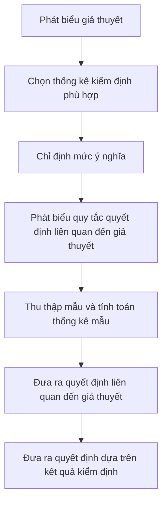

import FigureA from "./images/hypothesis-testing/figureA.png";

# Kiểm Định Giả Thuyết

Bài này đề cập đến các quy trình kiểm định giả thuyết phổ biến. Các quy trình này được sử dụng để tiến hành các kiểm định về trung bình tổng thể, phương sai tổng thể, sự khác biệt về trung bình, sự khác biệt về phương sai, và sự khác biệt trung bình. Các kiểm định cụ thể được xem xét bao gồm kiểm định $z$, kiểm định $t$, kiểm định $\text{chi-square}$ và kiểm định $F$. Bạn nên biết khi nào và làm thế nào để áp dụng từng loại kiểm định này. Một quy trình kiểm định giả thuyết tiêu chuẩn được sử dụng trong bài này. Hãy nắm vững nó! Bạn nên có khả năng thực hiện một kiểm định giả thuyết về giá trị trung bình mà không cần công thức nào. Các khoảng tin cậy, mức ý nghĩa, độ mạnh của kiểm định, và các loại lỗi kiểm định giả thuyết cũng được thảo luận. Đừng lo lắng về việc ghi nhớ các công thức phức tạp về kiểm định sự bằng nhau và khác nhau về trung bình và phương sai ở cuối bài này, nhưng hãy có khả năng diễn giải các thống kê này.

## 1: KIỂM ĐỊNH GIẢ THUYẾT VÀ CÁC LOẠI LỖI

Kiểm định giả thuyết là đánh giá thống kê của một phát biểu hoặc ý tưởng liên quan đến một tổng thể. Ví dụ, một phát biểu có thể như sau: “Lợi nhuận trung bình của thị trường cổ phiếu Mỹ lớn hơn không.” Với dữ liệu lợi nhuận liên quan, các quy trình kiểm định giả thuyết có thể được sử dụng để kiểm tra tính hợp lệ của phát biểu này ở một mức ý nghĩa nhất định.

### A: Định nghĩa giả thuyết, mô tả các bước kiểm định giả thuyết, và mô tả và diễn giải sự lựa chọn giả thuyết không và giả thuyết thay thế.

Giả thuyết là một phát biểu về giá trị của một tham số tổng thể được phát triển nhằm mục đích kiểm tra một lý thuyết hoặc niềm tin. Giả thuyết được phát biểu theo tham số tổng thể cần được kiểm tra, như trung bình tổng thể, $$\mu$$. Ví dụ, một nhà nghiên cứu có thể quan tâm đến lợi nhuận trung bình hàng ngày của các quyền chọn cổ phiếu. Do đó, giả thuyết có thể là lợi nhuận trung bình hàng ngày của một danh mục quyền chọn cổ phiếu là dương.

Các quy trình kiểm định giả thuyết, dựa trên thống kê mẫu và lý thuyết xác suất, được sử dụng để xác định xem giả thuyết có phải là một phát biểu hợp lý và không nên bị bác bỏ hay không, hoặc nếu nó là một phát biểu không hợp lý và nên bị bác bỏ. Quy trình kiểm định giả thuyết bao gồm một loạt các bước được hiển thị trong hình sau.

**Hình: Quy Trình Kiểm Định Giả Thuyết**

#### Giả thuyết không và Giả thuyết thay thế

**Giả thuyết không**, được ký hiệu là $$H_0$$, là giả thuyết mà nhà nghiên cứu muốn bác bỏ. Đây là giả thuyết được thực sự kiểm tra và là cơ sở để lựa chọn thống kê kiểm tra. Giả thuyết không thường được phát biểu như một tuyên bố đơn giản về tham số quần thể. Các tuyên bố điển hình của giả thuyết không đối với trung bình quần thể bao gồm $$H_0: \mu = \mu_0$$, $$H_0: \mu \leq \mu_0$$, và $$H_0: \mu \geq \mu_0$$, trong đó $$\mu$$ là trung bình quần thể và $$\mu_0$$ là giá trị giả thuyết của trung bình quần thể.

:::note[**GHI CHÚ CỦA GIÁO SƯ**]
Giả thuyết không luôn bao gồm điều kiện "bằng".
:::

**Giả thuyết thay thế**, được ký hiệu là $$H_a$$, là những gì được kết luận nếu có đủ bằng chứng để bác bỏ giả thuyết không. Thông thường, giả thuyết thay thế là những gì bạn thực sự muốn đánh giá. Tại sao? Vì bạn không bao giờ có thể thực sự chứng minh bất cứ điều gì bằng thống kê, khi giả thuyết không bị bác bỏ, điều đó ngụ ý rằng giả thuyết thay thế là hợp lệ.

### B: Phân biệt giữa kiểm định một phía và hai phía của giả thuyết.

Giả thuyết thay thế có thể là một phía hoặc hai phía. Kiểm định một phía được gọi là **kiểm định một đuôi**, và kiểm định hai phía được gọi là **kiểm định hai đuôi**. Kiểm định là một phía hay hai phía phụ thuộc vào mệnh đề đang được kiểm định. Nếu nhà nghiên cứu muốn kiểm định xem lợi nhuận từ quyền chọn cổ phiếu có lớn hơn không, thì nên sử dụng kiểm định một đuôi. Tuy nhiên, nếu câu hỏi nghiên cứu là liệu lợi nhuận từ quyền chọn có đơn giản khác không, thì nên sử dụng kiểm định hai đuôi. Kiểm định hai phía cho phép sự lệch lạc ở cả hai phía của giá trị giả định (bằng không). Trong thực tế, hầu hết các kiểm định giả thuyết được xây dựng dưới dạng kiểm định hai đuôi.

Một **kiểm định hai đuôi** cho trung bình tổng thể có thể được cấu trúc như sau:

$$
H_0: \mu = \mu_0 \text{ so với } H_a: \mu \neq \mu_0
$$

Vì giả thuyết thay thế cho phép các giá trị trên và dưới tham số giả định, kiểm định hai đuôi sử dụng hai **giá trị tới hạn** (hoặc **điểm từ chối**).

*Quy tắc quyết định chung cho một kiểm định hai đuôi* là:

$$
\text{Bác bỏ } H_0 \text{ nếu:}
\begin{cases}
\text{thống kê kiểm định } > \text{giá trị tới hạn trên} \\
\textit{hoặc}\ \text{thống kê kiểm định} < \text{giá trị tới hạn dưới}
\end{cases}
$$

Hãy xem xét sự phát triển của quy tắc quyết định cho một kiểm định hai đuôi bằng cách sử dụng thống kê kiểm định z phân phối (z-test) ở mức ý nghĩa 5\%, $\alpha = 0.05$.

- Ở $\alpha = 0.05$, thống kê kiểm định được tính toán được so sánh với các giá trị z tới hạn của $\pm 1.96$. Các giá trị $\pm 1.96$ tương ứng với $z_{\alpha/2} = \pm z_{0.025}$, là phạm vi của các giá trị z mà trong đó 95\% xác suất nằm. Các giá trị này được lấy từ bảng xác suất tích lũy cho phân phối chuẩn chuẩn (bảng z), được bao gồm ở phần cuối của cuốn sách này.

- Nếu thống kê kiểm định được tính toán nằm ngoài phạm vi của các giá trị z tới hạn (tức là thống kê kiểm định $> 1.96$, hoặc thống kê kiểm định $< -1.96$), chúng ta bác bỏ giả thuyết không và kết luận rằng thống kê mẫu khác biệt đủ lớn so với giá trị giả định.

- Nếu thống kê kiểm định được tính toán nằm trong phạm vi $\pm 1.96$, chúng ta kết luận rằng thống kê mẫu không khác biệt đủ lớn so với giá trị giả định ($\mu = \mu_0$ trong trường hợp này), và chúng ta không bác bỏ giả thuyết không.

**Quy tắc quyết định** (quy tắc từ chối) *cho một kiểm định z hai đuôi* tại $\alpha = 0.05$ có thể được phát biểu như sau:

$$
\text{Bác bỏ } H_0 \text{ nếu:}
\begin{cases}
\text{thống kê kiểm định } > \text{1.96} \\
\textit{hoặc}\ \text{thống kê kiểm định} < \text{-1.96}
\end{cases}
$$

Hình sau đây cho thấy phân phối chuẩn chuẩn cho một kiểm định giả thuyết hai đuôi sử dụng phân phối z. Lưu ý rằng mức ý nghĩa 0.05 có nghĩa là có xác suất 0.05 / 2 = 0.025 (diện tích) dưới mỗi đuôi của phân phối vượt quá $\pm 1.96$.

Đối với **kiểm định giả thuyết một đuôi** của trung bình tổng thể, các giả thuyết không và thay thế là:

$$
\begin{aligned}
    &\text{Đuôi trên: } & H_0: \mu \leq \mu_0 \ & \textbf{so với} & H_a: \mu > \mu_0 & \textit{, hoặc} \\
    &\text{Đuôi dưới: } & H_0: \mu \geq \mu_0 \ & \textbf{so với} & H_a: \mu < \mu_0 & \textit{.}
\end{aligned}
$$