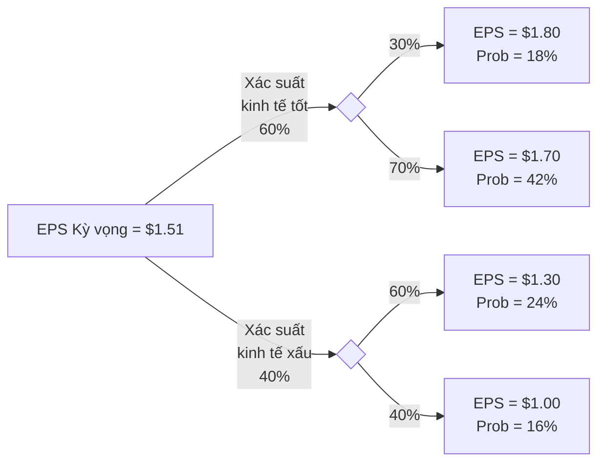
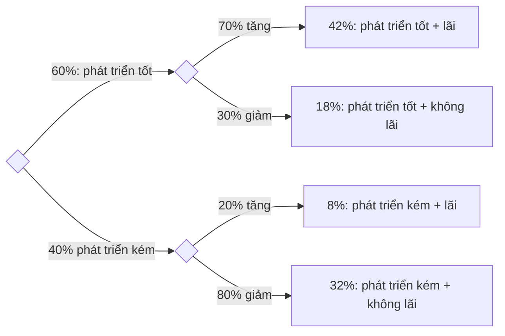

import Figure1 from "./images/probability/figure1.png";
import FigureA from "./images/probability/figureA.png";

# Các Khái Niệm Xác Suất

Bài này bao gồm các thuật ngữ và khái niệm quan trọng liên quan đến lý thuyết xác suất. Các biến ngẫu nhiên, sự kiện, kết quả, xác suất có điều kiện và xác suất chung được mô tả. Các quy tắc xác suất như quy tắc cộng và quy tắc nhân được giới thiệu. Những quy tắc này thường được các chuyên gia tài chính sử dụng. Giá trị kỳ vọng, độ lệch chuẩn, hiệp phương sai và tương quan cho lợi nhuận của tài sản cá nhân và danh mục đầu tư được thảo luận. Một ứng viên được chuẩn bị tốt sẽ có thể tính toán và diễn giải các thước đo được sử dụng rộng rãi này. Bài này cũng thảo luận về các quy tắc đếm, đặt nền tảng cho phân phối xác suất nhị thức được đề cập trong chủ đề tiếp theo.

## 1: XÁC SUẤT CÓ ĐIỀU KIỆN VÀ XÁC SUẤT HỢP

### A: Định nghĩa biến ngẫu nhiên, kết quả, sự kiện, các sự kiện loại trừ lẫn nhau, và các sự kiện đầy đủ.

- **Biến ngẫu nhiên** là một lượng/số không chắc chắn.
- **Kết quả** là giá trị quan sát được của một biến ngẫu nhiên.
- **Sự kiện** là một kết quả đơn lẻ hoặc một tập hợp các kết quả.
- **Các sự kiện loại trừ lẫn nhau** là các sự kiện không thể xảy ra đồng thời.
- **Các sự kiện đầy đủ** là những sự kiện bao gồm tất cả các kết quả có thể xảy ra.

Hãy xem xét việc lăn một con xúc xắc 6 mặt. Số xuất hiện là một **biến ngẫu nhiên**. Nếu bạn lăn được 4, đó là một **kết quả**. Lăn được 4 là một **sự kiện**, và lăn được số chẵn là một **sự kiện**. Lăn được 4 và lăn được 6 là các **sự kiện loại trừ lẫn nhau**. Lăn được số chẵn và lăn được số lẻ là một tập hợp các sự kiện loại trừ lẫn nhau và **các sự kiện đầy đủ**.

### B: Trình bày hai thuộc tính xác định của xác suất và phân biệt giữa xác suất thực nghiệm, chủ quan và tiên nghiệm.

Có **hai thuộc tính xác định của xác suất**.

- Xác suất xảy ra của bất kỳ sự kiện nào ($E_i$) nằm trong khoảng từ 0 đến 1 (tức là, $0 \leq P(E_i) \leq 1$).
- Nếu một tập hợp các sự kiện, $E_1, E_2, \ldots, E_n$, là loại trừ lẫn nhau và toàn diện, thì xác suất của các sự kiện đó cộng lại bằng 1 (tức là, $\sum P(E_i) = 1$).

Thuộc tính đầu tiên trong các thuộc tính xác định giới thiệu thuật ngữ $P(E_i)$, là viết tắt của “xác suất của sự kiện i.” Nếu $P(E_i) = 0$, sự kiện sẽ không bao giờ xảy ra. Nếu $P(E_i) = 1$, sự kiện chắc chắn xảy ra, và kết quả không phải ngẫu nhiên.

Xác suất của việc tung ra bất kỳ số nào từ 1 đến 6 với một con xúc xắc công bằng là $1/6 = 0.1667 = 16.7\%$. Tập hợp các sự kiện—tung ra một số bằng 1, 2, 3, 4, 5 hoặc 6—là toàn diện, và các sự kiện riêng lẻ là loại trừ lẫn nhau, do đó xác suất của tập hợp sự kiện này bằng 1. Chúng ta chắc chắn rằng một trong những giá trị trong tập hợp sự kiện này sẽ xảy ra.

Một **xác suất thực nghiệm** được thiết lập bằng cách phân tích dữ liệu quá khứ. Một **xác suất tiên nghiệm** được xác định bằng cách sử dụng quá trình lý luận và kiểm tra chính thức. Một **xác suất chủ quan** là phương pháp ít chính thức nhất để phát triển xác suất và liên quan đến việc sử dụng phán đoán cá nhân. Một nhà phân tích có thể biết nhiều điều về hiệu suất của một công ty và có kỳ vọng về thị trường tổng thể để tạo ra một xác suất chủ quan, chẳng hạn như, “Tôi tin rằng có 70\% khả năng Acme Foods sẽ vượt trội hơn thị trường trong năm nay.” Xác suất thực nghiệm và tiên nghiệm, ngược lại, là **xác suất khách quan**.

### C: Trình bày xác suất của một sự kiện theo tỷ lệ cược cho và chống lại sự kiện đó.

Việc nêu **tỷ lệ cược (oods)** rằng một sự kiện sẽ xảy ra hoặc không xảy ra là một cách thay thế để biểu thị xác suất. Hãy xem xét một sự kiện có xác suất xảy ra là 0,125, tức là một phần tám. Tỷ lệ cược rằng sự kiện sẽ xảy ra là $\frac{0.125}{(1 - 0.125)} = \frac{1/8}{7/8} = \frac{1}{7}$, mà chúng ta nói là, “tỷ lệ cược cho sự kiện xảy ra là một-chọi-bảy.” Tỷ lệ cược chống lại sự kiện xảy ra là nghịch đảo của $1/7$, tức là bảy-chọi-một.

Chúng ta cũng có thể tính xác suất của một sự kiện từ tỷ lệ cược bằng cách đảo ngược các phép tính này. Nếu chúng ta biết rằng tỷ lệ cược cho một sự kiện là một-chọi-sáu, chúng ta có thể tính xác suất xảy ra là $\frac{1}{1+6} = \frac{1}{7} = 0.1429 = 14.29\%$. Ngoài ra, xác suất rằng sự kiện sẽ không xảy ra là $\frac{6}{1+6} = \frac{6}{7} = 0.8571 = 85.71\%$.

:::note[**GHI CHÚ CỦA GIÁO SƯ**]
Mặc dù tôi khá quen thuộc với việc sử dụng tỷ lệ cược thay vì xác suất tại đường đua ngựa, tôi không thể nhớ đã từng gặp tỷ lệ cược cho cổ phiếu hoặc trái phiếu. Việc sử dụng tỷ lệ cược tại đường đua ngựa cho phép bạn biết được số tiền thắng mỗi \$1 đặt cược vào một con ngựa (sau khi trừ tỷ lệ phần trăm của đường đua). Nếu bạn đặt cược vào một con ngựa với tỷ lệ 15-1 và con ngựa đó thắng, bạn sẽ nhận được \$15 và \$1 đặt cược của bạn sẽ được trả lại, vì vậy lợi nhuận là \$15. Tất nhiên, nếu con ngựa thua, bạn sẽ mất \$1 bạn đặt cược và “lợi nhuận” là -\$1.

Một điểm cuối cùng là lợi nhuận kỳ vọng trên cược là bằng không, dựa trên xác suất thắng được biểu thị trong tỷ lệ cược. Xác suất con ngựa thắng khi tỷ lệ cược là 15-chọi-1 là $\frac{1}{15+1} = \frac{1}{16}$ và xác suất con ngựa thua là $15/16$. Lợi nhuận kỳ vọng là $$\frac{1}{16} \times \$15 + \frac{15}{16} \times (-\$1) = 0$$.
:::

### D: Phân biệt giữa xác suất không điều kiện và xác suất có điều kiện.

- **Xác suất không điều kiện** (còn gọi là **xác suất biên**) đề cập đến xác suất của một sự kiện bất kể sự kiện khác xảy ra trong quá khứ hoặc tương lai. Nếu chúng ta quan tâm đến xác suất của một cuộc suy thoái kinh tế, bất kể sự thay đổi trong lãi suất hoặc lạm phát, chúng ta đang quan tâm đến xác suất không điều kiện của một cuộc suy thoái.

- **Xác suất có điều kiện** là khi sự xuất hiện của một sự kiện ảnh hưởng đến xác suất xảy ra của một sự kiện khác. Ví dụ, chúng ta có thể quan tâm đến xác suất của một cuộc suy thoái **với điều kiện** là chính quyền tiền tệ tăng lãi suất. Đây là một xác suất có điều kiện. Từ khóa cần chú ý ở đây là “với điều kiện.” Sử dụng ký hiệu xác suất, “xác suất của A **với điều kiện** sự kiện B xảy ra” được biểu diễn là $$P(A | B)$$, trong đó dấu gạch đứng ($$|$$) chỉ “với điều kiện,” hoặc “dựa trên.” Đối với ví dụ về lãi suất ở trên, xác suất của một cuộc suy thoái **với điều kiện** tăng lãi suất được biểu diễn là $$P(\text{suy thoái}\  | \ \text{tăng lãi suất})$$. Xác suất có điều kiện của một sự kiện cũng được gọi là **khả năng xảy ra (likelihood)** của nó.

### E: Giải thích quy tắc nhân, cộng và xác suất toàn phần.

**Quy tắc nhân của xác suất** được sử dụng để xác định xác suất đồng thời của hai sự kiện:

$$
P(AB) = P(A \mid B) \times P(B)
$$

**Quy tắc cộng của xác suất** được sử dụng để xác định xác suất ít nhất một trong hai sự kiện sẽ xảy ra:

$$
P(A \text{ hoặc } B) = P(A) + P(B) - P(AB)
$$

**Quy tắc xác suất toàn phần** được sử dụng để xác định xác suất không điều kiện của một sự kiện, dựa trên các xác suất có điều kiện:

$$
P(A) = P(A \mid B_1)P(B_1) + P(A \mid B_2)P(B_2) + \ldots + P(A \mid B_N)P(B_N)
$$

trong đó $$ B_1, B_2, \ldots B_N $$ là một tập hợp các kết quả loại trừ lẫn nhau và đầy đủ.

### F: Tính toán và diễn giải 1) xác suất đồng thời của hai sự kiện, 2) xác suất ít nhất một trong hai sự kiện sẽ xảy ra, cho trước xác suất của từng sự kiện và xác suất đồng thời của hai sự kiện, và 3) xác suất đồng thời của bất kỳ số lượng sự kiện độc lập nào.

**Xác suất đồng thời** của hai sự kiện là xác suất mà cả hai sẽ xảy ra. Chúng ta có thể tính toán điều này từ xác suất có điều kiện rằng A sẽ xảy ra khi B xảy ra (một xác suất có điều kiện) và xác suất rằng B sẽ xảy ra (xác suất vô điều kiện của B). Phép tính này đôi khi được gọi là **quy tắc nhân của xác suất**. Sử dụng ký hiệu cho xác suất có điều kiện và vô điều kiện, chúng ta có thể biểu diễn quy tắc này như sau:

$$
P(AB) = P(A | B) \times P(B)
$$

Biểu thức này được đọc như sau: “Xác suất đồng thời của A và B, $$P(AB)$$, bằng với xác suất có điều kiện của A cho trước B, $P(A | B)$, nhân với xác suất không điều kiện của B, $$P(B)$$.”

Mối quan hệ này có thể được sắp xếp lại để xác định xác suất có điều kiện của A cho trước B như sau:

$$
P(A|B) = \frac{P(AB)}{P(B)}
$$

:::info[**VÍ DỤ**: Quy tắc nhân của xác suất]
Xem xét thông tin sau:

- P(I) = 0.4, xác suất cơ quan tiền tệ tăng lãi suất (I) là 40%.
- P(R | I) = 0.7, xác suất có một cuộc suy thoái (R) cho trước một sự tăng lãi suất là 70%.

P(RI) là gì, xác suất kết hợp của một cuộc suy thoái và một sự tăng lãi suất?

**Trả lời:**

Áp dụng quy tắc nhân, chúng ta có kết quả sau:

$$
\begin{align*}
P(RI) &= P(R | I) \times P(I) \\
P(RI) &= 0.7 \times 0.4 \\
P(RI) &= 0.28
\end{align*}
$$

Đừng để ký hiệu phức tạp che khuất logic đơn giản của kết quả này. Nếu một sự tăng lãi suất sẽ xảy ra 40% thời gian và dẫn đến một cuộc suy thoái 70% thời gian khi nó xảy ra, xác suất kết hợp của một sự tăng lãi suất và một cuộc suy thoái là (0.4)(0.7) = (0.28) = 28%.
:::

#### Tính Xác Suất Ít Nhất Một Trong Hai Sự Kiện Xảy Ra

**Quy tắc cộng** cho xác suất được sử dụng để xác định xác suất rằng ít nhất một trong hai sự kiện sẽ xảy ra. Ví dụ, với hai sự kiện, A và B, quy tắc cộng có thể được sử dụng để xác định xác suất rằng hoặc A hoặc B sẽ xảy ra. Nếu các sự kiện *không* loại trừ lẫn nhau, cần tránh đếm hai lần bằng cách trừ đi xác suất chung mà cả A và B sẽ xảy ra từ tổng các xác suất vô điều kiện. Điều này được thể hiện trong biểu thức chung cho quy tắc cộng sau đây:

$$
P(A \text{ hoặc } B) = P(A) + P(B) - P(AB)
$$

Đối với các sự kiện loại trừ lẫn nhau, khi xác suất chung, $$P(AB)$$, bằng không, xác suất rằng hoặc A hoặc B sẽ xảy ra chỉ đơn giản là tổng các xác suất vô điều kiện cho mỗi sự kiện, $$P(A \text{ hoặc } B) = P(A) + P(B)$$.

**Hình: Biểu đồ Venn cho các sự kiện không loại trừ lẫn nhau**

Hình vẽ minh họa quy tắc cộng với Biểu đồ Venn và nêu bật lý do tại sao phải trừ đi xác suất chung từ tổng các xác suất vô điều kiện. Lưu ý rằng nếu các sự kiện **loại trừ lẫn nhau**, các tập hợp không giao nhau, $$P(AB) = 0$$, và xác suất rằng một trong hai sự kiện sẽ xảy ra chỉ đơn giản là $$P(A) + P(B)$$.

:::info[**VÍ DỤ**: Quy tắc cộng của xác suất]
Sử dụng thông tin trong ví dụ lãi suất và suy thoái kinh tế trước đó của chúng ta và thực tế rằng xác suất vô điều kiện của suy thoái, $$P(R)$$, là 34\%, xác định xác suất rằng hoặc lãi suất sẽ tăng hoặc suy thoái sẽ xảy ra.

**Câu trả lời:**
Vì $$P(R) = 0.34$$, $$P(I) = 0.40$$, và $$P(RI) = 0.28$$, chúng ta có thể tính $$P(R \text{ hoặc } I)$$ như sau:

$$
P(R \text{ hoặc } I) = P(R) + P(I) - P(RI)
$$

$$
P(R \text{ hoặc } I) = 0.34 + 0.40 - 0.28
$$

$$
P(R \text{ hoặc } I) = 0.46
$$
:::

#### Tính xác suất kết hợp của bất kỳ số sự kiện độc lập nào

Khi gieo hai con xúc xắc, xác suất kết hợp của việc ra hai số 4 được tính như sau:

$$
P(4 \text{ trên xúc xắc thứ nhất và 4 trên xúc xắc thứ hai}) \\ =  P(4 \text{ trên xúc xắc thứ nhất}) \times P(4 \text{ trên xúc xắc thứ hai}) \\ = \frac{1}{6} \times \frac{1}{6} = \frac{1}{36} = 0.0278
$$

Khi tung hai đồng xu, xác suất ra hai mặt ngửa là:

$$
P(\text{mặt ngửa trên đồng xu thứ nhất và mặt ngửa trên đồng xu thứ hai}) = \frac{1}{2} \times \frac{1}{2} = \frac{1}{4} = 0.25
$$

*Gợi ý*: Khi xử lý các **sự kiện độc lập**, từ *`và`* chỉ ra phép nhân, và từ *`hoặc`* chỉ ra phép cộng. Trong ký hiệu xác suất:

$$
P(A \textbf{ hoặc } B) = P(A) + P(B) - P(AB), \text{ và } P(A \textbf{ và } B) = P(A) \times P(B)
$$

Quy tắc nhân mà chúng ta đã sử dụng để tính xác suất kết hợp của hai sự kiện độc lập có thể được áp dụng cho bất kỳ số lượng sự kiện độc lập nào, như ví dụ sau minh họa.

:::info[**VÍ DỤ**: Xác suất kết hợp cho nhiều hơn hai sự kiện độc lập]
**Xác suất để ra ba số 4 trong một lần tung ba con xúc xắc là bao nhiêu?**

**Trả lời:**
Vì xác suất ra số 4 cho mỗi con xúc xắc là 1/6, xác suất để ra ba số 4 là:

$$
P(\text{ba số 4 trong lần tung ba con xúc xắc}) = \frac{1}{6} \times \frac{1}{6} \times \frac{1}{6} = \frac{1}{216} = 0.00463
$$
:::

### 📝 LUYỆN TẬP

1. Một sự kiện bao gồm tất cả các kết quả có thể xảy ra được cho là:

* A. ngẫu nhiên.
* B. loại trừ.
* C. toàn diện.

2. Giá trị nào sau đây không thể là xác suất của một sự kiện?

* A. 0.00.
* B. 1.00.
* C. 1.25.

3. Xác suất DJIA sẽ tăng vào ngày mai là 2/3. Xác suất tăng DJIA được tuyên bố là tỷ lệ cược là:

* A. hai ăn một.
* B. một ăn ba.
* C. hai ăn ba.

4. Quy tắc nhân của xác suất xác định xác suất chung của hai sự kiện là tích của:

* A. hai xác suất có điều kiện.
* B. hai xác suất không điều kiện.
* C. một xác suất có điều kiện và một xác suất không điều kiện.

5. Nếu sự kiện A và B loại trừ lẫn nhau, thì:

* A. P(A | B) = P(A).
* B. P(AB) = P(A) x P(B).
* C. P(A hoặc B) = P(A) + P(B).

6. Tại một buổi dạ hội từ thiện, 800 tên được đưa vào một chiếc mũ. Bốn trong số các tên này là giống hệt nhau. Khi rút ngẫu nhiên, xác suất để một trong bốn tên này được rút ra là bao nhiêu?

* A. 0.004.
* B. 0.005.
* C. 0.010.

7. Hai sự kiện loại trừ lẫn nhau:

* A. luôn xảy ra cùng nhau.
* B. không thể xảy ra cùng nhau.
* C. đôi khi có thể xảy ra cùng nhau.

## 2: KỲ VỌNG CÓ ĐIỀU KIỆN, TƯƠNG QUAN

### G: Phân biệt giữa các sự kiện phụ thuộc và độc lập.

Các sự kiện độc lập là các sự kiện mà việc xảy ra của một sự kiện không ảnh hưởng đến việc xảy ra của các sự kiện khác. Định nghĩa của các sự kiện độc lập có thể được biểu diễn bằng xác suất có điều kiện. Các sự kiện A và B độc lập nếu và chỉ nếu:

$$
P(A | B) = P(A), \text{ hoặc tương đương, } P(B | A) = P(B)
$$

Nếu điều kiện này không được thỏa mãn, các sự kiện là phụ thuộc (tức là, việc xảy ra của một sự kiện phụ thuộc vào việc xảy ra của sự kiện khác).

Trong ví dụ về lãi suất và suy thoái kinh tế của chúng ta, nhớ rằng các sự kiện I và R không độc lập; việc xảy ra của I ảnh hưởng đến xác suất xảy ra của R. Trong ví dụ này, các điều kiện độc lập cho I và R bị vi phạm vì:

$$
P(R) = 0.34, \text{ nhưng } P(R | I) = 0.7;
$$

xác suất của một cuộc suy thoái kinh tế lớn hơn khi có sự gia tăng lãi suất.

Các ví dụ tốt nhất về các sự kiện độc lập được tìm thấy trong các xác suất tiên nghiệm của việc tung xúc xắc hoặc tung đồng xu. Một con xúc xắc không có “trí nhớ”. Do đó, sự kiện tung được số 4 ở lần tung thứ hai là độc lập với việc tung được số 4 ở lần tung thứ nhất. Ý tưởng này có thể được biểu diễn như sau:

$$
P(4 \text{ ở lần tung thứ hai } | 4 \text{ ở lần tung thứ nhất }) = P(4 \text{ ở lần tung thứ hai }) = 1/6 \text{ hoặc } 0.167
$$

Ý tưởng về các sự kiện độc lập cũng áp dụng cho việc tung đồng xu:

$$
P(\text{mặt ngửa ở đồng xu thứ nhất } | \text{ mặt ngửa ở đồng xu thứ hai}) = P(\text{mặt ngửa ở đồng xu thứ nhất}) = 1/2 \text{ hoặc } 0.50
$$

### H: Tính toán và diễn giải một xác suất vô điều kiện bằng cách sử dụng quy tắc xác suất toàn phần.

**Quy tắc xác suất toàn phần** nêu bật mối quan hệ giữa xác suất vô điều kiện và xác suất có điều kiện của các sự kiện loại trừ lẫn nhau và đầy đủ. Nó được sử dụng để giải thích xác suất vô điều kiện của một sự kiện theo các xác suất có điều kiện dựa trên các sự kiện khác.

Nói chung, xác suất vô điều kiện của sự kiện R,

$$
P(R) = P(R | S_1) × P(S_1) + P(R | S_2) × P(S_2) + . . . + P(R | S_N) × P(S_N)
$$

trong đó tập hợp các sự kiện $${S_1, S_2, . . . S_N}$$ là loại trừ lẫn nhau và đầy đủ.

:::info[**VÍ DỤ: Ứng dụng đầu tư của xác suất vô điều kiện**]
Dựa trên ví dụ đang tiếp diễn về lãi suất và suy thoái kinh tế, chúng ta có thể giả định rằng một cuộc suy thoái chỉ có thể xảy ra với một trong hai sự kiện—lãi suất tăng (I) hoặc lãi suất không tăng ($$I^C$$)—vì các sự kiện này loại trừ lẫn nhau và đầy đủ. $$I^C$$ được đọc là "phần bù của I," có nghĩa là "không I." Do đó, xác suất của $$I^C$$ là $$1 - P(I)$$. Vì vậy, hợp lý rằng tổng của hai xác suất kết hợp phải là xác suất vô điều kiện của một cuộc suy thoái. Điều này có thể được diễn đạt như sau:

$$
P(R) = P(RI) + P(RI^C)
$$

Áp dụng quy tắc nhân, chúng ta có thể viết lại biểu thức này như sau:

$$
P(R) = P(R | I) × P(I) + P(R | I^C) × P(I^C)
$$

Giả sử rằng $$P(R | I) = 0.70, P(R | I^C)$$, xác suất suy thoái nếu lãi suất không tăng, là 10% và rằng $$P(I) = 0.40$$ nên $$P(I^C) = 0.60$$. Xác suất vô điều kiện của một cuộc suy thoái có thể được tính như sau:

$$
P(R) = P(R | I) × P(I) + P(R | I) × P(I)
\\
= (0.70)(0.40) + (0.10)(0.60)
\\
= 0.28 + 0.06 = 0.34
$$
:::

#### Giá Trị Kỳ Vọng

Giá trị kỳ vọng của một biến ngẫu nhiên là giá trị trung bình có trọng số của các kết quả có thể xảy ra cho biến đó. Biểu diễn toán học cho giá trị kỳ vọng của biến ngẫu nhiên \(X\) là:

$$
E(X) = \Sigma P(x_i)x_i = P(x_1)x_1 + P(x_2)x_2 + \cdots + P(x_n)x_n
$$

:::info[**VÍ DỤ**: Thu nhập kỳ vọng trên mỗi cổ phần]

Phân phối xác suất của EPS cho các cửa hàng của Ron được cho trong hình dưới đây. Tính toán thu nhập kỳ vọng trên mỗi cổ phần.

**Phân Phối Xác Suất EPS**

| Xác Suất    | Thu Nhập Trên Mỗi Cổ Phần |
|-------------|---------------------------|
| 10%         | £1.80                     |
| 20%         | £1.60                     |
| 40%         | £1.20                     |
| 30%         | £1.00                     |

**Trả Lời:**

Thu nhập kỳ vọng trên mỗi cổ phần đơn giản là giá trị trung bình có trọng số của mỗi EPS có thể xảy ra, trong đó các trọng số là xác suất của mỗi kết quả có thể xảy ra.

$$
E[\text{EPS}] = 0.10(1.80) + 0.20(1.60) + 0.40(1.20) + 0.30(1.00) = £1.28
$$

:::

### I: Giải thích việc sử dụng kỳ vọng có điều kiện trong ứng dụng đầu tư.

**Giá trị kỳ vọng hoặc lợi tức có thể được tính toán bằng cách sử dụng xác suất có điều kiện.** Như tên gọi của nó, *giá trị kỳ vọng có điều kiện* phụ thuộc vào kết quả của một sự kiện khác. Một nhà phân tích sẽ sử dụng giá trị kỳ vọng có điều kiện để điều chỉnh kỳ vọng của mình khi có thông tin mới.

Hãy xem xét tác động của một mức thuế đối với nhập khẩu thép lên lợi tức của một cổ phiếu thép nội địa. Lợi tức kỳ vọng của cổ phiếu, giả sử chính phủ áp đặt thuế, sẽ cao hơn lợi tức kỳ vọng nếu thuế không được áp đặt.

Sử dụng quy tắc xác suất tổng, chúng ta có thể ước tính lợi tức kỳ vọng (không có điều kiện) trên cổ phiếu bằng tổng của lợi tức kỳ vọng nếu không có thuế nhân với xác suất không áp đặt thuế cộng với lợi tức kỳ vọng nếu có thuế nhân với xác suất áp đặt thuế.

### J: Giải thích việc sử dụng sơ đồ cây để đại diện cho một vấn đề đầu tư.

Bạn có thể tự hỏi những lợi nhuận và xác suất nào được sử dụng trong việc tính toán giá trị kỳ vọng đến từ đâu. Một khung chung được gọi là **sơ đồ cây** được sử dụng để hiển thị các xác suất của các kết quả khác nhau. Trong hình sau, chúng tôi đã hiển thị ước tính EPS cho bốn kết quả khác nhau: (1) một nền kinh tế tốt và kết quả tương đối tốt tại công ty, (2) một nền kinh tế tốt và kết quả tương đối kém tại công ty, (3) một nền kinh tế kém và kết quả tương đối tốt tại công ty, và (4) một nền kinh tế kém và kết quả tương đối kém tại công ty. Sử dụng các quy tắc xác suất, chúng tôi có thể tính toán xác suất của mỗi bốn kết quả EPS được hiển thị trong các ô bên phải của “cây”.

EPS kỳ vọng là $1.51 được tính đơn giản như sau:

$$
0.18 \times 1.80 + 0.42 \times 1.70 + 0.24 \times 1.30 + 0.16 \times 1.00 = \$1.51
$$

Lưu ý rằng xác suất của bốn kết quả có thể xảy ra cộng lại bằng 1.

**Hình: Sơ đồ Cây**

### K: Tính toán và diễn giải hiệp phương sai và tương quan, và diễn giải biểu đồ phân tán.

Phương sai và độ lệch chuẩn đo lường độ phân tán, hoặc độ biến động, của chỉ một biến số. Tuy nhiên, trong nhiều tình huống tài chính, chúng ta quan tâm đến cách hai biến ngẫu nhiên di chuyển liên quan đến nhau. Đối với các ứng dụng đầu tư, một trong những cặp biến ngẫu nhiên được phân tích thường xuyên nhất là lợi nhuận của hai tài sản. Các nhà đầu tư và quản lý thường hỏi những câu như, "mối quan hệ giữa lợi nhuận của cổ phiếu A và cổ phiếu B là gì?" hoặc, "mối quan hệ giữa hiệu suất của S&P 500 và ngành công nghiệp ô tô là gì?"

**Hiệp phương sai** là một phép đo lường cách hai tài sản di chuyển cùng nhau. Nó là giá trị kỳ vọng của tích các độ lệch của hai biến ngẫu nhiên so với các giá trị kỳ vọng tương ứng của chúng. Một ký hiệu phổ biến cho hiệp phương sai giữa các biến ngẫu nhiên X và Y là Cov(X, Y). Vì chúng ta sẽ chủ yếu quan tâm đến hiệp phương sai của lợi nhuận tài sản, công thức sau đây đã được viết theo hiệp phương sai của lợi nhuận của tài sản i, $$ R_i $$, và lợi nhuận của tài sản j, $$ R_j $$:

$$
\text{Cov}(R_i, R_j) = \mathrm{E}[(R_i - \mathrm{E}(R_i))(R_j - \mathrm{E}(R_j))]
$$

Dưới đây là **các thuộc tính của hiệp phương sai**:

- Hiệp phương sai là một biểu diễn tổng quát của cùng một khái niệm như phương sai. Đó là, phương sai đo lường cách một biến ngẫu nhiên di chuyển với chính nó, và hiệp phương sai đo lường cách một biến ngẫu nhiên di chuyển với một biến ngẫu nhiên khác.
- Hiệp phương sai của $$ R_A $$ với chính nó bằng với phương sai của $$ R_A $$; đó là, $$ \text{Cov}(R_A, R_A) = \text{Var}(R_A) $$.
- Hiệp phương sai có thể dao động từ âm vô cùng đến dương vô cùng.

Để hỗ trợ trong việc diễn giải hiệp phương sai, hãy xem xét lợi nhuận của một cổ phiếu và một quyền chọn bán trên cổ phiếu đó. Hai lợi nhuận này sẽ có hiệp phương sai âm vì chúng di chuyển theo các hướng ngược nhau. Lợi nhuận của hai cổ phiếu ô tô có khả năng có hiệp phương sai dương, và lợi nhuận của một cổ phiếu và một tài sản không rủi ro sẽ có hiệp phương sai bằng không vì lợi nhuận của tài sản không rủi ro không bao giờ thay đổi, bất kể sự di chuyển của lợi nhuận cổ phiếu. Trong khi công thức cho hiệp phương sai được đưa ra trước đây là chính xác, phương pháp tính toán hiệp phương sai của lợi nhuận từ một mô hình xác suất liên hợp sử dụng một trung bình trọng số xác suất của các tích độ lệch của biến ngẫu nhiên so với các giá trị trung bình của chúng cho mỗi kết quả có thể xảy ra. Ví dụ sau đây minh họa cho tính toán này.

:::info[**VÍ DỤ**: Hiệp phương sai]

Giả sử rằng nền kinh tế có thể ở trong ba trạng thái có thể xảy ra (S) vào năm tới: bùng nổ, bình thường, hoặc tăng trưởng kinh tế chậm. Một nguồn tin chuyên gia đã tính toán rằng

$$
P(\text{bùng nổ}) = 0.30, P(\text{bình thường}) = 0.50,\ \text{và}\ P(\text{tăng trưởng chậm}) = 0.20.
$$

Lợi nhuận của Cổ phiếu A, $$ R_A $$, và Cổ phiếu B, $$ R_B $$, dưới mỗi trạng thái kinh tế được cung cấp trong mô hình xác suất như sau. Hiệp phương sai của lợi nhuận của Cổ phiếu A và Cổ phiếu B là bao nhiêu?

**Phân phối xác suất của lợi nhuận**

| Sự kiện  | P(S) | $$ R_A $$ | $$ R_B $$ |
|----------|------|-----------|-----------|
| Bùng nổ  | 0.3  | 0.20      | 0.30      |
| Bình thường | 0.5  | 0.12      | 0.10      |
| Tăng trưởng chậm | 0.2  | 0.05      | 0.00      |

**Trả lời:**

Trước hết, lợi nhuận kỳ vọng cho mỗi cổ phiếu phải được xác định.

$$
E(R_A) = (0.3)(0.20) + (0.5)(0.12) + (0.2)(0.05) = 0.13
$$

$$
E(R_B) = (0.3)(0.30) + (0.5)(0.10) + (0.2)(0.00) = 0.14
$$

Hiệp phương sai có thể được tính toán bằng cách sử dụng quy trình được mô tả trong bảng sau.

**Tính toán Hiệp phương sai**

| Sự kiện  | P(S) | $$ R_A $$ | $$ R_B $$ | $$ P(S) \times [R_A - E(R_A)] \times [R_B - E(R_B)] $$         |
|----------|------|-----------|-----------|-------------------------------------------------------------|
| Bùng nổ  | 0.3  | 0.20      | 0.30      | $$ (0.3)(0.2 - 0.13)(0.3 - 0.14) = 0.00336 $$                 |
| Bình thường | 0.5  | 0.12      | 0.10      | $$ (0.5)(0.12 - 0.13)(0.1 - 0.14) = 0.00020 $$                |
| Tăng trưởng chậm | 0.2  | 0.05      | 0.00      | $$ (0.2)(0.05 - 0.13)(0 - 0.14) = 0.00224 $$                  |

$$
\text{Cov}(R_A, R_B) = \sum \{ P(S) \times [R_A - E(R_A)] \times [R_B - E(R_B)] \} = 0.00580
$$

:::

Cho đến nay, chúng ta đã tính toán hiệp phương sai từ mô hình xác suất. Chúng ta cũng có thể xác định hiệp phương sai bằng cách sử dụng dữ liệu lịch sử. Việc tính toán hiệp phương sai mẫu dựa trên công thức sau:

$$
\text{Cov}_{1,2} = \frac{\sum_{t=1}^{n}\{(R_{t,1} - \overline{R_1})(R_{t,2} - \overline{R_2})\}}{n-1}
$$

trong đó:
- $$R_{t,1}$$ = lợi nhuận của Tài sản 1 trong giai đoạn $$t$$
- $$R_{t,2}$$ = lợi nhuận của Tài sản 2 trong giai đoạn $$t$$
- $$\overline{R_1}$$ = lợi nhuận trung bình của Tài sản 1
- $$\overline{R_2}$$ = lợi nhuận trung bình của Tài sản 2
- $$n$$ = số lượng giai đoạn

Trong thực tế, hiệp phương sai khó để diễn giải. Điều này chủ yếu là vì nó có thể có giá trị rất lớn, từ âm đến dương vô cùng, và giống như phương sai, những giá trị này được biểu thị bằng đơn vị bình phương.

Để làm cho hiệp phương sai của hai biến ngẫu nhiên dễ hiểu hơn, nó có thể được chia cho tích của độ lệch chuẩn của các biến ngẫu nhiên. Giá trị kết quả được gọi là **hệ số tương quan**, hoặc đơn giản là **tương quan**. Mối quan hệ giữa hiệp phương sai, độ lệch chuẩn và tương quan có thể thấy trong biểu thức sau cho tương quan của lợi nhuận cho tài sản $$i$$ và $$j$$:

$$
\text{Corr} (R_i, R_j) = \frac{\text{Cov}(R_i, R_j)}{\sigma (R_i) \sigma (R_j)}
$$

điều này ngụ ý rằng

$$
\text{Cov}(R_i, R_j) = \text{Corr} (R_i, R_j) \sigma (R_i) \sigma (R_j)
$$

Tương quan giữa hai biến lợi nhuận ngẫu nhiên cũng có thể được biểu thị là $$\rho(R_i,R_j)$$, hoặc $$\rho_{i,j}$$. Tương quan có thể là tiên đoán nếu nó sử dụng hiệp phương sai từ mô hình xác suất, hoặc nhìn lại nếu nó sử dụng hiệp phương sai mẫu từ dữ liệu lịch sử.

Các tính chất của tương quan giữa hai biến ngẫu nhiên $$R_i$$ và $$R_j$$ được tóm tắt như sau:
- Tương quan đo lường độ mạnh của mối quan hệ tuyến tính giữa hai biến ngẫu nhiên.
- Tương quan không có đơn vị.
- Tương quan dao động từ $$-1$$ đến $$+1$$. Tức là, $$-1 \leq \text{Corr}(R_i, R_j) \leq +1$$.
- Nếu $$\text{Corr}(R_i, R_j) = 1.0$$, các biến ngẫu nhiên có tương quan dương hoàn hảo. Điều này có nghĩa là một biến động trong một biến ngẫu nhiên dẫn đến một biến động tỷ lệ dương trong biến kia so với trung bình của nó.
- Nếu $$\text{Corr}(R_i, R_j) = -1.0$$, các biến ngẫu nhiên có tương quan âm hoàn hảo. Điều này có nghĩa là một biến động trong một biến ngẫu nhiên dẫn đến một biến động ngược lại tỷ lệ chính xác trong biến kia so với trung bình của nó.
- Nếu $$\text{Corr}(R_i, R_j) = 0$$, không có mối quan hệ tuyến tính giữa các biến, cho thấy rằng việc dự đoán $$R_i$$ không thể được thực hiện dựa trên $$R_j$$ bằng các phương pháp tuyến tính.

:::info[**EXAMPLE: Tương quan**]

Sử dụng ví dụ trước của chúng ta, tính toán và diễn giải mối tương quan của lợi nhuận cho cổ phiếu A và B, với $\sigma^2(R_A) = 0.0028$ và $\sigma^2(R_B) = 0.0124$ và nhớ rằng $\text{Cov}(R_A, R_B) = 0.0058$.

**Câu trả lời:**

Trước hết, cần phải chuyển đổi phương sai thành độ lệch chuẩn.

$$
\sigma(R_A) = (0.0028)^{\frac{1}{2}} = 0.0529
$$

$$
\sigma(R_B) = (0.0124)^{\frac{1}{2}} = 0.1114
$$

Bây giờ, mối tương quan giữa lợi nhuận của Cổ phiếu A và Cổ phiếu B có thể được tính toán như sau:

$$
\text{Corr}(R_A, R_B) = \frac{0.0058}{(0.0529)(0.1114)} = 0.9842
$$

Thực tế rằng giá trị này gần bằng +1 cho thấy mối quan hệ tuyến tính không chỉ tích cực mà còn rất mạnh.
:::

**Biểu đồ phân tán** là một phương pháp để hiển thị mối quan hệ giữa hai biến. Với một biến trên trục dọc và biến kia trên trục ngang, các quan sát cặp của chúng có thể được vẽ dưới dạng một điểm duy nhất. Ví dụ, trong bảng `a` của Hình sau, có một điểm màu đỏ cho thấy khi một trong các biến (trên trục ngang) bằng 9.2, biến kia (trên trục dọc) bằng 8.5.

Biểu đồ phân tán trong bảng `a` là điển hình của hai biến không có mối quan hệ rõ ràng. Bảng `b` cho thấy hai biến có mối quan hệ tuyến tính mạnh, tức là có hệ số tương quan cao.

Một lợi thế quan trọng của việc tạo biểu đồ phân tán là chúng có thể tiết lộ các mối quan hệ phi tuyến tính, không được mô tả bởi hệ số tương quan. Bảng `c` minh họa một mối quan hệ như vậy. Mặc dù hệ số tương quan của hai biến này gần bằng không, biểu đồ phân tán của chúng cho thấy rõ ràng rằng chúng có mối quan hệ theo một cách dự đoán được.

Cần cẩn thận khi rút ra kết luận dựa trên mối tương quan. Tương quan không có nghĩa là nhân quả chỉ từ mối tương quan có ý nghĩa. Ngay cả khi có, biến nào đang "gây ra" sự thay đổi trong biến khác cũng không được tiết lộ bởi tương quan. Thận trọng hơn, nên nói rằng hai biến thể hiện sự liên kết tích cực (hoặc tiêu cực), cho thấy bản chất của bất kỳ mối quan hệ nhân quả nào cần được điều tra riêng biệt hoặc dựa trên lý thuyết có thể được kiểm tra thêm.

Một câu hỏi có thể được điều tra là vai trò của các giá trị **ngoại lai** (các giá trị cực đoan) trong mối tương quan của hai biến. Nếu việc loại bỏ các giá trị ngoại lai làm giảm đáng kể mối tương quan được tính toán, cần điều tra thêm về việc liệu các giá trị ngoại lai có cung cấp thông tin hay không hoặc chúng bị gây ra bởi nhiễu (ngẫu nhiên) trong dữ liệu được sử dụng.

**Tương quan giả** đề cập đến mối tương quan là kết quả của ngẫu nhiên hoặc hiện diện do sự thay đổi của cả hai biến theo thời gian được gây ra bởi sự liên kết của chúng với một biến thứ ba.

Ví dụ, chúng ta có thể tìm thấy các trường hợp hai biến đều liên quan đến tỷ lệ lạm phát cho thấy mối tương quan đáng kể, nhưng không có sự nhân quả theo hướng nào.

Trong cuốn sách _Spurious Correlation_ của mình, Tyler Vigen đưa ra các ví dụ sau. Mối tương quan giữa tuổi của Hoa hậu Mỹ mỗi năm và số lượng phim Nicholas Cage xuất hiện trong năm đó là 87%. Điều này có vẻ hơi ngẫu nhiên. Mối tương quan giữa chi tiêu của Hoa Kỳ cho khoa học, không gian và công nghệ và số lượng tự tử bằng treo cổ, siết cổ, và ngạt thở trong giai đoạn 1999-2009 là 99.87%. Mối tương quan ấn tượng, nhưng cả hai biến đều tăng theo một cách tuyến tính trong giai đoạn này.

:::note[**GHI CHÚ CỦA GIÁO SƯ**]
Ở đây, sự trôi qua của thời gian dường như là "biến thứ ba" thúc đẩy kết quả. Tại sao, tôi không biết, nhưng tôi chắc chắn 99.87% rằng không có biến nào trong hai biến là nguyên nhân của biến còn lại.
:::

### 📝 LUYỆN TẬP

1. Hai sự kiện được cho là độc lập nếu sự xuất hiện của một sự kiện:

* A. có nghĩa là sự kiện thứ hai không thể xảy ra.
* B. có nghĩa là sự kiện thứ hai chắc chắn sẽ xảy ra.
* C. không ảnh hưởng đến xác suất xảy ra của sự kiện còn lại.

2. Một nhà phân tích ước tính rằng giá cổ phiếu có xác suất tăng là 80% nếu tăng trưởng kinh tế vượt quá 3%, xác suất tăng là 40% nếu tăng trưởng kinh tế dương nhưng dưới 3%, và xác suất tăng là 10% nếu tăng trưởng kinh tế âm. Nếu tăng trưởng kinh tế có xác suất 25% vượt quá 3% và xác suất 25% là âm, thì xác suất giá cổ phiếu tăng là bao nhiêu?

* A. 22,5%
* B. 42,5%
* C. 62,5%

3. Các giá trị có thể có cho hiệp phương sai của hai biến ngẫu nhiên là:

* A. không bị giới hạn.
* B. bị giới hạn từ 0 đến 1.
* C. bị giới hạn từ –1 đến 1.

## BIẾN ĐỘNG DANH MỤC ĐẦU TƯ, BAYES, VÀ CÁC VẤN ĐỀ ĐẾM

### L: Tính toán và giải thích giá trị kỳ vọng, phương sai và độ lệch chuẩn của một biến ngẫu nhiên và của lợi nhuận trên danh mục đầu tư.

Nhớ rằng giá trị kỳ vọng của một biến ngẫu nhiên là trung bình trọng số của các kết quả có thể xảy ra của nó:

$$
E(X) = \Sigma P(x_i)x_i = P(x_1)x_1 + P(x_2)x_2 + \ldots + P(x_n)x_n
$$

Giá trị kỳ vọng và phương sai cho một danh mục đầu tư có thể được xác định bằng cách sử dụng các thuộc tính của từng tài sản riêng lẻ trong danh mục. Để làm điều này, cần thiết lập trọng số danh mục cho từng tài sản. Như đã chỉ ra trong công thức, trọng số, $w$, của tài sản danh mục đầu tư $i$ chỉ đơn giản là giá trị thị trường hiện đang đầu tư vào tài sản chia cho giá trị thị trường hiện tại của toàn bộ danh mục đầu tư.

$$
w_i = \frac{\text{giá trị thị trường của đầu tư vào tài sản } i}{\text{giá trị thị trường của danh mục đầu tư}}
$$

**Giá trị kỳ vọng của danh mục đầu tư.** Giá trị kỳ vọng của một danh mục đầu tư gồm $n$ tài sản với trọng số, $w_i$, và giá trị kỳ vọng, $R_i$, có thể được xác định bằng cách sử dụng công thức sau:

$$
E(R_p) = \sum_{i=1}^{N} w_i E(R_i) = w_1 E(R_1) + w_2 E(R_2) + \ldots + w_n E(R_n)
$$

Thường thì, chúng ta có lợi nhuận kỳ vọng (thay vì giá kỳ vọng). Khi $R_i$ là lợi nhuận, lợi nhuận kỳ vọng cho một danh mục đầu tư, $E(R_p)$, được tính bằng cách sử dụng trọng số tài sản và cùng công thức như trên.

**Phương sai của danh mục đầu tư.** Phương sai của lợi nhuận danh mục đầu tư sử dụng trọng số danh mục, nhưng theo cách phức tạp hơn:

$$
\text{Var}(R_p) = \sum_{i=1}^{N} \sum_{j=1}^{N} w_i w_j \text{Cov}(R_i, R_j)
$$

Phương sai của một danh mục đầu tư gồm tài sản rủi ro $A$ và tài sản rủi ro $B$ có thể được biểu thị như sau:

$$
\text{Var}(R_p) = w_A w_A \text{Cov}(R_A, R_A) + w_A w_B \text{Cov}(R_A, R_B) + w_B w_A \text{Cov}(R_B, R_A) + w_B w_B \text{Cov}(R_B, R_B)
$$

:::note[**LƯU Ý CỦA GIÁO SƯ**]
Trước đó trong Buổi Học này, chúng ta đã tính toán phương sai mẫu từ dữ liệu lịch sử. Ở đây, chúng ta đang tính toán phương sai dựa trên hiệp phương sai từ một mô hình xác suất.

Bây giờ, vì $$ \text{Cov}(R_A,R_B) = \text{Cov}(R_B,R_A) $$ và $$ \text{Cov}(R_A,R_A) = \sigma^2(R_A) $$, biểu thức này được rút gọn thành:

$$
\text{Var}(R_P) = w_A^2 \sigma^2(R_A) + w_B^2 \sigma^2(R_B) + 2w_A w_B \text{Cov}(R_A,R_B)
$$

Vì $$ \text{Cov}(R_A,R_B) = \sigma(R_B) \sigma(R_A) \rho(R_A,R_B) $$, một cách khác để trình bày công thức này là:

$$
\text{Var}(R_P) = w_A^2 \sigma^2(R_A) + w_B^2 \sigma^2(R_B) + 2w_A w_B \sigma(R_A) \sigma(R_B) \rho(R_A,R_B)
$$

:::

:::info[**EXAMPLE**: Độ lệch chuẩn của danh mục đầu tư hai tài sản]

Một danh mục đầu tư có 30% đầu tư vào cổ phiếu với độ lệch chuẩn của lợi nhuận là 20%, và phần còn lại đầu tư vào trái phiếu với độ lệch chuẩn của lợi nhuận là 12%. Tương quan của lợi nhuận trái phiếu với lợi nhuận cổ phiếu là 0,6. Tính toán độ lệch chuẩn của lợi nhuận cho danh mục đầu tư.

**Trả lời:**

Độ lệch chuẩn của danh mục đầu tư là:

$$
\sqrt{w^2_{\text{cổ phiếu}}\sigma^2_{\text{cổ phiếu}} + w^2_{\text{trái phiếu}}\sigma^2_{\text{trái phiếu}} + 2w_{\text{cổ phiếu}}w_{\text{trái phiếu}}\sigma_{\text{cổ phiếu}}\sigma_{\text{trái phiếu}}\rho_{\text{trái phiếu, cổ phiếu}}}
$$

$$
= \sqrt{(0.3^2)(0.20^2) + (0.7^2)(0.12^2) + 2(0.3)(0.7)(0.20)(0.12)(0.60)}
$$

$$
= \sqrt{0.0167} = 12.92\%
$$

Nếu câu hỏi cung cấp hiệp phương sai của lợi nhuận tài sản (0.0144) thay vì tương quan của chúng, thì việc tính toán độ lệch chuẩn của lợi nhuận danh mục đầu tư sẽ là:

$$
\sqrt{w^2_{\text{cổ phiếu}}\sigma^2_{\text{cổ phiếu}} + w^2_{\text{trái phiếu}}\sigma^2_{\text{trái phiếu}} + 2w_{\text{cổ phiếu}}w_{\text{trái phiếu}}\text{Cov}_{\text{trái phiếu, cổ phiếu}}}
$$

$$
= \sqrt{(0.3^2)(0.20^2) + (0.7^2)(0.12^2) + 2(0.3)(0.7)(0.0144)}
$$

$$
= \sqrt{0.0167} = 12.92\%
$$
:::

### M: Tính toán và diễn giải hiệp phương sai dựa trên hàm xác suất chung.

:::info[**EXAMPLE: Hiệp phương sai sử dụng mô hình xác suất chung**]

Xác suất chung của lợi tức Tài sản A và Tài sản B được đưa ra trong bảng dưới đây. Tính hiệp phương sai của lợi tức cho Tài sản A và Tài sản B.

**Bảng Xác Suất**

| Xác Suất Chung      | $$ R_B = 0.40 $$ | $$ R_B = 0.20 $$ | $$ R_B = 0.00 $$ |
|---------------------|------------------|------------------|------------------|
| $$ R_A = 0.20 $$    | 0.15             | 0                | 0                |
| $$ R_A = 0.15 $$    | 0                | 0.60             | 0                |
| $$ R_A = 0.04 $$    | 0                | 0                | 0.25             |

**Đáp án:**

Lợi tức kỳ vọng cho từng tài sản được xác định như sau:

$$ E(R_A) = P(R_{A1}, R_{B1})R_{A1} + P(R_{A2}, R_{B2})R_{A2} + P(R_{A3}, R_{B3})R_{A3} $$

$$ E(R_A) = (0.15)(0.20) + (0.60)(0.15) + (0.25)(0.04) = 0.13 $$

$$ E(R_B) = P(R_{B1}, R_{A1})R_{B1} + P(R_{B2}, R_{A2})R_{B2} + P(R_{B3}, R_{A3})R_{B3} $$

$$ E(R_B) = (0.15)(0.40) + (0.60)(0.20) + (0.25)(0.00) = 0.18 $$

Hiệp phương sai của lợi tức tài sản được xác định như sau:

$$ \text{Cov}(R_A, R_B) = P(R_{A1}, R_{B1})[R_{A1} - E(R_A)][R_{B1} - E(R_B)] $$

$$ + P(R_{A2}, R_{B2})[R_{A2} - E(R_A)][R_{B2} - E(R_B)] $$

$$ + P(R_{A3}, R_{B3})[R_{A3} - E(R_A)][R_{B3} - E(R_B)] $$

$$ \text{Cov}(R_A, R_B) = 0.15(0.20 - 0.13)(0.40 - 0.18) $$

$$ + 0.60(0.15 - 0.13)(0.20 - 0.18) $$

$$ + 0.25(0.04 - 0.13)(0.00 - 0.18) $$

$$ = 0.0066 $$

:::

### N: Tính toán và diễn giải xác suất cập nhật sử dụng công thức Bayes

**Công thức Bayes** được sử dụng để cập nhật tập hợp xác suất tiên nghiệm cho một sự kiện nhất định khi có thông tin mới. Quy tắc cập nhật xác suất tiên nghiệm của một sự kiện là:

$$
\text{updated probability} = \frac{\text{probability of new information for a given event}}{\text{unconditional probability of new information}} \times \text{prior probability of event}
$$

Lưu ý trong ví dụ sau về việc áp dụng công thức Bayes, chúng ta có thể đảo ngược tập hợp xác suất có điều kiện đã cho. Điều này có nghĩa là với $P(B)$, $P(A | B)$, và $P(A | B^C)$, có thể sử dụng công thức Bayes để tính $P(B | A)$.

:::info[**VÍ DỤ**: Công thức Bayes]

Có 60\% xác suất nền kinh tế sẽ phát triển tốt, và nếu điều này xảy ra, có 70\% khả năng cổ phiếu sẽ tăng và 30\% khả năng cổ phiếu sẽ giảm. Có 40\% khả năng nền kinh tế sẽ phát triển kém, và nếu điều này xảy ra, có 20\% khả năng cổ phiếu sẽ tăng giá (có lãi) và 80\% khả năng cổ phiếu sẽ không tăng. Biết rằng cổ phiếu đã tăng giá, tính xác suất rằng nền kinh tế đã phát triển tốt.

**Trả lời:**

Trong hình trên, chúng ta đã nhân các xác suất để tính xác suất của từng cặp kết quả. Lưu ý rằng tổng các xác suất này là 1. Biết rằng cổ phiếu có lãi, xác suất cập nhật của nền kinh tế phát triển tốt là bao nhiêu? Chúng ta cộng xác suất của cổ phiếu có lãi trong cả hai trạng thái (phát triển tốt và phát triển kém) để được 42\% + 8\% = 50\%. Biết rằng cổ phiếu có lãi, xác suất rằng nền kinh tế phát triển tốt là $$\frac{42\%}{50\%} = 84%$$.

:::

### O: Xác định phương pháp phù hợp nhất để giải quyết một vấn đề đếm cụ thể và giải quyết các vấn đề đếm bằng các khái niệm giai thừa, tổ hợp và hoán vị.

**Gán nhãn** đề cập đến tình huống có $$ n $$ mục và mỗi mục có thể nhận một trong $$ k $$ nhãn khác nhau. Số lượng mục nhận được nhãn 1 là $$ n_1 $$ và số nhận được nhãn 2 là $$ n_2 $$, v.v., sao cho $$ n_1 + n_2 + n_3 + \ldots + n_k = n $$. Tổng số cách mà các nhãn có thể được gán là:

$$
\frac{n!}{(n_1!)(n_2!) \times \cdots \times (n_k!)}
$$

trong đó:

* Ký hiệu “$$!$$” là **giai thừa**. Ví dụ, $$ 4! = 4 \times 3 \times 2 \times 1 = 24 $$, và $$ 2! = 2 \times 1 = 2 $$.

Biểu thức tổng quát cho giai thừa $$ n $$ là:

$$
n! = n \times (n - 1) \times (n - 2) \times (n - 3) \times \ldots \times 1, \\
\text{mà theo định nghĩa, } 0! = 1
$$

*Hỗ trợ sử dụng máy tính:* Trên máy tính TI, giai thừa là `[2nd]` `[x!]` (trên dấu nhân). Trên máy tính HP, giai thừa là `[g]` `[n!]`. Để tính $$ 4! $$ trên máy tính TI, nhập `[4]` `[2nd]` `[x!]` = 24. Trên máy tính HP, nhấn `[4]` `[ENTER]` `[g]` `[n!]`.

:::info[**VÍ DỤ**: Gán nhãn]

Xem xét một danh mục đầu tư bao gồm tám cổ phiếu. Mục tiêu của bạn là chỉ định bốn trong số các cổ phiếu là “giữ lâu dài,” ba cổ phiếu là “giữ ngắn hạn,” và một cổ phiếu là “bán.” Có bao nhiêu cách để gán nhãn cho tám cổ phiếu này?

**Trả lời:**

Có $$8! = 40,320$$ tổng số dãy có thể để gán ba nhãn cho tám cổ phiếu. Tuy nhiên, thứ tự mà mỗi cổ phiếu được gán một nhãn không quan trọng. Ví dụ, không quan trọng cổ phiếu nào trong số những cổ phiếu được gán nhãn “giữ lâu dài” là cổ phiếu đầu tiên được gán nhãn. Do đó, có $$4!$$ cách để gán nhãn giữ lâu dài. Tiếp tục suy luận này cho các danh mục khác, có $$4! \times 3! \times 1!$$ dãy tương đương để gán nhãn. Để loại bỏ việc đếm các dãy thừa này, tổng số dãy có thể ($$8!$$) phải được chia cho số dãy thừa ($$4! \times 3! \times 1!$$).

Do đó, số cách khác nhau để gán nhãn cho tám cổ phiếu là:

$$
\frac{8!}{4! \times 3! \times 1!} = \frac{40,320}{24 \times 6 \times 1} = 280
$$

:::

Nếu có $$n$$ nhãn $$(k = n)$$, chúng ta có $$\frac{n!}{1} = n!$$. Số cách để gán $$n$$ nhãn khác nhau cho $$n$$ mục đơn giản là $$n!$$.

Một trường hợp đặc biệt của việc gán nhãn phát sinh khi số lượng nhãn bằng 2 $$(k = 2)$$. Đó là, các mục $$n$$ chỉ có thể nằm trong một trong hai nhóm, và $$n_1 + n_2 = n$$. Trong trường hợp này, chúng ta có thể để $$r = n_1$$ và $$n_2 = n - r$$. Vì chỉ có hai danh mục, chúng ta thường nói về việc chọn $$r$$ mục. Sau đó, các mục $$(n - r)$$ không được chọn. Công thức tổng quát cho việc gán nhãn khi $$k = 2$$ được gọi là **công thức tổ hợp** (hoặc **công thức nhị thức**) và được biểu diễn là:

$$
_nC_r = \frac{n!}{(n-r)!r!}
$$

trong đó $_nC_r$ là số cách có thể (tổ hợp) để chọn $$r$$ mục từ một tập hợp $$n$$ mục khi thứ tự chọn không quan trọng. Điều này cũng được viết là $\binom{n}{r}$ và đọc là “$$n$$ chọn $$r$$.”

Một công thức hữu ích khác là **công thức hoán vị**. Một hoán vị là một thứ tự cụ thể của một nhóm đối tượng. Câu hỏi về số nhóm khác nhau có kích thước $$r$$ theo thứ tự cụ thể có thể được chọn từ $$n$$ đối tượng được trả lời bởi công thức hoán vị. Số lượng hoán vị của các đối tượng $$r$$ từ các đối tượng $$n$$ là $$ \frac{n!}{(n-r)!}$$. Chúng tôi sẽ đưa ra một ví dụ sử dụng công thức này sớm.

:::note[**LƯU Ý CỦA GIÁO SƯ**]

Công thức tổ hợp $_nC_r$ và công thức hoán vị $_nP_r$ đều có sẵn trên máy tính TI. Để tính số nhóm khác nhau của ba cổ phiếu từ danh sách tám cổ phiếu (tức là, $_8C_3$), chuỗi là `8` `[2nd]` [$_nC_r$] `3` `[=]`, cho kết quả $$56$$. Nếu chúng ta muốn biết số nhóm theo thứ tự khác nhau của ba nhóm có thể được chọn từ danh sách tám, chúng ta nhập `8` `[2nd]` [$_nP_r$] `3` `[=]` để nhận $336$, là số hoán vị, $\frac{8!}{(8-3)!}$. Chức năng này không có sẵn trên máy tính HP. Nhớ rằng, chính sách hiện tại cho phép bạn mang cả hai máy tính vào kỳ thi nếu bạn chọn.

:::

:::info[**VÍ DỤ**: Số lượng lựa chọn trong bất kỳ thứ tự nào]
Có bao nhiêu cách để bán ba cổ phiếu từ một danh mục đầu tư gồm 8 cổ phiếu?

**Trả lời:**
Điều này tương tự như ví dụ dán nhãn trước đó. Vì thứ tự không quan trọng, chúng ta lấy tổng số cách có thể chọn ba trong số tám cổ phiếu và chia cho số lượng lựa chọn dư thừa có thể. Do đó, câu trả lời là:
$$
\frac{8!}{5! \times 3!} = 56
$$
:::

Trong hai ví dụ trước, thứ tự không quan trọng. Tuy nhiên, thứ tự lựa chọn có thể quan trọng. Ví dụ, giả sử chúng ta muốn thanh lý chỉ một vị trí cổ phiếu mỗi tuần trong ba tuần tới. Khi chúng ta chọn ba cổ phiếu cụ thể để bán, thứ tự bán của chúng phải được xác định. Trong trường hợp này, khái niệm hoán vị được đưa vào. **Công thức hoán vị** là:
$$
{}_{n}P_{r} = \frac{n!}{(n-r)!}
$$
trong đó ${}_{n}P_{r}$ là số cách có thể (hoán vị) để chọn $r$ mục từ một tập hợp gồm $n$ mục khi thứ tự lựa chọn là quan trọng. Công thức hoán vị cho thấy rằng có $r!$ nhiều cách hơn để chọn $r$ mục nếu thứ tự lựa chọn là **quan trọng** hơn là khi thứ tự không quan trọng. Nghĩa là, ${}_{n}P_{r} = r! \times {}_{n}C_{r}$.

:::info[**VÍ DỤ**: Hoán vị]
Có bao nhiêu cách để bán ba cổ phiếu trong số tám cổ phiếu nếu thứ tự bán là quan trọng?

**Trả lời:**
$$
{}_{8}P_{3} = \frac{8!}{(8-3)!} = \frac{8!}{5!} = 336
$$
Đây là $3!$ lần 56 cách kết hợp có thể tính toán được trong ví dụ trước để chọn ba cổ phiếu khi thứ tự không quan trọng.
:::

Có năm hướng dẫn có thể được sử dụng để xác định phương pháp đếm nào cần áp dụng khi giải quyết các vấn đề đếm:

- **Quy tắc nhân của đếm** được sử dụng khi có hai hoặc nhiều nhóm. Chìa khóa là chỉ **một** mục có thể được chọn từ mỗi nhóm. Nếu có $k$ bước cần thiết để hoàn thành một nhiệm vụ và mỗi bước có thể được thực hiện theo $n$ cách, số lượng cách khác nhau để hoàn thành nhiệm vụ là $n_1 \times n_2 \times \ldots \times n_k$.
- **Giai thừa** được sử dụng riêng khi không có nhóm nào — chúng ta chỉ sắp xếp một tập hợp gồm $n$ mục nhất định. Với $n$ mục, có $n!$ cách sắp xếp chúng.
- **Công thức dán nhãn** áp dụng cho ba hoặc nhiều nhóm con có kích thước xác định trước. Mỗi phần tử của toàn bộ nhóm phải được gán một vị trí, hoặc nhãn, trong một trong ba hoặc nhiều nhóm con.
- **Công thức kết hợp** chỉ áp dụng cho hai nhóm có kích thước xác định trước. Tìm từ "chọn" hoặc "kết hợp."
- **Công thức hoán vị** chỉ áp dụng cho hai nhóm có kích thước xác định trước. Tìm một tham chiếu cụ thể đến "thứ tự" là quan trọng.

### 📝 LUYỆN TẬP

1. Với các xác suất có điều kiện trong bảng dưới đây và các xác suất vô điều kiện $$P(Y = 1) = 0.3$$ và $$P(Y = 2) = 0.7$$, giá trị kỳ vọng của X là gì?

| $$ \mathbf{x_i} $$ | $$\mathbf{P(x_i \vert \ Y = 1)} $$  | $$\mathbf{P(x_i \vert \ Y = 2)}$$| 
|-------------------|-----------------------------------|-----------------------------------|
| 0                 | 0.2                               | 0.1                               |
| 5                 | 0.4                               | 0.8                               |
| 10                | 0.4                               | 0.1                               |

* A. 5.0.  
* B. 5.3.  
* C. 5.7.

2. Một phân phối đồng đều rời rạc (mỗi sự kiện có xác suất xảy ra bằng nhau) có các kết quả có thể xảy ra cho X là: [1, 2, 3, 4]. Phương sai của phân phối này gần với:

* A. 1.00.  
* B. 1.25.  
* C. 2.00.

3. Hệ số tương quan của lợi nhuận giữa Cổ phiếu A và B là 0.50. Hiệp phương sai giữa hai chứng khoán này là 0.0043, và độ lệch chuẩn của lợi nhuận Cổ phiếu B là 26\%. Phương sai của lợi nhuận Cổ phiếu A là:

* A. 0.0011.  
* B. 0.0331.  
* C. 0.2656.

4. Một nhà phân tích tin rằng Công ty Davies có xác suất 40\% thu được lợi nhuận trên 2 USD mỗi cổ phiếu. Cô ước tính rằng xác suất xếp hạng tín dụng của Công ty Davies sẽ được nâng cấp là 70\% nếu thu nhập trên mỗi cổ phiếu lớn hơn 2 USD và 20\% nếu thu nhập trên mỗi cổ phiếu là 2 USD trở xuống. Với thông tin rằng xếp hạng tín dụng của Công ty Davies đã được nâng cấp, xác suất cập nhật rằng thu nhập trên mỗi cổ phiếu lớn hơn 2 USD là bao nhiêu?

* A. 50\%.  
* B. 60\%.  
* C. 70\%.

5. Xét một tập hợp gồm 10 trái phiếu từ đó một nhà đầu tư sẽ mua sáu trái phiếu cho danh mục đầu tư của mình. Nếu thứ tự mua các trái phiếu này không quan trọng, có bao nhiêu tổ hợp 6 trái phiếu có thể có?

* A. 7.  
* B. 210.  
* C. 5,040.

6. Có 10 vận động viên chạy nước rút trong vòng chung kết của một cuộc đua. Có bao nhiêu cách khác nhau để trao huy chương vàng, bạc và đồng?

* A. 120.  
* B. 720.  
* C. 1,440.
