import Figure1 from "./images/probability/figure1.png";

# Các Khái Niệm Xác Suất

Bài này bao gồm các thuật ngữ và khái niệm quan trọng liên quan đến lý thuyết xác suất. Các biến ngẫu nhiên, sự kiện, kết quả, xác suất có điều kiện và xác suất chung được mô tả. Các quy tắc xác suất như quy tắc cộng và quy tắc nhân được giới thiệu. Những quy tắc này thường được các chuyên gia tài chính sử dụng. Giá trị kỳ vọng, độ lệch chuẩn, hiệp phương sai và tương quan cho lợi nhuận của tài sản cá nhân và danh mục đầu tư được thảo luận. Một ứng viên được chuẩn bị tốt sẽ có thể tính toán và diễn giải các thước đo được sử dụng rộng rãi này. Bài này cũng thảo luận về các quy tắc đếm, đặt nền tảng cho phân phối xác suất nhị thức được đề cập trong chủ đề tiếp theo.

## 1: XÁC SUẤT CÓ ĐIỀU KIỆN VÀ XÁC SUẤT HỢP

### A: Định nghĩa biến ngẫu nhiên, kết quả, sự kiện, các sự kiện loại trừ lẫn nhau, và các sự kiện đầy đủ.

- **Biến ngẫu nhiên** là một lượng/số không chắc chắn.
- **Kết quả** là giá trị quan sát được của một biến ngẫu nhiên.
- **Sự kiện** là một kết quả đơn lẻ hoặc một tập hợp các kết quả.
- **Các sự kiện loại trừ lẫn nhau** là các sự kiện không thể xảy ra đồng thời.
- **Các sự kiện đầy đủ** là những sự kiện bao gồm tất cả các kết quả có thể xảy ra.

Hãy xem xét việc lăn một con xúc xắc 6 mặt. Số xuất hiện là một **biến ngẫu nhiên**. Nếu bạn lăn được 4, đó là một **kết quả**. Lăn được 4 là một **sự kiện**, và lăn được số chẵn là một **sự kiện**. Lăn được 4 và lăn được 6 là các **sự kiện loại trừ lẫn nhau**. Lăn được số chẵn và lăn được số lẻ là một tập hợp các sự kiện loại trừ lẫn nhau và **các sự kiện đầy đủ**.

### B: Trình bày hai thuộc tính xác định của xác suất và phân biệt giữa xác suất thực nghiệm, chủ quan và tiên nghiệm.

Có **hai thuộc tính xác định của xác suất**.

- Xác suất xảy ra của bất kỳ sự kiện nào ($E_i$) nằm trong khoảng từ 0 đến 1 (tức là, $0 \leq P(E_i) \leq 1$).
- Nếu một tập hợp các sự kiện, $E_1, E_2, \ldots, E_n$, là loại trừ lẫn nhau và toàn diện, thì xác suất của các sự kiện đó cộng lại bằng 1 (tức là, $\sum P(E_i) = 1$).

Thuộc tính đầu tiên trong các thuộc tính xác định giới thiệu thuật ngữ $P(E_i)$, là viết tắt của “xác suất của sự kiện i.” Nếu $P(E_i) = 0$, sự kiện sẽ không bao giờ xảy ra. Nếu $P(E_i) = 1$, sự kiện chắc chắn xảy ra, và kết quả không phải ngẫu nhiên.

Xác suất của việc tung ra bất kỳ số nào từ 1 đến 6 với một con xúc xắc công bằng là $1/6 = 0.1667 = 16.7\%$. Tập hợp các sự kiện—tung ra một số bằng 1, 2, 3, 4, 5 hoặc 6—là toàn diện, và các sự kiện riêng lẻ là loại trừ lẫn nhau, do đó xác suất của tập hợp sự kiện này bằng 1. Chúng ta chắc chắn rằng một trong những giá trị trong tập hợp sự kiện này sẽ xảy ra.

Một **xác suất thực nghiệm** được thiết lập bằng cách phân tích dữ liệu quá khứ. Một **xác suất tiên nghiệm** được xác định bằng cách sử dụng quá trình lý luận và kiểm tra chính thức. Một **xác suất chủ quan** là phương pháp ít chính thức nhất để phát triển xác suất và liên quan đến việc sử dụng phán đoán cá nhân. Một nhà phân tích có thể biết nhiều điều về hiệu suất của một công ty và có kỳ vọng về thị trường tổng thể để tạo ra một xác suất chủ quan, chẳng hạn như, “Tôi tin rằng có 70\% khả năng Acme Foods sẽ vượt trội hơn thị trường trong năm nay.” Xác suất thực nghiệm và tiên nghiệm, ngược lại, là **xác suất khách quan**.

### C: Trình bày xác suất của một sự kiện theo tỷ lệ cược cho và chống lại sự kiện đó.

Việc nêu **tỷ lệ cược (oods)** rằng một sự kiện sẽ xảy ra hoặc không xảy ra là một cách thay thế để biểu thị xác suất. Hãy xem xét một sự kiện có xác suất xảy ra là 0,125, tức là một phần tám. Tỷ lệ cược rằng sự kiện sẽ xảy ra là $\frac{0.125}{(1 - 0.125)} = \frac{1/8}{7/8} = \frac{1}{7}$, mà chúng ta nói là, “tỷ lệ cược cho sự kiện xảy ra là một-chọi-bảy.” Tỷ lệ cược chống lại sự kiện xảy ra là nghịch đảo của $1/7$, tức là bảy-chọi-một.

Chúng ta cũng có thể tính xác suất của một sự kiện từ tỷ lệ cược bằng cách đảo ngược các phép tính này. Nếu chúng ta biết rằng tỷ lệ cược cho một sự kiện là một-chọi-sáu, chúng ta có thể tính xác suất xảy ra là $\frac{1}{1+6} = \frac{1}{7} = 0.1429 = 14.29\%$. Ngoài ra, xác suất rằng sự kiện sẽ không xảy ra là $\frac{6}{1+6} = \frac{6}{7} = 0.8571 = 85.71\%$.

:::note[**GHI CHÚ CỦA GIÁO SƯ**]
Mặc dù tôi khá quen thuộc với việc sử dụng tỷ lệ cược thay vì xác suất tại đường đua ngựa, tôi không thể nhớ đã từng gặp tỷ lệ cược cho cổ phiếu hoặc trái phiếu. Việc sử dụng tỷ lệ cược tại đường đua ngựa cho phép bạn biết được số tiền thắng mỗi \$1 đặt cược vào một con ngựa (sau khi trừ tỷ lệ phần trăm của đường đua). Nếu bạn đặt cược vào một con ngựa với tỷ lệ 15-1 và con ngựa đó thắng, bạn sẽ nhận được \$15 và \$1 đặt cược của bạn sẽ được trả lại, vì vậy lợi nhuận là \$15. Tất nhiên, nếu con ngựa thua, bạn sẽ mất \$1 bạn đặt cược và “lợi nhuận” là -\$1.

Một điểm cuối cùng là lợi nhuận kỳ vọng trên cược là bằng không, dựa trên xác suất thắng được biểu thị trong tỷ lệ cược. Xác suất con ngựa thắng khi tỷ lệ cược là 15-chọi-1 là $\frac{1}{15+1} = \frac{1}{16}$ và xác suất con ngựa thua là $15/16$. Lợi nhuận kỳ vọng là $$\frac{1}{16} \times \$15 + \frac{15}{16} \times (-\$1) = 0$$.
:::

### D: Phân biệt giữa xác suất không điều kiện và xác suất có điều kiện.

- **Xác suất không điều kiện** (còn gọi là **xác suất biên**) đề cập đến xác suất của một sự kiện bất kể sự kiện khác xảy ra trong quá khứ hoặc tương lai. Nếu chúng ta quan tâm đến xác suất của một cuộc suy thoái kinh tế, bất kể sự thay đổi trong lãi suất hoặc lạm phát, chúng ta đang quan tâm đến xác suất không điều kiện của một cuộc suy thoái.

- **Xác suất có điều kiện** là khi sự xuất hiện của một sự kiện ảnh hưởng đến xác suất xảy ra của một sự kiện khác. Ví dụ, chúng ta có thể quan tâm đến xác suất của một cuộc suy thoái **với điều kiện** là chính quyền tiền tệ tăng lãi suất. Đây là một xác suất có điều kiện. Từ khóa cần chú ý ở đây là “với điều kiện.” Sử dụng ký hiệu xác suất, “xác suất của A **với điều kiện** sự kiện B xảy ra” được biểu diễn là $$P(A | B)$$, trong đó dấu gạch đứng ($$|$$) chỉ “với điều kiện,” hoặc “dựa trên.” Đối với ví dụ về lãi suất ở trên, xác suất của một cuộc suy thoái **với điều kiện** tăng lãi suất được biểu diễn là $$P(\text{suy thoái}\  | \ \text{tăng lãi suất})$$. Xác suất có điều kiện của một sự kiện cũng được gọi là **khả năng xảy ra (likelihood)** của nó.

### E: Giải thích quy tắc nhân, cộng và xác suất toàn phần.

**Quy tắc nhân của xác suất** được sử dụng để xác định xác suất đồng thời của hai sự kiện:

$$
P(AB) = P(A \mid B) \times P(B)
$$

**Quy tắc cộng của xác suất** được sử dụng để xác định xác suất ít nhất một trong hai sự kiện sẽ xảy ra:

$$
P(A \text{ hoặc } B) = P(A) + P(B) - P(AB)
$$

**Quy tắc xác suất toàn phần** được sử dụng để xác định xác suất không điều kiện của một sự kiện, dựa trên các xác suất có điều kiện:

$$
P(A) = P(A \mid B_1)P(B_1) + P(A \mid B_2)P(B_2) + \ldots + P(A \mid B_N)P(B_N)
$$

trong đó $$ B_1, B_2, \ldots B_N $$ là một tập hợp các kết quả loại trừ lẫn nhau và đầy đủ.

### F: Tính toán và diễn giải 1) xác suất đồng thời của hai sự kiện, 2) xác suất ít nhất một trong hai sự kiện sẽ xảy ra, cho trước xác suất của từng sự kiện và xác suất đồng thời của hai sự kiện, và 3) xác suất đồng thời của bất kỳ số lượng sự kiện độc lập nào.

**Xác suất đồng thời** của hai sự kiện là xác suất mà cả hai sẽ xảy ra. Chúng ta có thể tính toán điều này từ xác suất có điều kiện rằng A sẽ xảy ra khi B xảy ra (một xác suất có điều kiện) và xác suất rằng B sẽ xảy ra (xác suất vô điều kiện của B). Phép tính này đôi khi được gọi là **quy tắc nhân của xác suất**. Sử dụng ký hiệu cho xác suất có điều kiện và vô điều kiện, chúng ta có thể biểu diễn quy tắc này như sau:

$$
P(AB) = P(A | B) \times P(B)
$$

Biểu thức này được đọc như sau: “Xác suất đồng thời của A và B, $$P(AB)$$, bằng với xác suất có điều kiện của A cho trước B, $P(A | B)$, nhân với xác suất không điều kiện của B, $$P(B)$$.”

Mối quan hệ này có thể được sắp xếp lại để xác định xác suất có điều kiện của A cho trước B như sau:

$$
P(A|B) = \frac{P(AB)}{P(B)}
$$

:::info[**VÍ DỤ**: Quy tắc nhân của xác suất]
Xem xét thông tin sau:

- P(I) = 0.4, xác suất cơ quan tiền tệ tăng lãi suất (I) là 40%.
- P(R | I) = 0.7, xác suất có một cuộc suy thoái (R) cho trước một sự tăng lãi suất là 70%.

P(RI) là gì, xác suất kết hợp của một cuộc suy thoái và một sự tăng lãi suất?

**Trả lời:**

Áp dụng quy tắc nhân, chúng ta có kết quả sau:

$$
\begin{align*}
P(RI) &= P(R | I) \times P(I) \\
P(RI) &= 0.7 \times 0.4 \\
P(RI) &= 0.28
\end{align*}
$$

Đừng để ký hiệu phức tạp che khuất logic đơn giản của kết quả này. Nếu một sự tăng lãi suất sẽ xảy ra 40% thời gian và dẫn đến một cuộc suy thoái 70% thời gian khi nó xảy ra, xác suất kết hợp của một sự tăng lãi suất và một cuộc suy thoái là (0.4)(0.7) = (0.28) = 28%.
:::

#### Tính Xác Suất Ít Nhất Một Trong Hai Sự Kiện Xảy Ra

**Quy tắc cộng** cho xác suất được sử dụng để xác định xác suất rằng ít nhất một trong hai sự kiện sẽ xảy ra. Ví dụ, với hai sự kiện, A và B, quy tắc cộng có thể được sử dụng để xác định xác suất rằng hoặc A hoặc B sẽ xảy ra. Nếu các sự kiện *không* loại trừ lẫn nhau, cần tránh đếm hai lần bằng cách trừ đi xác suất chung mà cả A và B sẽ xảy ra từ tổng các xác suất vô điều kiện. Điều này được thể hiện trong biểu thức chung cho quy tắc cộng sau đây:

$$
P(A \text{ hoặc } B) = P(A) + P(B) - P(AB)
$$

Đối với các sự kiện loại trừ lẫn nhau, khi xác suất chung, $$P(AB)$$, bằng không, xác suất rằng hoặc A hoặc B sẽ xảy ra chỉ đơn giản là tổng các xác suất vô điều kiện cho mỗi sự kiện, $$P(A \text{ hoặc } B) = P(A) + P(B)$$.

**Hình: Biểu đồ Venn cho các sự kiện không loại trừ lẫn nhau**

Hình vẽ minh họa quy tắc cộng với Biểu đồ Venn và nêu bật lý do tại sao phải trừ đi xác suất chung từ tổng các xác suất vô điều kiện. Lưu ý rằng nếu các sự kiện **loại trừ lẫn nhau**, các tập hợp không giao nhau, $$P(AB) = 0$$, và xác suất rằng một trong hai sự kiện sẽ xảy ra chỉ đơn giản là $$P(A) + P(B)$$.

:::info[**VÍ DỤ**: Quy tắc cộng của xác suất]
Sử dụng thông tin trong ví dụ lãi suất và suy thoái kinh tế trước đó của chúng ta và thực tế rằng xác suất vô điều kiện của suy thoái, $$P(R)$$, là 34\%, xác định xác suất rằng hoặc lãi suất sẽ tăng hoặc suy thoái sẽ xảy ra.

**Câu trả lời:**
Vì $$P(R) = 0.34$$, $$P(I) = 0.40$$, và $$P(RI) = 0.28$$, chúng ta có thể tính $$P(R \text{ hoặc } I)$$ như sau:

$$
P(R \text{ hoặc } I) = P(R) + P(I) - P(RI)
$$

$$
P(R \text{ hoặc } I) = 0.34 + 0.40 - 0.28
$$

$$
P(R \text{ hoặc } I) = 0.46
$$
:::

#### Tính xác suất kết hợp của bất kỳ số sự kiện độc lập nào

Khi gieo hai con xúc xắc, xác suất kết hợp của việc ra hai số 4 được tính như sau:

$$
P(4 \text{ trên xúc xắc thứ nhất và 4 trên xúc xắc thứ hai}) \\ =  P(4 \text{ trên xúc xắc thứ nhất}) \times P(4 \text{ trên xúc xắc thứ hai}) \\ = \frac{1}{6} \times \frac{1}{6} = \frac{1}{36} = 0.0278
$$

Khi tung hai đồng xu, xác suất ra hai mặt ngửa là:

$$
P(\text{mặt ngửa trên đồng xu thứ nhất và mặt ngửa trên đồng xu thứ hai}) = \frac{1}{2} \times \frac{1}{2} = \frac{1}{4} = 0.25
$$

*Gợi ý*: Khi xử lý các **sự kiện độc lập**, từ *`và`* chỉ ra phép nhân, và từ *`hoặc`* chỉ ra phép cộng. Trong ký hiệu xác suất:

$$
P(A \textbf{ hoặc } B) = P(A) + P(B) - P(AB), \text{ và } P(A \textbf{ và } B) = P(A) \times P(B)
$$

Quy tắc nhân mà chúng ta đã sử dụng để tính xác suất kết hợp của hai sự kiện độc lập có thể được áp dụng cho bất kỳ số lượng sự kiện độc lập nào, như ví dụ sau minh họa.

:::info[**VÍ DỤ**: Xác suất kết hợp cho nhiều hơn hai sự kiện độc lập]
**Xác suất để ra ba số 4 trong một lần tung ba con xúc xắc là bao nhiêu?**

**Trả lời:**
Vì xác suất ra số 4 cho mỗi con xúc xắc là 1/6, xác suất để ra ba số 4 là:

$$
P(\text{ba số 4 trong lần tung ba con xúc xắc}) = \frac{1}{6} \times \frac{1}{6} \times \frac{1}{6} = \frac{1}{216} = 0.00463
$$
:::

### 📝 LUYỆN TẬP

1. Một sự kiện bao gồm tất cả các kết quả có thể xảy ra được cho là:

* A. ngẫu nhiên.
* B. loại trừ.
* C. toàn diện.

2. Giá trị nào sau đây không thể là xác suất của một sự kiện?

* A. 0.00.
* B. 1.00.
* C. 1.25.

3. Xác suất DJIA sẽ tăng vào ngày mai là 2/3. Xác suất tăng DJIA được tuyên bố là tỷ lệ cược là:

* A. hai ăn một.
* B. một ăn ba.
* C. hai ăn ba.

4. Quy tắc nhân của xác suất xác định xác suất chung của hai sự kiện là tích của:

* A. hai xác suất có điều kiện.
* B. hai xác suất không điều kiện.
* C. một xác suất có điều kiện và một xác suất không điều kiện.

5. Nếu sự kiện A và B loại trừ lẫn nhau, thì:

* A. P(A | B) = P(A).
* B. P(AB) = P(A) x P(B).
* C. P(A hoặc B) = P(A) + P(B).

6. Tại một buổi dạ hội từ thiện, 800 tên được đưa vào một chiếc mũ. Bốn trong số các tên này là giống hệt nhau. Khi rút ngẫu nhiên, xác suất để một trong bốn tên này được rút ra là bao nhiêu?

* A. 0.004.
* B. 0.005.
* C. 0.010.

7. Hai sự kiện loại trừ lẫn nhau:

* A. luôn xảy ra cùng nhau.
* B. không thể xảy ra cùng nhau.
* C. đôi khi có thể xảy ra cùng nhau.

## 2: KỲ VỌNG CÓ ĐIỀU KIỆN, TƯƠNG QUAN

### G: Phân biệt giữa các sự kiện phụ thuộc và độc lập.

Các sự kiện độc lập là các sự kiện mà việc xảy ra của một sự kiện không ảnh hưởng đến việc xảy ra của các sự kiện khác. Định nghĩa của các sự kiện độc lập có thể được biểu diễn bằng xác suất có điều kiện. Các sự kiện A và B độc lập nếu và chỉ nếu:

$$
P(A | B) = P(A), \text{ hoặc tương đương, } P(B | A) = P(B)
$$

Nếu điều kiện này không được thỏa mãn, các sự kiện là phụ thuộc (tức là, việc xảy ra của một sự kiện phụ thuộc vào việc xảy ra của sự kiện khác).

Trong ví dụ về lãi suất và suy thoái kinh tế của chúng ta, nhớ rằng các sự kiện I và R không độc lập; việc xảy ra của I ảnh hưởng đến xác suất xảy ra của R. Trong ví dụ này, các điều kiện độc lập cho I và R bị vi phạm vì:

$$
P(R) = 0.34, \text{ nhưng } P(R | I) = 0.7;
$$

xác suất của một cuộc suy thoái kinh tế lớn hơn khi có sự gia tăng lãi suất.

Các ví dụ tốt nhất về các sự kiện độc lập được tìm thấy trong các xác suất tiên nghiệm của việc tung xúc xắc hoặc tung đồng xu. Một con xúc xắc không có “trí nhớ”. Do đó, sự kiện tung được số 4 ở lần tung thứ hai là độc lập với việc tung được số 4 ở lần tung thứ nhất. Ý tưởng này có thể được biểu diễn như sau:

$$
P(4 \text{ ở lần tung thứ hai } | 4 \text{ ở lần tung thứ nhất }) = P(4 \text{ ở lần tung thứ hai }) = 1/6 \text{ hoặc } 0.167
$$

Ý tưởng về các sự kiện độc lập cũng áp dụng cho việc tung đồng xu:

$$
P(\text{mặt ngửa ở đồng xu thứ nhất } | \text{ mặt ngửa ở đồng xu thứ hai}) = P(\text{mặt ngửa ở đồng xu thứ nhất}) = 1/2 \text{ hoặc } 0.50
$$

### H: Tính toán và diễn giải một xác suất vô điều kiện bằng cách sử dụng quy tắc xác suất toàn phần.

**Quy tắc xác suất toàn phần** nêu bật mối quan hệ giữa xác suất vô điều kiện và xác suất có điều kiện của các sự kiện loại trừ lẫn nhau và đầy đủ. Nó được sử dụng để giải thích xác suất vô điều kiện của một sự kiện theo các xác suất có điều kiện dựa trên các sự kiện khác.

Nói chung, xác suất vô điều kiện của sự kiện R,

$$
P(R) = P(R | S_1) × P(S_1) + P(R | S_2) × P(S_2) + . . . + P(R | S_N) × P(S_N)
$$

trong đó tập hợp các sự kiện $${S_1, S_2, . . . S_N}$$ là loại trừ lẫn nhau và đầy đủ.

:::info[**VÍ DỤ: Ứng dụng đầu tư của xác suất vô điều kiện**]
Dựa trên ví dụ đang tiếp diễn về lãi suất và suy thoái kinh tế, chúng ta có thể giả định rằng một cuộc suy thoái chỉ có thể xảy ra với một trong hai sự kiện—lãi suất tăng (I) hoặc lãi suất không tăng ($$I^C$$)—vì các sự kiện này loại trừ lẫn nhau và đầy đủ. $$I^C$$ được đọc là "phần bù của I," có nghĩa là "không I." Do đó, xác suất của $$I^C$$ là $$1 - P(I)$$. Vì vậy, hợp lý rằng tổng của hai xác suất kết hợp phải là xác suất vô điều kiện của một cuộc suy thoái. Điều này có thể được diễn đạt như sau:

$$
P(R) = P(RI) + P(RI^C)
$$

Áp dụng quy tắc nhân, chúng ta có thể viết lại biểu thức này như sau:

$$
P(R) = P(R | I) × P(I) + P(R | I^C) × P(I^C)
$$

Giả sử rằng $$P(R | I) = 0.70, P(R | I^C)$$, xác suất suy thoái nếu lãi suất không tăng, là 10% và rằng $$P(I) = 0.40$$ nên $$P(I^C) = 0.60$$. Xác suất vô điều kiện của một cuộc suy thoái có thể được tính như sau:

$$
P(R) = P(R | I) × P(I) + P(R | I) × P(I)
\\
= (0.70)(0.40) + (0.10)(0.60)
\\
= 0.28 + 0.06 = 0.34
$$
:::

#### Giá Trị Kỳ Vọng

Giá trị kỳ vọng của một biến ngẫu nhiên là giá trị trung bình có trọng số của các kết quả có thể xảy ra cho biến đó. Biểu diễn toán học cho giá trị kỳ vọng của biến ngẫu nhiên \(X\) là:

$$
E(X) = \Sigma P(x_i)x_i = P(x_1)x_1 + P(x_2)x_2 + \cdots + P(x_n)x_n
$$

:::info[**VÍ DỤ**: Thu nhập kỳ vọng trên mỗi cổ phần]

Phân phối xác suất của EPS cho các cửa hàng của Ron được cho trong hình dưới đây. Tính toán thu nhập kỳ vọng trên mỗi cổ phần.

**Phân Phối Xác Suất EPS**

| Xác Suất    | Thu Nhập Trên Mỗi Cổ Phần |
|-------------|---------------------------|
| 10%         | £1.80                     |
| 20%         | £1.60                     |
| 40%         | £1.20                     |
| 30%         | £1.00                     |

**Trả Lời:**

Thu nhập kỳ vọng trên mỗi cổ phần đơn giản là giá trị trung bình có trọng số của mỗi EPS có thể xảy ra, trong đó các trọng số là xác suất của mỗi kết quả có thể xảy ra.

$$
E[\text{EPS}] = 0.10(1.80) + 0.20(1.60) + 0.40(1.20) + 0.30(1.00) = £1.28
$$

:::

### I: Giải thích việc sử dụng kỳ vọng có điều kiện trong ứng dụng đầu tư.

**Giá trị kỳ vọng hoặc lợi tức có thể được tính toán bằng cách sử dụng xác suất có điều kiện.** Như tên gọi của nó, *giá trị kỳ vọng có điều kiện* phụ thuộc vào kết quả của một sự kiện khác. Một nhà phân tích sẽ sử dụng giá trị kỳ vọng có điều kiện để điều chỉnh kỳ vọng của mình khi có thông tin mới.

Hãy xem xét tác động của một mức thuế đối với nhập khẩu thép lên lợi tức của một cổ phiếu thép nội địa. Lợi tức kỳ vọng của cổ phiếu, giả sử chính phủ áp đặt thuế, sẽ cao hơn lợi tức kỳ vọng nếu thuế không được áp đặt.

Sử dụng quy tắc xác suất tổng, chúng ta có thể ước tính lợi tức kỳ vọng (không có điều kiện) trên cổ phiếu bằng tổng của lợi tức kỳ vọng nếu không có thuế nhân với xác suất không áp đặt thuế cộng với lợi tức kỳ vọng nếu có thuế nhân với xác suất áp đặt thuế.

### J: Giải thích việc sử dụng sơ đồ cây để đại diện cho một vấn đề đầu tư.

Bạn có thể tự hỏi những lợi nhuận và xác suất nào được sử dụng trong việc tính toán giá trị kỳ vọng đến từ đâu. Một khung chung được gọi là **sơ đồ cây** được sử dụng để hiển thị các xác suất của các kết quả khác nhau. Trong hình sau, chúng tôi đã hiển thị ước tính EPS cho bốn kết quả khác nhau: (1) một nền kinh tế tốt và kết quả tương đối tốt tại công ty, (2) một nền kinh tế tốt và kết quả tương đối kém tại công ty, (3) một nền kinh tế kém và kết quả tương đối tốt tại công ty, và (4) một nền kinh tế kém và kết quả tương đối kém tại công ty. Sử dụng các quy tắc xác suất, chúng tôi có thể tính toán xác suất của mỗi bốn kết quả EPS được hiển thị trong các ô bên phải của “cây”.

EPS kỳ vọng là $1.51 được tính đơn giản như sau:

$$
0.18 \times 1.80 + 0.42 \times 1.70 + 0.24 \times 1.30 + 0.16 \times 1.00 = \$1.51
$$

Lưu ý rằng xác suất của bốn kết quả có thể xảy ra cộng lại bằng 1.

**Hình: Sơ đồ Cây**

```mermaid
flowchart LR
    A[EPS Kỳ vọng = $1.51]
    A -->|Xác suất \n kinh tế tốt\n60%| B{ }
    A -->|Xác suất \n kinh tế xấu\n40%| C{ }
    B -->|30%| D[EPS = $1.80\nProb = 18%]
    B -->|70%| E[EPS = $1.70\nProb = 42%]
    C -->|60%| F[EPS = $1.30\nProb = 24%]
    C -->|40%| G[EPS = $1.00\nProb = 16%]
```

